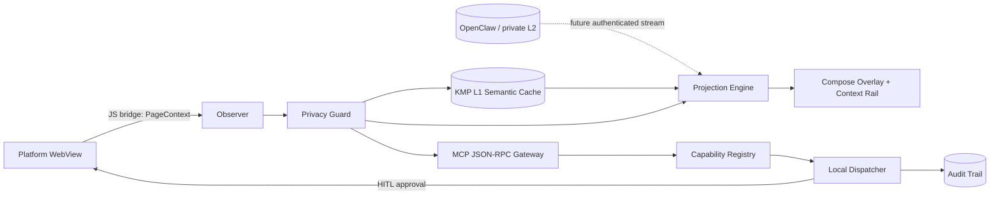
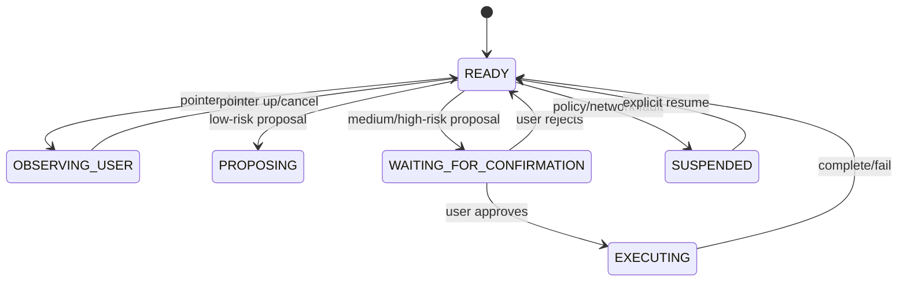

# Kotlin Auto WebView

[繁體中文](README.zh-TW.md) · English

A production-oriented Kotlin Multiplatform browser shell for Android, iOS, Web (Wasm), and Desktop. It turns an embedded WebView from a passive renderer into a **bounded agent surface**: the app captures sanitized page context, stores a local semantic cache, projects relevant prior context, exposes MCP resources/tools, and keeps every state-changing action behind a deterministic capability policy and human confirmation gate.

> Status: architecture foundation / executable MVP. Android, iOS, Web, and Desktop entry points are present. Store signing, production identity, remote OpenClaw transport, persistent SQLDelight storage, and full accessibility-tree action execution remain explicit follow-up work.

## What is implemented

| Plane | Implementation |
|---|---|
| Cross-platform UI | Compose Multiplatform shared UI and platform entry points |
| Browser surface | `compose-webview-multiplatform` over Android WebView, iOS WKWebView, KCEF desktop, and Wasm web adapter |
| Context observer | Idempotent JavaScript injection, DOM text cleanup, interactive-element fingerprints, geometry capture, selection capture |
| Privacy boundary | Sensitive input exclusion, secret/card/private-key redaction, content and element limits |
| L1 semantic cache | Deterministic in-memory semantic cache with relevance ranking |
| Projection | DOM-anchor matching, overlay paths/bubbles, fallback context rail |
| Local dispatcher | Human-input preemption, proposal state machine, explicit confirmation for medium/high-risk actions |
| Capability registry | Deny-by-default capability registration, enablement, permission and risk ceilings |
| MCP | Transport-independent JSON-RPC gateway exposing `browser://current-page` and bounded proposal tools |
| Evidence | Audit trail plus common tests for cache, dispatcher, policy, privacy, projection, and MCP behavior |

## Architecture





## Repository layout

```text
composeApp/
  src/commonMain/
    cache/           # L1 semantic cache contract and implementation
    capability/      # capability registry and policy decisions
    dispatcher/      # deterministic human/agent arbitration
    domain/          # serialized contracts shared across targets
    mcp/             # portable MCP JSON-RPC discovery/resource/tool gateway
    privacy/         # redaction and sensitive-element filtering
    projection/      # cache-to-DOM anchor projection
    runtime/         # orchestration and audit state
    ui/              # browser shell, overlay, context rail
    web/             # injected observer and JS bridge handler
  src/androidMain/   # Android application entry
  src/iosMain/       # iOS UIViewController entry
  src/desktopMain/   # desktop app entry
  src/wasmJsMain/    # browser entry and index.html
iosApp/              # Xcode application shell

docs/architecture/  # design decisions and data-flow contract
docs/release/       # Android, iOS, and Web release runbooks
docs/security/      # threat model
```

## Run

Prerequisites: JDK 17, Android SDK 36 for Android, and Xcode on macOS for iOS.

```bash
# Common tests
./gradlew :composeApp:allTests

# Desktop
./gradlew :composeApp:run

# Web development server
./gradlew :composeApp:wasmJsBrowserDevelopmentRun

# Android debug APK
./gradlew :composeApp:assembleDebug

# iOS simulator framework
./gradlew :composeApp:linkDebugFrameworkIosSimulatorArm64
# Then open iosApp/iosApp.xcodeproj in Xcode.
```

The repository uses a checksum-pinned Gradle bootstrap script rather than committing a wrapper JAR. CI installs the same Gradle version through `gradle/actions/setup-gradle`.

## MCP compatibility boundary

`BrowserMcpGateway` lives in `commonMain`, supports stateless discovery plus the legacy initialization path, and exposes only sanitized resources and typed action proposals. It intentionally does not start a network listener. Android/iOS/Web/Desktop transports must add peer authentication, origin allowlists, rate limits, protocol headers, and lifecycle binding before accepting remote requests.

The official Kotlin SDK can be added in platform/edge modules where its published target variants match the deployment target. The shared mobile core does not pretend an unavailable artifact variant exists. See [ADR-0003](docs/architecture/ADR-0003-mcp-platform-boundary.md).

## Platform constraints

- Mobile WebViews do not support Chrome extensions. Browser-assistant behavior is implemented through a controlled JavaScript bridge.
- iOS uses WKWebView; Chromium-only APIs must have a fallback.
- Web/Wasm embedding remains subject to browser same-origin, CSP, `X-Frame-Options`, and iframe policy. App-owned pages can expose richer context through `postMessage`; arbitrary sites may refuse embedding.
- Desktop KCEF has the most browser-like surface but increases package size and cold-start cost.

See [the architecture contract](docs/architecture/README.md) and [the traceability matrix](docs/TRACEABILITY.md).

## Security model

No arbitrary model output is executed. Models propose typed actions; the capability registry and dispatcher decide whether the action is denied, proposed, or requires confirmation. Password and payment fields are excluded before context reaches Kotlin. Production builds should keep telemetry disabled by default, pin transport identities, use platform attestation, and persist auditable policy decisions.

Read [SECURITY.md](SECURITY.md) and [the threat model](docs/security/THREAT_MODEL.md).

## License

Apache License 2.0. Third-party dependencies retain their own licenses; see [NOTICE](NOTICE).
