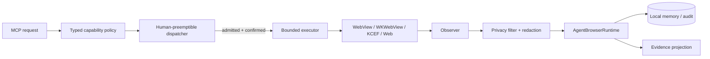

# Kotlin Auto WebView

[繁體中文](README.zh-TW.md) · English

Kotlin Auto WebView is a Kotlin Multiplatform **bounded Agent browser and capability workspace** for Android, iOS, Web/Wasm, and Desktop. The current executable baseline observes and sanitizes page context, keeps local memory, projects evidence, exposes typed MCP proposals, and keeps state-changing authority behind deterministic policy, human preemption, and exact evidence.

The repository is now also designing a **Creator Capability Browser**:

```text
admitted source
→ v7.2 timestamp/structural cards
→ evidence and contradiction graph
→ procedural DAG
→ independently qualified SKILL.md
→ creator workspace / Community Skill Edition
→ user outcome foldback
```

The creator initiative is **not implemented yet**. Its risk contract and Community Edition architecture are published as Draft PRs; implementation is atomized into issues with explicit path leases, State Machines, negative controls, and evidence ceilings.

## Exact current state

Snapshot basis: 2026-08-19, Creator documentation convergence issue [#98](https://github.com/ed3c/kotlin-auto-webview/issues/98).

| Plane | Exact subject | Current state | What it proves |
|---|---|---|---|
| Existing KMP Agent-browser baseline | PR #1 head `a449fac24b8ee602b3c36ae60e972fe25f35c516` | repository-recorded common/Desktop/Wasm/Android/iOS-simulator checks `PASS` | the existing bounded browser baseline, not Creator Capability runtime |
| v7.2 procedural compiler prompt | main commit `290a82f0394a42e0c20949a36ab575229b95051d` | `MATERIALIZED_DOCUMENT` | prompt/contract only |
| Platform/media/rights risk foundation | issue #80 / Draft PR #81 head `8e2181e11144ae5bb349c1a0aa9b790485d60c4d` | `DRAFT_PUBLISHED` | reviewable risk/admission contract only |
| Community Skill Edition architecture | issue #82 / Draft PR #83 head `d8b105ba1bb7be88caf9ae52eaa5bc31bf4667c9` | `DRAFT_PUBLISHED` | architecture/schema/example only |
| Creator implementation atoms | issues #84–#97 | `NOT_IMPLEMENTED` | ownership and planned acceptance criteria only |
| Cross-media source adapters | issues #102–#110 | `NOT_IMPLEMENTED` | atomized source-specific work only |
| Shared documentation convergence | issue #98 / `docs/creator-capability-convergence` | `IN_PROGRESS_DOCUMENTATION` | current index work only; exact moving head is GitHub metadata |
| Docs CI, prompts, handoff, policy/DoD reviews | issues #99–#101, #111–#117 | `PLANNED` | future docs/evidence work only |
| Local Git Town Worker, linked worktree and local checks | no current receipt | `NOT_EXERCISED` / `BLOCKED_POLICY` | no local-runtime claim |
| Legal/platform/store/device/provider approval | external authorities | `EXTERNAL_AUTHORITY_REQUIRED` / `NOT_EXERCISED` | no approval or production claim |

Use these evidence states without normalization:

```text
PASS
FAIL
ABSENT
NOT_IMPLEMENTED
NOT_EXERCISED
SKIPPED_BY_POLICY
DENIED_BY_ARCHITECTURE
EXTERNAL_AUTHORITY_REQUIRED
```

Issue creation, a branch, a Draft PR, a schema, or a prompt is never implementation evidence.

## Product boundary

The product is not an AI chat overlay or a YouTube downloader. The intended durable value is:

```text
WebView / WKWebView / KCEF / official media surfaces
= observation and playback substrates

Kotlin runtime
= identity, policy, state, lifecycle, privacy and human authority

v7.2
= source-bound cards, stable IDs, typed links and evidence graph

Procedural compiler
= card graph → state/decision DAG → candidate Procedural IR

Independent qualifier
= executable / discriminative / falsifiable / observable / transferable verdict

Community Edition
= versioned contributor SkillPatch variants, conflicts, moderation and outcomes
```

### Edition modes

| Mode | Source-media behavior | Status |
|---|---|---|
| `REFERENCE_EDITION` | official player or external official app; locator/timestamp/cards only | first intended MVP; issue #95 |
| `OFFICIAL_CLIP_REFERENCE` | stores eligible official Clip URLs as references only | planned reference lane |
| `LICENSED_RENDER_EDITION` | screenshots/segments/rendered derivative/native PiP only with exact rights packet | rights-gated issue #96 |

```text
publicly visible != reusable media
embed ready != content authorized
Media Integrity != Premium entitlement != copyright permission
community popularity != evidence truth
rendered Skill != qualified Skill
```

## Existing bounded-browser data flow



Core runtime laws remain:

1. Observation and sanitization precede cache, model, MCP, projection, or action.
2. A model or protocol may propose a typed action; it cannot grant authority.
3. User interaction preempts Agent authority.
4. Page/source identity and freshness are revalidated before action.
5. Origin, CSP, iframe, DRM, platform and physical limits are surfaced, never bypassed.
6. Missing evidence stays missing.

## Creator Capability data flow

```mermaid
flowchart LR
    SRC[YouTube / PDF / EPUB / Notion / X / Web / Drive-Docs / local file] --> ADM[Per-operation source admission]
    ADM -->|allow / minimize| ADAPTER[Source-specific adapter]
    ADM -->|deny / unknown| BLOCK[Stable degraded or blocked state]
    ADAPTER --> EVENTS[Sanitized bounded events + revision-bound locators]
    EVENTS --> IDX[v7.2 auto-indexer]
    IDX --> CARDS[Atomic cards + typed evidence links]
    CARDS --> EDITOR[Timeline / Graph / Procedure editor]
    CARDS --> COMP[Procedural compiler]
    COMP --> IR[Candidate Procedural IR]
    IR --> QUAL[Independent qualifier]
    QUAL -->|QUALIFIED| SKILL[Qualified Skill variant]
    QUAL -->|NOT_QUALIFIED| NQ[Missing evidence / contradiction route]
    SKILL --> WS[Portable creator workspace]
    SKILL --> COMM[Community SkillPatch variants]
    COMM --> REF[Reference Edition]
    REF --> EXP[Creator experiment]
    EXP --> OUT[USER_OUTCOME]
    OUT --> FOLD[Preserve / strengthen / narrow / revise / refute]
    FOLD --> SKILL
    CHANGE[Source / rights / contribution change] --> REV[Impact + revocation]
    REV --> IDX
    REV --> REF
```



## Creator State Machines

### Source and indexing

```text
SOURCE_REQUESTED
→ ACCESS / RIGHTS / DESTINATION CLASSIFIED
→ SOURCE_READY | LOCATOR_ONLY | BLOCKED
→ STRUCTURAL_OR_TEMPORAL_EVENTS
→ AUTO_INDEXING
→ TIMELINE_CARDS_READY
→ SEMANTIC_GRAPH_READY
→ PROCEDURE_CLUSTERS_READY
```

### Procedure and Skill

```text
CARD_SUBGRAPH_SELECTED
→ PROCEDURAL_ATOMS
→ STATE_MACHINE_RECOVERED
→ COUNTERFACTUALS / CONFOUNDERS
→ CROSS_CASE_INTERSECTION
→ PROCEDURAL_IR_CANDIDATE
→ INDEPENDENT_QUALIFICATION
→ QUALIFIED | NOT_QUALIFIED
```

### Community Edition

```text
SOURCE_REGISTERED
→ RIGHTS_CLASSIFIED
→ EDITION_MODE_SELECTED
→ COMMUNITY_CONTRIBUTIONS_OPEN
→ PATCH_SUBMITTED
→ RIGHTS / LEAKAGE / MODERATION / QUALIFICATION
→ PROCEDURE_VARIANTS_ASSEMBLED
→ REFERENCE_EDITION_READY | LICENSED_RENDER_READY
→ PRIVATE_PREVIEW
→ PUBLICATION_AUTHORIZED | PUBLICATION_BLOCKED
```

### Revocation and foldback

```text
SOURCE / RIGHTS / CONTRIBUTION CHANGE
→ IMPACT_GRAPH
→ REINDEX | LOCATOR_ONLY | PARTIAL_TAKEDOWN | FULL_TAKEDOWN
→ CLEANUP RECEIPTS

USER EXPERIMENT
→ OUTCOME RECEIPT
→ PRESERVED | STRENGTHENED | NARROWED | REVISED | REFUTED
```

## Directory → State Machine → DAG ownership

Planned paths are marked `[P]`; their presence here does not claim directories or code exist.

| Path | Owner / State Machine | Input | Output / next owner | Forbidden coupling | State |
|---|---|---|---|---|---|
| `domain/`, `web/`, `privacy/`, `cache/`, `projection/`, `mcp/`, `capability/`, `dispatcher/`, `runtime/`, `ui/` | existing bounded-browser planes | page contexts and typed proposals | sanitized evidence / bounded actions | raw model execution or authority bypass | implemented baseline |
| `docs/security/` | source/platform/media admission | external policy and rights claims | risk decisions → all adapters | legal self-approval | Draft PR #81 |
| `docs/creator/` | creator architecture, current state, DAG, Stack, prompts | GitHub/code/evidence graph | zero-context Agent routing | implementation claims | docs in progress |
| `creator/contract/` `[P]` | `DECODE → VALIDATE → ADMIT/REJECT` | untrusted source/card/IR/community DTOs | immutable contracts → every creator plane | platform I/O or self-qualification | #84 |
| `creator/source/youtube/` `[P]` | player/embed/identity/seek lifecycle | video identity + policy | timestamp/source events → index/UI | media download, hidden PiP, Premium claims | #85 |
| `creator/source/pdf/` `[P]` | page/region/text/figure locator lifecycle | authorized PDF | revision-bound events → index | rights inference / whole-copy retention | #103 |
| `creator/source/epub/` `[P]` | chapter/CFI/DRM lifecycle | authorized EPUB | structural events → index | DRM bypass / source substitute | #104 |
| `creator/source/notion/` `[P]` | workspace/page/block authority lifecycle | admitted connector/session | block events → index | visibility→ownership inference | #105 |
| `creator/source/x/` `[P]` | observation-only post/thread/article lifecycle | public/authorized X source | source events → index | website action automation | #106 |
| `creator/source/web/` `[P]` | origin/navigation/DOM observer lifecycle | admitted Web page | sanitized DOM events → index | CSP/origin/anti-bot bypass | #107 |
| `creator/source/google/` `[P]` | Drive/Docs OAuth/organization/revision lifecycle | admitted connector/API | structural events → index | embedded OAuth / token leakage | #108 |
| `creator/source/local/` `[P]` | URI/digest/codec/resource lifecycle | user-selected file | local events → index | possession→ownership inference | #109 |
| `creator/source/registry/` `[P]` | adapter resolve/probe/degrade convergence | source request | exact adapter/result → runtime | fake parity or hidden fallback | #110 |
| `creator/indexing/` `[P]` | segmentation/cards/links/dedup/clusters | admitted events | card graph → editor/compiler | arbitrary chunks / evidence loss | #86 |
| `creator/editor/`, `creator/ui/` `[P]` | immutable curation revisions | card graph + source events | selected DAG → compiler/source navigation | evidence-class mutation / player overlay | #87 |
| `creator/compiler/` `[P]` | cards → Procedural IR → candidate Skill | selected evidence graph | candidate → qualifier | raw source reading / self-qualification | #88 |
| `creator/qualification/` `[P]` | G1–G8 adversarial verdict | candidate IR + evidence | qualified or exact failure → runtime | shared mutable compiler authority | #89 |
| `creator/provider/`, `creator/export/` `[P]` | destination admission and budget routing | minimized payload | provider receipt / workspace | consumer session-token reuse | #90 |
| `creator/runtime/` `[P]` | core multi-parent convergence | verified leaf heads | creator vertical slice | inventing leaf fixes | #91 |
| `creator/community/model|store/` `[P]` | SkillPatch/version/conflict lifecycle | contributor proposals | variants → moderation/reference UI | votes→truth | #92 |
| `creator/community/moderation/` `[P]` | filter/report/block/appeal/takedown | public UGC | moderation receipt | model as legal authority | #93 |
| `creator/freshness/`, `creator/community/revocation/` `[P]` | source/rights impact and cleanup | source/rights changes | reindex/degrade/takedown | cached-source continuation | #94 |
| `creator/community/playback/reference/` `[P]` | foreground source dock + card seek | source/player/cards/variants | reference edition | source media copy / OS PiP | #95 |
| `creator/community/render/` `[P]` | rights-bound render/native PiP | exact licensed assets | derivative/PiP receipt | standard YouTube source admission | #96 |
| `tests|scripts|receipts/creator/` `[P]` | exact evidence lanes | exact subject/carrier | bounded receipts → docs/Human | evidence laundering | #97 |

## Molecular implementation DAG

```text
#80 risk and policy docs → Draft PR #81
└── #82 Community Skill Edition architecture → Draft PR #83
    └── #84 creator contracts
        ├── #85 YouTube source adapter
        ├── #86 v7.2 auto-indexer
        ├── #87 card editor
        ├── #88 procedural compiler
        ├── #89 independent qualifier (consumes #88 candidate contract)
        ├── #90 model/destination router
        └── #91 core convergence (process dependencies: #85–#90)
            └── #92 Community SkillPatch store
                ├── #93 UGC moderation
                ├── #94 source/rights revocation
                ├── #95 reference edition
                │   └── #96 licensed render/native PiP [rights-gated]
                └── #97 exact evidence convergence

#98 shared README/AGENTS/TRACEABILITY/Stack convergence
├── #99 exact-head docs CI
├── #100 eventual local handoff queue
├── #101 zero-context system prompts
└── #111–#117 source index, snapshot, global review, roadmap, DoD, non-claims and policy drift

#102 cross-media source epic
├── #103 PDF
├── #104 EPUB
├── #105 Notion
├── #106 X
├── #107 generic Web
├── #108 Drive/Docs
├── #109 local files/media
└── #110 source registry convergence
```

Git ancestry represents consumed bytes only. Cross-leaf completion dependencies are process DAG edges, not fake multi-parent Git history.

## Git Town / Stack PR status

Canonical method: [`git-town-stacked-pr-worker`](https://github.com/ed3c/skills-shared/tree/main/skills/git-town-stacked-pr-worker).

Actual Creator remote graph:

```text
main@290a82f0394a42e0c20949a36ab575229b95051d
└── agent/media-rights-risk-register@8e2181e11144ae5bb349c1a0aa9b790485d60c4d  #80 / PR #81
    └── agent/community-skill-edition-design@d8b105ba1bb7be88caf9ae52eaa5bc31bf4667c9  #82 / PR #83
        └── docs/creator-capability-convergence  #98; exact head from GitHub metadata
```

All implementation branches in #84–#110 are planned; issue creation does not mean they exist. Live Git Town executable/worktree/sync evidence remains `ABSENT` / `NOT_EXERCISED`. Merge remains `EXTERNAL_AUTHORITY_REQUIRED`.

See [`docs/git/STACKED_PRS.md`](docs/git/STACKED_PRS.md) and [`docs/creator/MOLECULAR_STACK_INDEX.md`](docs/creator/MOLECULAR_STACK_INDEX.md).

## MVP and stronger lanes

```text
MVP_REFERENCE_EDITION
  #84–#91 + private/reference portions of #92/#94/#95 + exact docs/evidence

PUBLIC_COMMUNITY_GATED
  #93 executable UGC controls + store/publication review

LICENSED_RENDER_RIGHTS_GATED
  #96 exact rights packet + licensed media + physical PiP/render evidence

POST_MVP_MULTI_SOURCE
  #102–#110, each independently admitted
```

MVP does not require every future adapter or licensed render. Revenue, creator growth and paid demand are market-outcome lanes, not technical Definition of Done.

## Closure classes and non-claims

Allowed closure classes:

```text
CONTRACT_CLOSED
LOCAL_DETERMINISTIC_CLOSED
REFERENCE_VERTICAL_SLICE_CLOSED
PUBLIC_COMMUNITY_TECHNICALLY_CLOSED
LICENSED_RENDER_SUBJECT_CLOSED
PHYSICAL_EVIDENCE_CLOSED
STORE_OR_LEGAL_ADMITTED        # external
MARKET_OUTCOME_VERIFIED        # user/customer receipts
```

The repository currently claims none of the Creator implementation closure classes.

Do not claim:

- official affiliation or platform approval;
- generic YouTube download, transcript, ad suppression, Premium, background playback or PiP;
- automatic copyright/fair-use/legal clearance;
- arbitrary private/organization-content export;
- universal creator success or guaranteed revenue;
- a qualified Skill from one source, one judge, one model, or community majority;
- physical-device/store/production readiness from schemas, builds or simulators.

## Agent route

Read in this order for Creator work:

1. [`AGENTS.md`](AGENTS.md)
2. [`docs/security/CONTENT_PLATFORM_MEDIA_RISK_REGISTER.md`](docs/security/CONTENT_PLATFORM_MEDIA_RISK_REGISTER.md)
3. [`docs/creator/COMMUNITY_SKILL_EDITION_ARCHITECTURE.md`](docs/creator/COMMUNITY_SKILL_EDITION_ARCHITECTURE.md)
4. [`docs/creator/PROCEDURAL_SKILL_COMPILER_SYSTEM_PROMPT.md`](docs/creator/PROCEDURAL_SKILL_COMPILER_SYSTEM_PROMPT.md)
5. [`docs/creator/README.md`](docs/creator/README.md)
6. [`docs/creator/AGENTS.md`](docs/creator/AGENTS.md)
7. [`docs/creator/CREATOR_CAPABILITY_DAG.md`](docs/creator/CREATOR_CAPABILITY_DAG.md)
8. [`docs/creator/MOLECULAR_STACK_INDEX.md`](docs/creator/MOLECULAR_STACK_INDEX.md)
9. exact issue, branch, PR, head/tree and nearest directory README/AGENTS

## Verification

Existing repository checks remain:

```bash
./gradlew :composeApp:allTests
./gradlew :composeApp:compileKotlinDesktop
./gradlew :composeApp:wasmJsBrowserDistribution
./gradlew :composeApp:assembleDebug
# on macOS:
./gradlew :composeApp:linkDebugFrameworkIosSimulatorArm64
```

Creator-specific commands are intentionally not invented before implementation issues own concrete entrypoints. Issue #100 keeps the Local Handoff queue `ABSENT` until exact commands, subjects and receipt paths exist. Issue #99 owns future exact-head docs checks.

## Authority boundary

Legal interpretation, license/terms acceptance, creator/media rights, provider account authorization, physical-device access, App Store/Google Play review, merge, release, production deployment and destructive rollback remain Human or organizational authority.
