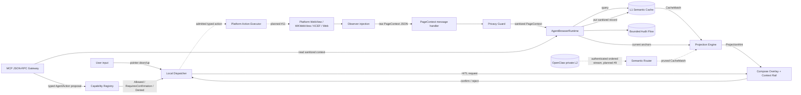
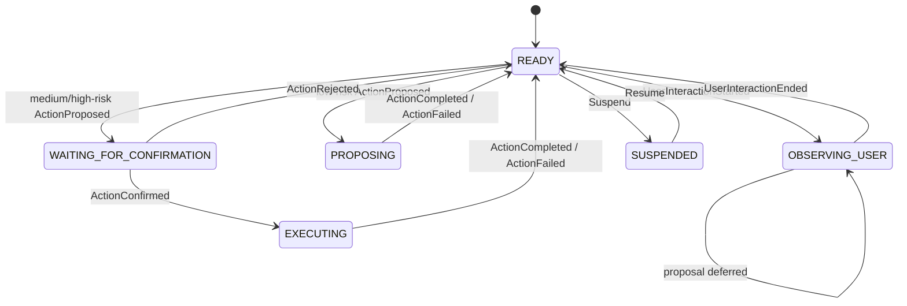
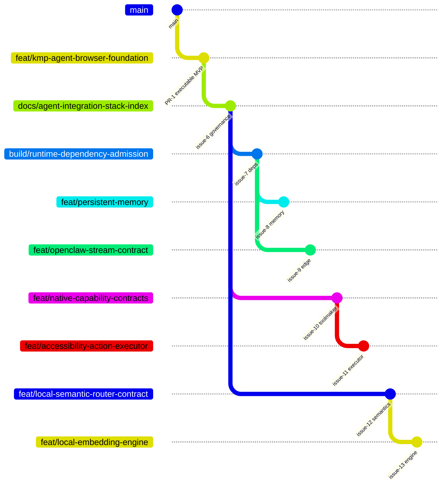

# Kotlin Auto WebView

[繁體中文](README.zh-TW.md) · English

A production-oriented Kotlin Multiplatform browser shell for Android, iOS, Web/Wasm, and Desktop. It turns an embedded WebView from a passive renderer into a **bounded agent surface**: the app observes and sanitizes page context, retains a local L1 memory, projects relevant evidence back onto the page, exposes bounded MCP resources/proposals, and keeps state-changing authority behind deterministic policy and human confirmation.

> **Current baseline:** executable architecture MVP in draft PR #1. Head `a449fac24b8ee602b3c36ae60e972fe25f35c516` passed common tests, Desktop compilation, Wasm production distribution, Android debug assembly, and iOS Simulator ARM64 framework linking. Store delivery, persistent memory, authenticated OpenClaw L2, native action execution, and an admitted on-device semantic engine remain separate work.

## Integration truth

| Capability | Implementation | Evidence state | Owner / next gate |
|---|---|---|---|
| Android, iOS, Web/Wasm, Desktop entry points | Implemented | `PASS` at baseline head | PR #1 |
| WebView observer, DOM text, selection, fingerprints, geometry | Implemented | `PASS` through common/platform builds | `web/` |
| Sensitive-field exclusion and Kotlin redaction | Implemented | `PASS` common tests | `privacy/` |
| L1 semantic cache | In-memory deterministic baseline | `PASS` common tests | `cache/`; persistence #8 |
| OpenClaw L2 stream | Contract only in architecture | `NOT_IMPLEMENTED` | epic #4; transport #9 |
| Cache-to-DOM projection | Bubble/context-rail MVP | `PASS` common tests | `projection/` |
| Capability policy and human preemption | Implemented | `PASS` common tests | `capability/`, `dispatcher/` |
| Bounded browser action executor | No privileged executor yet | `NOT_IMPLEMENTED` | contracts #10; executor #11 |
| MCP | Portable JSON-RPC discovery/resource/proposal gateway | `PASS` common tests | `mcp/` |
| MCP peer authentication/network listener | Intentionally absent from common core | `NOT_IMPLEMENTED` | #9 |
| Local semantic router | Lexical ranking embedded in cache baseline | `IMPLEMENTED`; extraction contract pending | #12 |
| On-device embedding/SLM engine | No engine selected | `NOT_IMPLEMENTED` | #13 |
| Android Play delivery | Debug APK only | `NOT_EXERCISED` as store evidence | #2 |
| iOS App Store/TestFlight delivery | Simulator framework only | `NOT_EXERCISED` as store evidence | #3 |
| Web deployment | Production Wasm artifact built | deployment `NOT_EXERCISED` | #5 |
| Git Town static policy | `.git-town.toml` for v24.0.0 | configuration present | issue #6 |
| Git Town executable admission/live sync | Host binary/checksum/canaries missing | `ABSENT` / `NOT_EXERCISED` | `docs/git/GIT_TOWN_ADMISSION.md` |

`PASS`, `FAIL`, `ABSENT`, `NOT_IMPLEMENTED`, `NOT_EXERCISED`, and `SKIPPED_BY_POLICY` are not interchangeable.

## Runtime data flow



### End-to-end invariants

1. Observation precedes action.
2. Raw page data is sanitized before cache, projection, MCP, or audit use.
3. A model or remote node can propose a typed action; it cannot grant authority.
4. User interaction preempts agent authority.
5. Page identity and anchor freshness must be revalidated before future execution.
6. Web origin/CSP/iframe limitations are surfaced, never bypassed.

## Directory → state machine → data contract

The table distinguishes explicit code state machines from pipeline transition contracts. Only `dispatcher/` currently owns a serialized enum state machine; other rows describe the required lifecycle of that module.

| Directory | State/transition responsibility | Inputs | Outputs | Forbidden coupling |
|---|---|---|---|---|
| `domain/` | `DEFINE -> SERIALIZE -> VALIDATE` immutable contracts | Constructor/decoder values | `PageContext`, `AgentAction`, `ProjectionHint`, cache/audit DTOs | I/O, platform APIs, policy decisions |
| `web/` | `NOT_INJECTED -> OBSERVING -> EMITTING -> RETRY/DEGRADED` | Page lifecycle, DOM/selection/mutation events | Raw `PageContext` JSON | Privileged execution, secret retention, authorization |
| `privacy/` | `RAW -> FILTERED -> REDACTED -> BOUNDED` | Raw `PageContext` | Sanitized `PageContext` | Ranking, remote transport, permission decisions |
| `cache/` | `QUERY -> HIT/MISS`; `PUT -> STORED`; `REMOVE/CLEAR` | Sanitized text/records | Ranked `CacheMatch` | UI rendering, network identity, action execution |
| `projection/` | `MATCH -> ANCHORED/BUBBLE` or `UNMATCHED/CONTEXT_RAIL`; stale data is dropped | Current anchors + cache matches | `ProjectionHint` list | Authorization or direct DOM mutation |
| `mcp/` | `PARSE -> VALIDATE -> DISCOVER/READ/PROPOSE -> RESULT/ERROR` | JSON-RPC payload | Sanitized resource result or typed proposal | Network listener, peer trust, WebView/native calls |
| `capability/` | `UNREGISTERED/DISABLED/MISSING_PERMISSION/OVER_RISK -> DENIED`; low risk `-> ALLOWED`; medium/high `-> REQUIRES_CONFIRMATION` | `AgentAction`, granted permissions | `PolicyDecision` | Temporal execution state, UI rendering |
| `dispatcher/` | Explicit `READY`, `OBSERVING_USER`, `PROPOSING`, `WAITING_FOR_CONFIRMATION`, `EXECUTING`, `SUSPENDED` | User and action lifecycle events | `DispatcherSnapshot` | Capability invention, platform implementation |
| `runtime/` | `CAPTURE -> SANITIZE -> QUERY -> PROJECT -> STORE -> AUDIT` | Page contexts, proposals, HITL events | StateFlows for context/projection/audit/dispatcher | Store packaging, transport identity |
| `ui/` | `RENDER -> OBSERVE_USER -> REQUEST_CONFIRMATION -> CONFIRM/REJECT -> RENDER` | Runtime flows and user input | UI events only | Hidden authorization or raw model execution |
| `androidMain/` | `CREATE -> ATTACH_RENDERER -> FOREGROUND/BACKGROUND -> DESTROY` | Android lifecycle and shared contracts | Android renderer/tool results | Android-only policy divergence |
| `iosMain/` + `iosApp/` | `CREATE_CONTROLLER -> ATTACH_WKWEBVIEW -> ACTIVE/BACKGROUND -> RELEASE` | iOS lifecycle and shared contracts | iOS renderer/tool results | iOS-only policy divergence |
| `desktopMain/` | `INIT_KCEF -> READY -> ACTIVE -> SHUTDOWN` | Desktop lifecycle and shared contracts | Desktop renderer/tool results | Replacing mobile constraints with Chromium assumptions |
| `wasmJsMain/` | `BOOT -> MOUNT -> ACTIVE -> UNMOUNT` | Browser document/lifecycle | Web UI events | Same-origin/CSP bypass claims |

### Dispatcher state machine



## Repository layout

```text
.git-town.toml                 # static no-push Git Town policy; not executable admission
AGENTS.md                      # repository-wide Agent authority
README.md / README.zh-TW.md    # architecture, state/data map, live stack index

composeApp/
  src/commonMain/kotlin/dev/ed3c/autowebview/
    domain/                    # serializable contracts; no I/O
    web/                       # observer injection + PageContext bridge
    privacy/                   # filtering/redaction boundary
    cache/                     # L1 cache contract + in-memory implementation
    projection/                # anchor selection + rendering hints
    mcp/                       # transport-independent JSON-RPC gateway
    capability/                # capability policy decisions
    dispatcher/                # explicit human/agent state machine
    runtime/                   # orchestration + bounded audit state
    ui/                        # browser shell, overlay, HITL surface
  src/commonTest/              # shared state/policy/privacy/serialization evidence
  src/androidMain/             # Android lifecycle and renderer adapters
  src/iosMain/                 # iOS lifecycle and WKWebView adapters
  src/desktopMain/             # Desktop/KCEF lifecycle
  src/wasmJsMain/              # browser entry and web resources

iosApp/                       # Xcode host shell

docs/
  architecture/               # hard laws and ADRs
  git/                        # Git Town profile, stack graph, Worker protocol
  harness/                    # eval and evidence contract
  release/                    # platform delivery runbooks
  security/                   # threat model
  TRACEABILITY.md             # requirement -> owner -> code -> evidence -> issue

.github/
  ISSUE_TEMPLATE/             # eval-first Stack PR task packet
  PULL_REQUEST_TEMPLATE.md    # branch graph/path lease/evidence contract
  workflows/                  # CI and Pages workflows
```

## Git Town Stacked PR governance

This repository consumes the shared [`git-town-stacked-pr-worker`](https://github.com/ed3c/skills-shared/tree/main/skills/git-town-stacked-pr-worker) method. The canonical Skill is not copied into this repository.

```text
Git Town                  branch hierarchy + bounded local synchronization
Consumer repository       profile + task packets + path leases + evals + CI + receipts
GitHub publication gate   exact-HEAD publication admission
Human/trusted operator    semantic conflicts + legal acceptance + merge/ship + release
```

### Admission status

| Lane | State |
|---|---|
| Static `.git-town.toml` reviewed for v24.0.0 | present |
| Exact source release and checksum-manifest identity | recorded |
| Host OS/architecture binary checksum | `ABSENT` |
| Executable provenance/SBOM/legal approval | `ABSENT` / `NOT_EXERCISED` |
| Live dry-run and no-push sync canary | `NOT_EXERCISED` |
| Planted conflict canary | `NOT_EXERCISED` |
| Exact-HEAD publication gate | `NOT_IMPLEMENTED` |

Until admission is complete, a Worker returns `BLOCKED_POLICY`; it does not install `latest`, run another Git tool as a substitute, or publish manually.

### Planned branch graph

Solid edges are true branch-parent dependencies. The convergence branch is created only after every required sibling head is admitted. Independent children have disjoint path leases.



The complete graph, including release branches and convergence, is maintained in [`docs/git/STACKED_PRS.md`](docs/git/STACKED_PRS.md).

### Atomized Stack PR index

| Order | Issue | Planned branch | Parent | Class | Exclusive path lease | Required evidence / state |
|---:|---:|---|---|---|---|---|
| 0 | #1 | `feat/kmp-agent-browser-foundation` | `main` | foundation | initial repository implementation | Draft PR; CI `PASS` at baseline head |
| 1 | #6 | `docs/agent-integration-stack-index` | foundation | foundation | `.git-town.toml`, root docs, `docs/git/**`, `docs/harness/**`, templates | current docs stack; live Git Town `NOT_EXERCISED` |
| 2 | #7 | `build/runtime-dependency-admission` | docs stack | foundation | Gradle catalogs/build files, dependency evidence, NOTICE | exact variants/licenses; no feature code |
| 3A | #8 | `feat/persistent-memory` | runtime deps | child | `persistence/**`, SQLDelight schema/tests, ADR-0004 | migrations/restart/redaction; `NOT_IMPLEMENTED` |
| 3B | #9 | `feat/openclaw-stream-contract` | runtime deps | child | `edge/**` common/mobile tests, ADR-0005 | auth/order/replay/backpressure; `NOT_IMPLEMENTED` |
| 2B | #10 | `feat/native-capability-contracts` | docs stack | sibling | `toolmaker/**`, ADR-0006 | contracts/policy only; `NOT_IMPLEMENTED` |
| 3C | #11 | `feat/accessibility-action-executor` | capability contracts | child | `executor/**` common/platform tests, ADR-0007 | freshness/HITL/preemption; `NOT_IMPLEMENTED` |
| 2C | #12 | `feat/local-semantic-router-contract` | docs stack | sibling | `semantics/**` contract/fixtures, ADR-0008 | deterministic benchmark baseline; `NOT_IMPLEMENTED` |
| 3D | #13 | `feat/local-embedding-engine` | semantic contract | child | semantic engine/platform adapters + its admitted dependency changes | physical-device budget/license; `NOT_IMPLEMENTED` |
| 4A | #2 | `release/android-play-evidence` | action executor | release | Android release workflow/metadata/runbook only | signed AAB + device/pre-launch evidence |
| 4B | #3 | `release/ios-app-store-evidence` | action executor | release | iOS signing/metadata/runbook only | signed archive + TestFlight/device evidence |
| 2D | #5 | `release/web-deployment-evidence` | docs stack | sibling | Pages/web deployment smoke evidence | deployed URL/browser/CSP receipts |
| 5 | #14 | `converge/release-readiness-index` | docs stack after admitted dependencies | convergence | shared READMEs, `AGENTS.md`, traceability, aggregate release index | full exact-head matrix + Human Admit |

Issue #4 remains the parent epic for persistent/private L2 and semantic-runtime work. Leaf PRs must not edit shared indexes; #14 owns final reconciliation.

### Worker synchronization after admission

```bash
# Version-supported equivalents only; exact v24.0.0 binary must be admitted first.
git town sync --stack --dry-run --non-interactive --no-auto-resolve --no-push
git town sync --stack --non-interactive --no-auto-resolve --no-push
```

A command exit `0` proves synchronization only. Publication, CI, merge, store submission, promotion, and rollback remain separate evidence lanes.

## Build and verification

Prerequisites: JDK 17, Android SDK 36 for Android, and Xcode on macOS for iOS.

```bash
./gradlew :composeApp:allTests
./gradlew :composeApp:compileKotlinDesktop
./gradlew :composeApp:wasmJsBrowserDistribution
./gradlew :composeApp:assembleDebug
./gradlew :composeApp:linkDebugFrameworkIosSimulatorArm64  # macOS
```

Development entry points:

```bash
./gradlew :composeApp:run
./gradlew :composeApp:wasmJsBrowserDevelopmentRun
```

See [`docs/harness/README.md`](docs/harness/README.md) for module evals, mutation controls, evidence states, and release proof boundaries.

## MCP compatibility boundary

`BrowserMcpGateway` lives in `commonMain`, supports stateless discovery plus the legacy initialization path, and exposes only sanitized resources and typed action proposals. It intentionally starts no network listener. Platform/edge transports must add authenticated pairing, protocol/version negotiation, origin policy, rate limits, cancellation, replay protection, and lifecycle shutdown.

The official Kotlin SDK may be used in edge/platform modules only where its published variants match the admitted target. The common mobile core does not pretend an unavailable artifact variant exists. See [ADR-0003](docs/architecture/ADR-0003-mcp-platform-boundary.md).

## Platform constraints

- Mobile WebViews do not support Chrome extensions; assistant behavior uses controlled observer injection and a JS bridge.
- iOS uses WKWebView; Chromium-only behavior requires a fallback or an explicit unsupported state.
- Web/Wasm remains subject to same-origin, CSP, `X-Frame-Options`, and iframe policy. App-owned pages can expose richer context through an explicit `postMessage` contract; arbitrary sites may refuse embedding.
- Desktop KCEF provides the richest Chromium surface but increases package size, memory use, and cold-start cost.

## Security model

No arbitrary model output is executed. Models and remote peers propose typed actions; capability policy and dispatcher state decide whether the proposal is denied, staged, or requires explicit confirmation. Password/payment fields are excluded before Kotlin processing. Production work still requires identity pinning, attestation, zero-telemetry review, persistent audit evidence, and store-specific privacy declarations.

Read [`SECURITY.md`](SECURITY.md), [`docs/security/THREAT_MODEL.md`](docs/security/THREAT_MODEL.md), and [`docs/TRACEABILITY.md`](docs/TRACEABILITY.md).

## License

Apache License 2.0. Third-party dependencies retain their own licenses; see [`NOTICE`](NOTICE). Git Town is a development tool and is separately admitted under `docs/git/GIT_TOWN_ADMISSION.md`.
