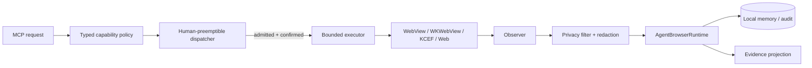

# Kotlin Auto WebView

繁體中文 · [English](README.md)

Kotlin Auto WebView 是一個跨 Android、iOS、Web/Wasm 與 Desktop 的 Kotlin Multiplatform **有邊界 Agent Browser／Capability Workspace**。既有可執行基線負責觀察與清洗頁面 Context、保存本地記憶、投影證據、接收 Typed MCP Proposal，所有改變狀態的權限都必須經過決定性 Policy、人類搶回控制權與精確證據。

本專案目前也在設計 **Creator Capability Browser**：

```text
通過 Admission 的來源
→ v7.2 時間／結構卡片
→ 證據與矛盾圖
→ 程序 DAG
→ 獨立資格審查的 SKILL.md
→ Creator Workspace／Community Skill Edition
→ 真實使用者 Outcome 回寫
```

Creator 主線**尚未實作**。目前完成的是系統提示詞、平台／媒體／權利風險契約與 Community Edition 架構；其餘工作已拆成具有路徑租約、State Machine、負向控制與證據上限的 GitHub issues。

## 精確目前狀態

Snapshot：2026-08-19，Creator 文件 convergence issue [#98](https://github.com/ed3c/kotlin-auto-webview/issues/98)。

| Plane | 精確 subject | 狀態 | 能證明什麼 |
|---|---|---|---|
| 既有 KMP Agent-browser 基線 | PR #1 head `a449fac24b8ee602b3c36ae60e972fe25f35c516` | repo 既有記錄為 common/Desktop/Wasm/Android/iOS simulator `PASS` | 舊有 bounded browser，不是 Creator runtime |
| v7.2 程序編譯 Prompt | main `290a82f0394a42e0c20949a36ab575229b95051d` | `MATERIALIZED_DOCUMENT` | Prompt／契約 |
| 平台、媒體、權利風險 | #80／Draft PR #81 `8e2181e11144ae5bb349c1a0aa9b790485d60c4d` | `DRAFT_PUBLISHED` | 架構風險契約 |
| Community Skill Edition | #82／Draft PR #83 `d8b105ba1bb7be88caf9ae52eaa5bc31bf4667c9` | `DRAFT_PUBLISHED` | 架構、Schema、Example |
| Creator 實作 atoms | #84–#97 | `NOT_IMPLEMENTED` | Owner 與驗收契約 |
| 跨媒體 adapters | #102–#110 | `NOT_IMPLEMENTED` | Source-specific 計畫 |
| 共享文件 convergence | #98／`docs/creator-capability-convergence` | `IN_PROGRESS_DOCUMENTATION` | 目前索引工作；精確 moving head 以 GitHub metadata 為準 |
| Docs CI、Prompt、handoff、政策／DoD review | #99–#101、#111–#117 | `PLANNED` | 未來文件／證據工作 |
| Local Git Town、worktree、本地驗證 | 無 receipt | `NOT_EXERCISED`／`BLOCKED_POLICY` | 不可主張本地 runtime |
| 法律、平台、Store、實機、Provider | 外部權限 | `EXTERNAL_AUTHORITY_REQUIRED`／`NOT_EXERCISED` | 無核准／Production 主張 |

以下證據狀態不可互換：

```text
PASS
FAIL
ABSENT
NOT_IMPLEMENTED
NOT_EXERCISED
SKIPPED_BY_POLICY
DENIED_BY_ARCHITECTURE
EXTERNAL_AUTHORITY_REQUIRED
```

Issue、branch、Draft PR、Schema 或 Prompt 的存在都不等於實作。

## 產品邊界

```text
WebView / WKWebView / KCEF / 官方媒體 Surface
= 觀察與播放 substrate

Kotlin runtime
= identity、policy、state、lifecycle、privacy、人類 authority

v7.2
= source-bound cards、stable IDs、typed links、evidence graph

Procedural Compiler
= card graph → state/decision DAG → candidate Procedural IR

Independent Qualifier
= executable／discriminative／falsifiable／observable／transferable verdict

Community Edition
= versioned SkillPatch variants、conflicts、moderation、outcomes
```

### Edition modes

| Mode | 媒體行為 | 狀態 |
|---|---|---|
| `REFERENCE_EDITION` | 官方播放器或官方 App；只存 locator/timestamp/card | 第一個 MVP，#95 |
| `OFFICIAL_CLIP_REFERENCE` | 只保存可用的官方 Clip URL | reference lane |
| `LICENSED_RENDER_EDITION` | 只有精確 rights packet 才可截圖、片段、衍生影片、原生 PiP | rights-gated #96 |

```text
公開可見 != 可重用媒體
embed ready != 內容授權
Media Integrity != Premium entitlement != 著作權許可
社群人氣 != 證據真實
產生 Skill != Qualified Skill
```

## 既有 bounded-browser 資料流



## Creator Capability 資料流

```mermaid
flowchart LR
    SRC[YouTube / PDF / EPUB / Notion / X / Web / Drive-Docs / local] --> ADM[逐操作 Source Admission]
    ADM -->|允許 / 最小化| ADAPTER[Source-specific adapter]
    ADM -->|拒絕 / 未知| BLOCK[穩定 degraded / blocked state]
    ADAPTER --> EVENTS[清洗後事件 + revision-bound locator]
    EVENTS --> IDX[v7.2 auto-indexer]
    IDX --> CARDS[Atomic cards + typed evidence links]
    CARDS --> EDITOR[Timeline / Graph / Procedure editor]
    CARDS --> COMP[Procedural compiler]
    COMP --> IR[Candidate Procedural IR]
    IR --> QUAL[Independent qualifier]
    QUAL -->|QUALIFIED| SKILL[Qualified Skill variant]
    QUAL -->|NOT_QUALIFIED| NQ[缺少證據／矛盾回路]
    SKILL --> WS[Portable creator workspace]
    SKILL --> COMM[Community SkillPatch variants]
    COMM --> REF[Reference Edition]
    REF --> EXP[Creator experiment]
    EXP --> OUT[USER_OUTCOME]
    OUT --> FOLD[保留／強化／縮窄／修訂／反駁]
    CHANGE[來源／權利／貢獻變更] --> REV[Impact + revocation]
    REV --> IDX
    REV --> REF
```



## Creator State Machines

### Source／Indexing

```text
SOURCE_REQUESTED
→ ACCESS／RIGHTS／DESTINATION CLASSIFIED
→ SOURCE_READY | LOCATOR_ONLY | BLOCKED
→ STRUCTURAL_OR_TEMPORAL_EVENTS
→ AUTO_INDEXING
→ TIMELINE_CARDS_READY
→ SEMANTIC_GRAPH_READY
→ PROCEDURE_CLUSTERS_READY
```

### Procedure／Skill

```text
CARD_SUBGRAPH_SELECTED
→ PROCEDURAL_ATOMS
→ STATE_MACHINE_RECOVERED
→ COUNTERFACTUALS／CONFOUNDERS
→ CROSS_CASE_INTERSECTION
→ PROCEDURAL_IR_CANDIDATE
→ INDEPENDENT_QUALIFICATION
→ QUALIFIED | NOT_QUALIFIED
```

### Community Edition

```text
SOURCE_REGISTERED
→ RIGHTS_CLASSIFIED
→ EDITION_MODE_SELECTED
→ COMMUNITY_CONTRIBUTIONS_OPEN
→ PATCH_SUBMITTED
→ RIGHTS／LEAKAGE／MODERATION／QUALIFICATION
→ PROCEDURE_VARIANTS_ASSEMBLED
→ REFERENCE_EDITION_READY | LICENSED_RENDER_READY
→ PRIVATE_PREVIEW
→ PUBLICATION_AUTHORIZED | PUBLICATION_BLOCKED
```

### Revocation／Outcome

```text
SOURCE／RIGHTS／CONTRIBUTION CHANGE
→ IMPACT_GRAPH
→ REINDEX | LOCATOR_ONLY | PARTIAL_TAKEDOWN | FULL_TAKEDOWN
→ CLEANUP RECEIPTS

USER EXPERIMENT
→ OUTCOME RECEIPT
→ PRESERVED | STRENGTHENED | NARROWED | REVISED | REFUTED
```

## 目錄 → State Machine → DAG 分工

`[P]` 表示規劃路徑，不代表目錄或程式已存在。

| Path | Owner／State Machine | Input | Output／下一 Owner | 禁止耦合 | 狀態 |
|---|---|---|---|---|---|
| `domain/`、`web/`、`privacy/`、`cache/`、`projection/`、`mcp/`、`capability/`、`dispatcher/`、`runtime/`、`ui/` | 既有 bounded-browser planes | page context、typed proposal | 清洗證據／受控動作 | raw model authority | 基線已實作 |
| `docs/security/` | 平台／媒體／權利 Admission | 外部 policy／rights claim | risk decisions → adapters | 自行法律核准 | Draft PR #81 |
| `docs/creator/` | Creator 架構、DAG、Stack、Prompt | GitHub/code/evidence graph | Agent routing | 實作宣稱 | 文件進行中 |
| `creator/contract/` `[P]` | `DECODE → VALIDATE → ADMIT/REJECT` | 不可信 DTO | typed contracts | platform I/O／self-qualification | #84 |
| `creator/source/youtube/` `[P]` | player/embed/seek | video identity | source events → index/UI | download／hidden PiP／Premium claim | #85 |
| `creator/source/pdf/` `[P]` | page/region/text/figure | authorized PDF | events → index | rights inference／full-copy | #103 |
| `creator/source/epub/` `[P]` | chapter/CFI/DRM | authorized EPUB | events → index | DRM bypass／source substitute | #104 |
| `creator/source/notion/` `[P]` | workspace/page/block authority | admitted connector/session | events → index | visibility→ownership | #105 |
| `creator/source/x/` `[P]` | observation-only post/thread/article | public/authorized X | events → index | website action automation | #106 |
| `creator/source/web/` `[P]` | origin/navigation/DOM | admitted Web page | events → index | CSP/origin bypass | #107 |
| `creator/source/google/` `[P]` | Drive/Docs OAuth/org/revision | connector/API | events → index | embedded OAuth/token leakage | #108 |
| `creator/source/local/` `[P]` | URI/digest/codec/resource | user-selected file | events → index | possession→ownership | #109 |
| `creator/source/registry/` `[P]` | adapter resolution/convergence | source request | exact adapter result | fake parity/fallback | #110 |
| `creator/indexing/` `[P]` | segmentation/cards/links/dedup | admitted events | graph → editor/compiler | arbitrary chunks/evidence loss | #86 |
| `creator/editor/`、`creator/ui/` `[P]` | immutable curation | cards + source events | selected DAG | evidence mutation/player overlay | #87 |
| `creator/compiler/` `[P]` | cards → IR → candidate Skill | evidence graph | candidate → qualifier | raw source/self-qualification | #88 |
| `creator/qualification/` `[P]` | G1–G8 adversarial verdict | candidate + evidence | verdict → runtime | shared mutable compiler authority | #89 |
| `creator/provider/`、`creator/export/` `[P]` | destination admission/budget | minimized payload | provider receipt/workspace | consumer session-token reuse | #90 |
| `creator/runtime/` `[P]` | core convergence | verified leaf heads | vertical slice | invent leaf fixes | #91 |
| `creator/community/model|store/` `[P]` | SkillPatch/version/conflict | contributor data | variants | votes→truth | #92 |
| `creator/community/moderation/` `[P]` | filter/report/block/appeal | public UGC | moderation receipt | model as legal authority | #93 |
| `creator/freshness/`、`community/revocation/` `[P]` | impact/cleanup | source changes | reindex/takedown | cached-source continuation | #94 |
| `creator/community/playback/reference/` `[P]` | foreground source dock/card seek | player/cards/variants | reference edition | media copy／OS PiP | #95 |
| `creator/community/render/` `[P]` | rights-bound render/PiP | licensed assets | derivative receipt | standard YouTube source | #96 |
| `tests|scripts|receipts/creator/` `[P]` | exact evidence lanes | exact subject | receipts | evidence laundering | #97 |

## Molecular DAG

```text
#80 risk/policy docs → Draft PR #81
└─ #82 Community architecture → Draft PR #83
   └─ #84 creator contracts
      ├─ #85 YouTube adapter
      ├─ #86 v7.2 auto-indexer
      ├─ #87 card editor
      ├─ #88 procedural compiler
      ├─ #89 independent qualifier
      ├─ #90 model/destination router
      └─ #91 core convergence
         └─ #92 Community SkillPatch store
            ├─ #93 UGC moderation
            ├─ #94 source revocation
            ├─ #95 reference edition
            │  └─ #96 licensed render/native PiP [rights-gated]
            └─ #97 evidence convergence

#98 shared docs convergence
├─ #99 docs CI
├─ #100 Local Handoff Queue
├─ #101 zero-context prompts
└─ #111–#117 index/snapshot/global review/roadmap/DoD/non-claims/policy drift

#102 multi-source epic
├─ #103 PDF
├─ #104 EPUB
├─ #105 Notion
├─ #106 X
├─ #107 Web
├─ #108 Drive/Docs
├─ #109 local files/media
└─ #110 source registry
```

Git ancestry 只表示「消耗未合併 parent bytes」；跨 leaf 的完成依賴是 process DAG，不可偽造成多 parent Git history。

## Git Town／Stack 狀態

```text
main@290a82f0394a42e0c20949a36ab575229b95051d
└─ agent/media-rights-risk-register@8e2181e11144ae5bb349c1a0aa9b790485d60c4d  #80/PR #81
   └─ agent/community-skill-edition-design@d8b105ba1bb7be88caf9ae52eaa5bc31bf4667c9  #82/PR #83
      └─ docs/creator-capability-convergence  #98；精確 head 以 GitHub metadata 為準
```

#84–#110 的 implementation branch 目前都只是 issue 中的規劃；Live Git Town executable/worktree/sync 仍是 `ABSENT`／`NOT_EXERCISED`，merge 是 `EXTERNAL_AUTHORITY_REQUIRED`。

完整索引：[`docs/git/STACKED_PRS.md`](docs/git/STACKED_PRS.md)、[`docs/creator/MOLECULAR_STACK_INDEX.md`](docs/creator/MOLECULAR_STACK_INDEX.md)。

## MVP、後續與外部權限

```text
MVP_REFERENCE_EDITION
  #84–#91 + #92/#94/#95 的 private/reference 部分 + 精確 docs/evidence

PUBLIC_COMMUNITY_GATED
  #93 executable UGC controls + Store/publication review

LICENSED_RENDER_RIGHTS_GATED
  #96 exact rights packet + licensed media + physical PiP/render evidence

POST_MVP_MULTI_SOURCE
  #102–#110，各自獨立 admission
```

MVP 不依賴所有未來 adapter 或 licensed render。Creator 成長、收入與付費需求屬於市場 Outcome，不是技術 Definition of Done。

## Agent 讀取順序

1. [`AGENTS.md`](AGENTS.md)
2. [`docs/security/CONTENT_PLATFORM_MEDIA_RISK_REGISTER.md`](docs/security/CONTENT_PLATFORM_MEDIA_RISK_REGISTER.md)
3. [`docs/creator/COMMUNITY_SKILL_EDITION_ARCHITECTURE.md`](docs/creator/COMMUNITY_SKILL_EDITION_ARCHITECTURE.md)
4. [`docs/creator/PROCEDURAL_SKILL_COMPILER_SYSTEM_PROMPT.md`](docs/creator/PROCEDURAL_SKILL_COMPILER_SYSTEM_PROMPT.md)
5. [`docs/creator/README.md`](docs/creator/README.md)
6. [`docs/creator/AGENTS.md`](docs/creator/AGENTS.md)
7. [`docs/creator/CREATOR_CAPABILITY_DAG.md`](docs/creator/CREATOR_CAPABILITY_DAG.md)
8. [`docs/creator/MOLECULAR_STACK_INDEX.md`](docs/creator/MOLECULAR_STACK_INDEX.md)
9. 精確 issue、branch、PR、head/tree 與最近的 README/AGENTS

## 驗證與權限邊界

既有檢查：

```bash
./gradlew :composeApp:allTests
./gradlew :composeApp:compileKotlinDesktop
./gradlew :composeApp:wasmJsBrowserDistribution
./gradlew :composeApp:assembleDebug
# macOS:
./gradlew :composeApp:linkDebugFrameworkIosSimulatorArm64
```

Creator-specific 命令在 owning implementation issues 真正提供 entrypoint 前不會被捏造。#100 保持 Local Handoff Queue `ABSENT`；#99 擁有未來 exact-head docs CI。

法律判斷、授權／條款、Creator／媒體權利、Provider account、實機、App Store／Google Play、merge、release、production deployment 與 destructive rollback 都屬於 Human／組織權限。
