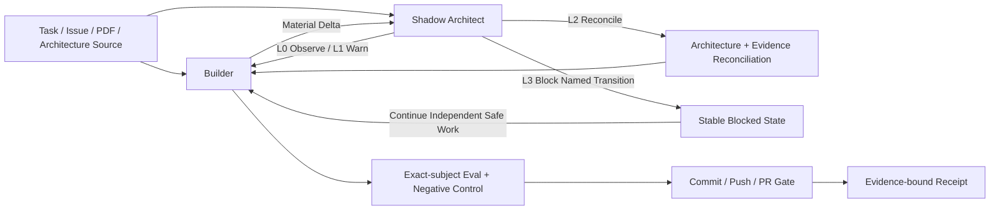
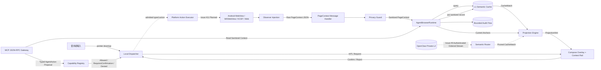
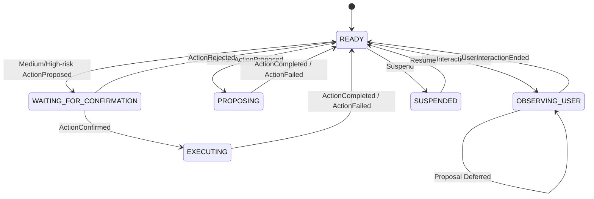
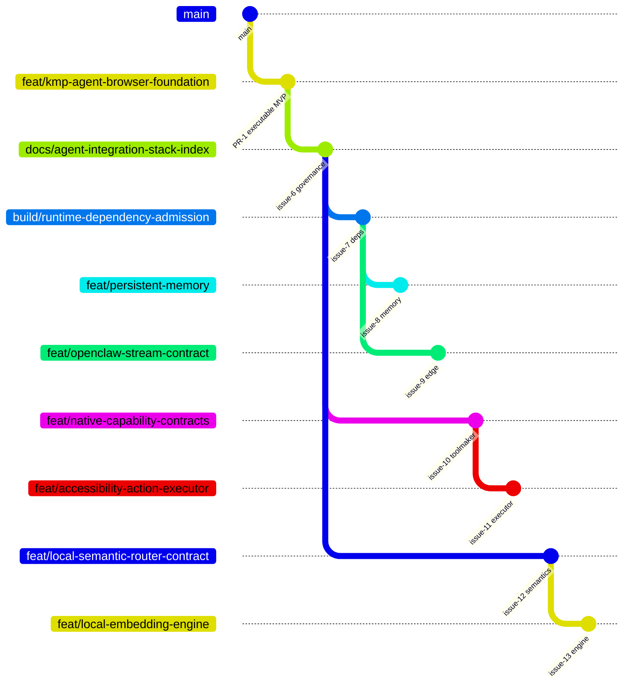

# Kotlin Auto WebView

繁體中文 · [English](README.md)

這是一個可上架導向的 Kotlin Multiplatform 瀏覽器外殼，目標平台包含 Android、iOS、Web/Wasm 與 Desktop。它把 WebView 從被動容器轉為**有邊界、可驗證、可由人類隨時接管的 Agent Surface**：觀察並清洗頁面 Context、保存在地 L1 記憶、把相關證據投影回頁面、以 MCP 暴露受控 Resource／Proposal，所有會改變狀態的權限都必須通過決定性 Policy 與 Human-in-the-loop。

> **目前基線：** Draft PR #1 已完成可執行架構 MVP。Head `a449fac24b8ee602b3c36ae60e972fe25f35c516` 已通過 Common tests、Desktop compile、Wasm production distribution、Android debug assembly 與 iOS Simulator ARM64 framework linking。商店交付、永久記憶、Authenticated OpenClaw L2、原生動作執行與可上架的端側 Semantic Engine 仍是獨立工作。

## 整合真實狀態

| 能力 | 實作 | 證據狀態 | Owner／下一關卡 |
|---|---|---|---|
| Android、iOS、Web/Wasm、Desktop 入口 | 已實作 | 基線 Head `PASS` | PR #1 |
| WebView Observer、DOM、Selection、Fingerprint、Geometry | 已實作 | Common／Platform build `PASS` | `web/` |
| Sensitive field 排除與 Kotlin Redaction | 已實作 | Common tests `PASS` | `privacy/` |
| L1 Semantic Cache | In-memory 決定性基線 | Common tests `PASS` | `cache/`；永久化 #8 |
| OpenClaw L2 Stream | 架構契約而已 | `NOT_IMPLEMENTED` | Epic #4；Transport #9 |
| Cache-to-DOM Projection | Bubble／Context Rail MVP | Common tests `PASS` | `projection/` |
| Capability Policy 與人類搶回控制權 | 已實作 | Common tests `PASS` | `capability/`、`dispatcher/` |
| 受控 Browser Action Executor | 尚無 Privileged Executor | `NOT_IMPLEMENTED` | Contract #10；Executor #11 |
| MCP | 跨平台 JSON-RPC Discovery／Resource／Proposal Gateway | Common tests `PASS` | `mcp/` |
| MCP Peer Authentication／Network Listener | Common Core 刻意不包含 | `NOT_IMPLEMENTED` | #9 |
| Local Semantic Router | Lexical Ranking 位於 Cache 基線 | 基線已實作；拆分契約待完成 | #12 |
| On-device Embedding／SLM Engine | 尚未選定 | `NOT_IMPLEMENTED` | #13 |
| Android Play 交付 | 只有 Debug APK | Store Evidence `NOT_EXERCISED` | #2 |
| iOS App Store／TestFlight | 只有 Simulator Framework | Store Evidence `NOT_EXERCISED` | #3 |
| Web 部署 | 已產生 Production Wasm Artifact | Deployment `NOT_EXERCISED` | #5 |
| Git Town Static Policy | `.git-town.toml` 對應 v24.0.0 | 設定存在 | Issue #6 |
| Git Town Executable Admission／Live Sync | 缺 Host Binary、Checksum 與 Canary | `ABSENT`／`NOT_EXERCISED` | `docs/git/GIT_TOWN_ADMISSION.md` |
| 自主雙軌控制面 | Repo Binding 與 Safety Profile | 文件已實作；本地 Lane `NOT_EXERCISED` | `docs/automation/` |
| 自動 Merge | 沒有 Repo-owned 預先授權 | `EXTERNAL_AUTHORITY_REQUIRED` | 保留 Exact PR Open |

`PASS`、`FAIL`、`ABSENT`、`NOT_IMPLEMENTED`、`NOT_EXERCISED`、`SKIPPED_BY_POLICY` 與 `EXTERNAL_AUTHORITY_REQUIRED` 不可互換。

## 自主雙軌控制面

本 Repo 透過薄型 Binding 套用使用者提供的 **Repository Autonomous Dual-Lane Integration + Shadow Architecture + Git Town System Prompt v2.0**。可攜式法則仍由共享 Skill 擁有；Repo 只保存精確 Identity、State Ownership、Eval、Task Packet 與 Safety Postcondition。



### 目前 Automation Admission

| Operation Class | State | Boundary |
|---|---|---|
| Repository／Forge Inspect | `READ_ONLY_ADMITTED` | 同一個 Public Repo |
| Feature Branch Write | `BRANCH_WRITE_ADMITTED` | 宣告的 PR Branch；Fast-forward only |
| Issue／PR Publication | `REMOTE_PR_ADMITTED` | Exact Head/Base、Disclosure Scan、既有權限 |
| Local Linked Worktree／Dirty-state Proof | `NOT_EXERCISED` | 目前 Connector 不暴露 Local Checkout State |
| Live Git Town Sync | `BLOCKED_POLICY` | 缺 Exact Host Binary、Wrapper、Lease、Receipt、Canary |
| Merge | `EXTERNAL_AUTHORITY_REQUIRED` | Repo 沒有預先授權 Trusted Automation；Auto-merge 關閉 |
| Store／Release／Production／Settings／Secrets／License Change | Denied | 超出 Agent Authority |

被 Block 的 Transition 不會觸發問題，也不會停止其他 Path-disjoint Safe Slice。詳見 [`docs/automation/README.md`](docs/automation/README.md) 與 [`docs/automation/REPOSITORY_PROFILE.md`](docs/automation/REPOSITORY_PROFILE.md)。

## Runtime 資料流



### 端到端硬法則

1. Observation 必須先於 Action。
2. Raw Page Data 必須在 Cache、Projection、MCP、Audit 前清洗。
3. Model 或 Remote Node 只能提出 Typed Action，不能自己授權。
4. 使用者互動永遠優先於 Agent。
5. 未來執行前必須重新驗證 Page Identity 與 Anchor Freshness。
6. Same-origin、CSP、iframe 等限制必須明示，不得繞過。
7. 自主工作不得改變 Repo Visibility、Owner、Access、Default Branch、License／Usage Rights、Remote Topology 或 Private-data Boundary。
8. Missing Evidence 仍是 Missing；Green Build 不能升級 Local、Physical Device、Store、Legal、Merge 或 Production Lane。

## 目錄 → State Machine → Data Contract

目前只有 `dispatcher/` 擁有序列化 Enum State Machine；其他 Runtime 列是必須遵守的 Lifecycle／Pipeline Contract。

| Path | Domain／Owner | State／Transition Responsibility | Input | Output | Forbidden Coupling | Evidence／Next Slice |
|---|---|---|---|---|---|---|
| `domain/` | Shared Contract | `DEFINE -> SERIALIZE -> VALIDATE` | Constructor／Decoder Value | `PageContext`、`AgentAction`、`ProjectionHint`、Cache／Audit DTO | I/O、Platform API、Policy | Serialization Test |
| `web/` | Browser Observer | `NOT_INJECTED -> OBSERVING -> EMITTING -> RETRY/DEGRADED` | Page Lifecycle、DOM／Selection／Mutation | Raw `PageContext` JSON | Privileged Action、Secret Retention、Authorization | Observer／Privacy Control |
| `privacy/` | Data Boundary | `RAW -> FILTERED -> REDACTED -> BOUNDED` | Raw Context | Sanitized Context | Ranking、Remote Transport、Permission | Privacy Test |
| `cache/` | L1 Memory | `QUERY -> HIT/MISS`；`PUT -> STORED`；`REMOVE/CLEAR` | Sanitized Text／Record | Ranked `CacheMatch` | UI、Network Identity、Execution | Cache Test；#8 |
| `projection/` | Visual Evidence | `MATCH -> ANCHORED/BUBBLE` 或 `UNMATCHED/CONTEXT_RAIL`；Stale Drop | Anchors + Cache Match | `ProjectionHint` | Authorization、DOM Mutation | Projection Test；#11/#12 |
| `mcp/` | Protocol Gateway | `PARSE -> VALIDATE -> DISCOVER/READ/PROPOSE -> RESULT/ERROR` | JSON-RPC | Sanitized Resource／Typed Proposal | Listener、Peer Trust、WebView／Native Call | MCP Test；#9 |
| `capability/` | Authorization Policy | Unknown／Disabled／Missing／Over-risk `-> DENIED`；Low `-> ALLOWED`；Medium／High `-> REQUIRES_CONFIRMATION` | Action + Permission | `PolicyDecision` | Temporal Authority、UI | Policy Test；#10 |
| `dispatcher/` | Human／Agent Authority | `READY`、`OBSERVING_USER`、`PROPOSING`、`WAITING_FOR_CONFIRMATION`、`EXECUTING`、`SUSPENDED` | User／Action Event | `DispatcherSnapshot` | Capability Invention、Platform Implementation | State Test；#11 |
| `runtime/` | Pipeline Orchestration | `CAPTURE -> SANITIZE -> QUERY -> PROJECT -> STORE -> AUDIT` | Context、Proposal、HITL | Context／Projection／Audit／Dispatcher Flow | Store Packaging、Transport Identity | Common Test；#8/#9 |
| `ui/` | Rendering／HITL | `RENDER -> OBSERVE_USER -> REQUEST_CONFIRMATION -> CONFIRM/REJECT -> RENDER` | Runtime Flow + User Input | UI Event | Hidden Authorization、Raw Model Execution | UI／Semantics Test |
| `androidMain/` | Android Adapter | `CREATE -> ATTACH_RENDERER -> FOREGROUND/BACKGROUND -> DESTROY` | Android Lifecycle | Android Result | Android-only Policy Divergence | #2/#10/#11 |
| `iosMain/` + `iosApp/` | Apple Adapter／Host | `CREATE_CONTROLLER -> ATTACH_WKWEBVIEW -> ACTIVE/BACKGROUND -> RELEASE` | iOS Lifecycle | iOS Result | iOS-only Policy Divergence | #3/#10/#11 |
| `desktopMain/` | Desktop／KCEF | `INIT_KCEF -> READY -> ACTIVE -> SHUTDOWN` | Desktop Lifecycle | Desktop Result | 把 Chromium 假設套到 Mobile | Desktop Runtime Task |
| `wasmJsMain/` | Web／Wasm | `BOOT -> MOUNT -> ACTIVE -> UNMOUNT` | Browser Lifecycle | Web Event | 宣稱繞過 Same-origin／CSP | #5 |
| `docs/automation/` | Autonomous Control Plane | `SM-AUTO-001`、`SM-SHADOW-001`、`SM-SAFE-001`、`SM-PUB-001` | Repo／Task／Evidence Metadata | Admission、Intervention、Safety、Receipt Contract | 複製 Shared Skill 或捏造 Runtime Truth | Issue #6／PR #15 |
| `docs/git/` | Stack Governance | Task Admission、Branch／Lease／Sync／Publication | Issue、Ref、Exact Tool Evidence | Stack Graph、Worker Outcome、Receipt | Runtime Feature Ownership、Merge Authority | Issue #6／Future Wrapper |
| `docs/harness/` | Verification Architecture | Invariant -> Observer -> Oracle -> Control -> Evidence | Exact Subject + Environment | Evidence State／Receipt | Cross-subject Evidence Promotion | All Slices |

### Dispatcher State Machine



### Autonomous State Machine 索引

| ID | Owner | Purpose |
|---|---|---|
| `SM-AUTO-001` | Autonomous Orchestrator | 從 Discovery 到 Furthest Safe Delivery |
| `SM-SHADOW-001` | Shadow Architect | L0-L3 Architecture Delta Intervention |
| `SM-SAFE-001` | Safety Binder | 不擴權的 Read／Local／Branch／PR／Merge Admission |
| `SM-PUB-001` | Publication Gate | 分離 Exact-head Commit／Push／PR／Merge |
| `SM-DISP-001` | `dispatcher/` | User Input Preemption 與 Action Lifecycle |

詳細契約請看 `docs/automation/README.md`。

## Repository Layout

```text
.git-town.toml                 # Static No-push Policy；不等於 Executable Admission
AGENTS.md                      # Repository-wide Agent Authority
README.md / README.zh-TW.md    # Architecture、State/Data、Automation、Stack Index

composeApp/
  src/commonMain/kotlin/dev/ed3c/autowebview/
    domain/                    # Serializable Contract；No I/O
    web/                       # Observer Injection + Bridge
    privacy/                   # Filtering／Redaction Boundary
    cache/                     # L1 Contract + In-memory Implementation
    projection/                # Anchor + Rendering Hint
    mcp/                       # Transport-independent JSON-RPC Gateway
    capability/                # Capability Policy
    dispatcher/                # Human／Agent State Machine
    runtime/                   # Orchestration + Bounded Audit
    ui/                        # Browser Shell、Overlay、HITL
  src/commonTest/              # Shared Evidence
  src/androidMain/             # Android Adapter
  src/iosMain/                 # iOS／WKWebView Adapter
  src/desktopMain/             # Desktop／KCEF
  src/wasmJsMain/              # Web Entry

iosApp/                       # Xcode Host Shell

docs/
  automation/                 # Autonomous Dual-lane／Shadow／Safety Binding
  architecture/               # Hard Laws／ADR
  git/                        # Git Town Profile／Stack／Worker Protocol
  harness/                    # Eval／Shadow Checkpoint／Safety／Evidence
  release/                    # Platform Delivery Runbook
  security/                   # Threat Model
  TRACEABILITY.md             # REQ／SM／DF／INV／EVAL／WP／STACK／Evidence Index

.github/
  ISSUE_TEMPLATE/             # Eval-first + Safety-bound Task Packet
  PULL_REQUEST_TEMPLATE.md    # Branch／Path／State／Safety／Evidence Contract
  workflows/                  # CI／Pages
```

## Git Town Stacked PR Governance

本 Repo 使用 Canonical [`git-town-stacked-pr-worker`](https://github.com/ed3c/skills-shared/tree/main/skills/git-town-stacked-pr-worker)，不在 Repo 內複製 Skill。

```text
Git Town                  Branch Hierarchy + Bounded Local Synchronization
Consumer Repository       Profile + Task Packet + Path Lease + Eval + CI + Receipt
GitHub Publication Gate   Exact-HEAD Publication Admission
Pre-existing Policy       僅在明確預先授權時提供 Merge Authority
External Authority        Semantic Conflict、Legal、Store／Production／Settings
```

### Admission 狀態

| Lane | State |
|---|---|
| Static `.git-town.toml` for v24.0.0 | Present |
| Exact Source Release + Checksums Manifest | Recorded |
| Host OS／Architecture Binary Checksum | `ABSENT` |
| Provenance／SBOM／Legal Approval | `ABSENT`／`NOT_EXERCISED` |
| Local Worktree／Lease Wrapper | `NOT_IMPLEMENTED`；Current Session `NOT_EXERCISED` |
| Live Dry-run／No-push Sync | `NOT_EXERCISED` |
| Conflict Canary | `NOT_EXERCISED` |
| Exact-head Publication Gate | `NOT_IMPLEMENTED` |
| Repo-preauthorized Auto Merge | `ABSENT` |

Admission 完成前，Worker 回傳 `BLOCKED_POLICY`；不得安裝 `latest`、替換工具或手動繞過 Publish Gate。

### Planned Branch Graph



包含 Release 與 Convergence 的完整圖請看 [`docs/git/STACKED_PRS.md`](docs/git/STACKED_PRS.md)。

### 分子化 Stack PR 索引

| Order | Issue | Planned Branch | Parent | Class | Exclusive Path Lease | Evidence／State |
|---:|---:|---|---|---|---|---|
| 0 | #1 | `feat/kmp-agent-browser-foundation` | `main` | foundation | Initial Implementation | Draft PR；Baseline CI `PASS` |
| 1 | #6 | `docs/agent-integration-stack-index` | Foundation | foundation | Automation／Git／Harness／Root Docs／Templates | Current Docs Stack；Local Git Town `NOT_EXERCISED` |
| 2 | #7 | `build/runtime-dependency-admission` | Docs Stack | foundation | Gradle／Dependency Evidence／NOTICE | Exact Variant／License；No Feature Code |
| 3A | #8 | `feat/persistent-memory` | Runtime Deps | child | `persistence/**`、Schema／Test、ADR-0004 | Migration／Restart／Redaction；`NOT_IMPLEMENTED` |
| 3B | #9 | `feat/openclaw-stream-contract` | Runtime Deps | child | `edge/**`、ADR-0005 | Auth／Order／Replay／Backpressure；`NOT_IMPLEMENTED` |
| 2B | #10 | `feat/native-capability-contracts` | Docs Stack | sibling | `toolmaker/**`、ADR-0006 | Contract／Policy Only；`NOT_IMPLEMENTED` |
| 3C | #11 | `feat/accessibility-action-executor` | Capability Contract | child | `executor/**`、ADR-0007 | Freshness／HITL／Preemption；`NOT_IMPLEMENTED` |
| 2C | #12 | `feat/local-semantic-router-contract` | Docs Stack | sibling | `semantics/**`、ADR-0008 | Deterministic Benchmark；`NOT_IMPLEMENTED` |
| 3D | #13 | `feat/local-embedding-engine` | Semantic Contract | child | Engine／Platform Adapter + Dependency Admission | Physical-device Budget／License；`NOT_IMPLEMENTED` |
| 4A | #2 | `release/android-play-evidence` | Action Executor | release | Android Release／Metadata／Runbook | Signed AAB + Device／Pre-launch |
| 4B | #3 | `release/ios-app-store-evidence` | Action Executor | release | iOS Signing／Metadata／Runbook | Signed Archive + TestFlight／Device |
| 2D | #5 | `release/web-deployment-evidence` | Docs Stack | sibling | Pages／Web Smoke Evidence | Deployed URL／Browser／CSP |
| 5 | #14 | `converge/release-readiness-index` | Docs Stack after Dependencies | convergence | Shared README／AGENTS／Traceability／Release Index | Full Exact-head Matrix + External Merge／Release Authority |

Issue #4 是 Persistent／Private L2／Semantic Runtime 的 Parent Epic。Leaf PR 禁止修改 Shared Index；#14 是唯一 Convergence Owner。

### Admission 後的 Worker Sync

```bash
git town sync --stack --dry-run --non-interactive --no-auto-resolve --no-push
git town sync --stack --non-interactive --no-auto-resolve --no-push
```

Exit `0` 只證明 Synchronization。Publication、CI、Merge、Store、Promotion、Rollback 都是獨立 Evidence Lane。

## Build 與 Verification

```bash
./gradlew :composeApp:allTests
./gradlew :composeApp:compileKotlinDesktop
./gradlew :composeApp:wasmJsBrowserDistribution
./gradlew :composeApp:assembleDebug
./gradlew :composeApp:linkDebugFrameworkIosSimulatorArm64  # macOS
```

```bash
./gradlew :composeApp:run
./gradlew :composeApp:wasmJsBrowserDevelopmentRun
```

Module Eval、Shadow Checkpoint、Mutation Control、Safety Postcondition、Evidence State 與 Release Boundary 請看 [`docs/harness/README.md`](docs/harness/README.md)。

## MCP 相容性邊界

`BrowserMcpGateway` 位於 `commonMain`，支援 Stateless Discovery 與 Legacy Initialize，只暴露 Sanitized Resource 與 Typed Action Proposal，不啟動 Network Listener。Platform／Edge Transport 必須加入 Authenticated Pairing、Version Negotiation、Origin Policy、Rate Limit、Cancellation、Replay Protection 與 Lifecycle Shutdown。

官方 Kotlin SDK 只能放在 Published Variant 與目標平台相符的 Edge／Platform Module；Common Core 不假裝不存在的 Variant 可以解析。詳細決策請看 [ADR-0003](docs/architecture/ADR-0003-mcp-platform-boundary.md)。

## 平台硬限制

- Mobile WebView 不支援 Chrome Extension；本專案使用受控 Observer Injection 與 JS Bridge。
- iOS 使用 WKWebView；Chromium-only Behavior 必須有 Fallback 或明確 Unsupported State。
- Web/Wasm 受 Same-origin、CSP、`X-Frame-Options` 與 iframe Policy 限制；任意網站可以拒絕嵌入。
- Desktop KCEF 提供最完整 Chromium Surface，但增加 Package Size、Memory 與 Cold Start 成本。

## Security、Privacy 與 Publication Model

不執行 Raw Model Output。Model／Remote Peer 只能提出 Typed Action；Capability Policy 與 Dispatcher 決定 Deny、Stage 或要求 Explicit Confirmation。Password／Payment Field 在進入 Kotlin 前排除。

自主 Repo 工作也必須保留 Visibility、Owner、Access／Ruleset、Default Branch、License／Usage-right Meaning、Private-data Boundary、User Local State、Protected History 與 Remote Topology。Current Connector 無法證明 Local User State，因此該 Lane 保持 `NOT_EXERCISED`，不能寫成 PASS。

正式版仍需 Identity Pinning、Attestation、Zero-telemetry Review、Persistent Audit、Physical Device、Store Privacy Declaration 與 External Authority。

請閱讀 [`SECURITY.md`](SECURITY.md)、[`docs/security/THREAT_MODEL.md`](docs/security/THREAT_MODEL.md)、[`docs/automation/README.md`](docs/automation/README.md) 與 [`docs/TRACEABILITY.md`](docs/TRACEABILITY.md)。

## 授權

Apache License 2.0。第三方元件維持各自授權，請見 [`NOTICE`](NOTICE)。本次 Autonomous Binding 不改變 License 或 Usage Rights。Git Town 是 Development Tool，必須依 `docs/git/GIT_TOWN_ADMISSION.md` 獨立 Admission。
