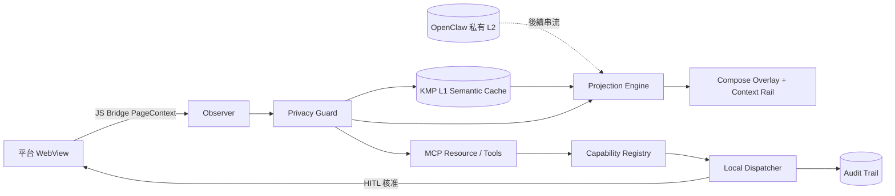

# Kotlin Auto WebView

繁體中文 · [English](README.md)

這是一個可上架導向的 Kotlin Multiplatform 瀏覽器外殼，目標平台包含 Android、iOS、Web（Wasm）與 Desktop。它不是把 WebView 當成被動頁面容器，而是建立一個**有邊界、可驗證、可由人類隨時接管的 Agent Surface**：擷取並清洗網頁 Context、保存在地 L1 Semantic Cache、把相關記憶投影回畫面、以 MCP 暴露 Resource/Tool，所有會改變狀態的動作都必須通過 Capability Policy 與 Human-in-the-loop。

> 現況：已完成可執行 MVP 與核心架構。四個平台都有入口；商店簽署、正式 Bundle Identity、OpenClaw 遠端串流、SQLDelight 永久儲存，以及完整 Accessibility Tree Action Executor，仍保留為後續明確工作項目。

## 已完成能力

| 平面 | 實作 |
|---|---|
| 跨平台 UI | Compose Multiplatform 共用 UI 與各平台入口 |
| Browser Surface | Android WebView、iOS WKWebView、Desktop KCEF、Web/Wasm adapter |
| Context Observer | 可重複安全注入的 JavaScript、DOM 文字清洗、可互動元素 Fingerprint、座標與 Selection 擷取 |
| Privacy Boundary | 排除密碼/付款欄位、Secret/Card/Private Key Redaction、內容長度與元素數限制 |
| KMP L1 Cache | 決定性 Semantic Cache 與 Relevance Ranking |
| Projection | DOM Anchor Matching、Overlay 導航線/氣泡、Context Rail Fallback |
| Local Dispatcher | 人類輸入優先、狀態機、Medium/High Risk 必須確認 |
| Capability Registry | Deny-by-default、權限檢查、Risk Ceiling |
| MCP | Kotlin MCP Server Factory，提供 `browser://current-page` 與受控 Browser Tools |
| Evidence | Audit Trail 與 Cache/Dispatcher/Policy/Privacy/Projection 共通測試 |

## 資料流



## 執行

```bash
./gradlew :composeApp:allTests
./gradlew :composeApp:run
./gradlew :composeApp:wasmJsBrowserDevelopmentRun
./gradlew :composeApp:assembleDebug
./gradlew :composeApp:linkDebugFrameworkIosSimulatorArm64
```

iOS 請在 macOS 上開啟 `iosApp/iosApp.xcodeproj`。

## 平台硬限制

- Android/iOS WebView 不支援 Chrome Extension；本專案以受控 JS Bridge 重建 Assistant Context。
- iOS 底層固定為 WKWebView，Chromium-only API 必須有 fallback。
- Web/Wasm 受 Same-origin、CSP、`X-Frame-Options` 與 iframe policy 限制；任意網站可能拒絕嵌入。
- Desktop KCEF 最接近完整 Chromium 體驗，但安裝體積與冷啟動成本較高。

完整設計請看 [Architecture Contract](docs/architecture/README.md)、[需求追溯矩陣](docs/TRACEABILITY.md) 與 [Threat Model](docs/security/THREAT_MODEL.md)。

## 安全邊界

模型輸出不會直接執行。模型只能提出 typed action；Capability Registry 與 Local Dispatcher 決定 Deny、Proposal 或 HITL。Password/Payment fields 在進入 Kotlin 前即被排除。正式版還需要加入 Transport Identity Pinning、Platform Attestation、Zero-telemetry build 與持久化 Audit Evidence。

## 授權

Apache License 2.0。第三方元件維持原授權，請見 [NOTICE](NOTICE)。
