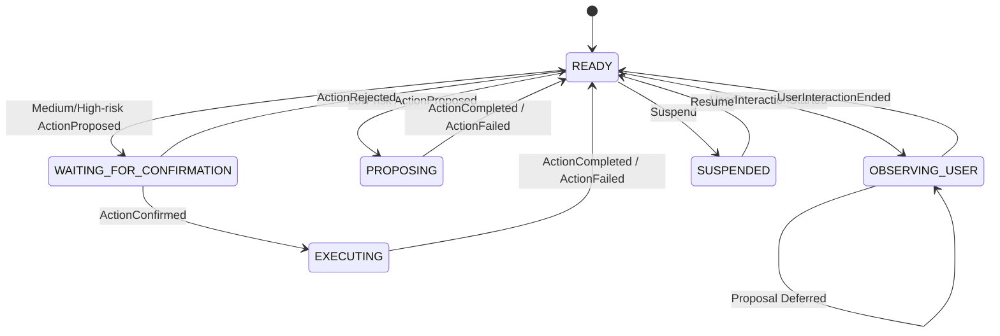
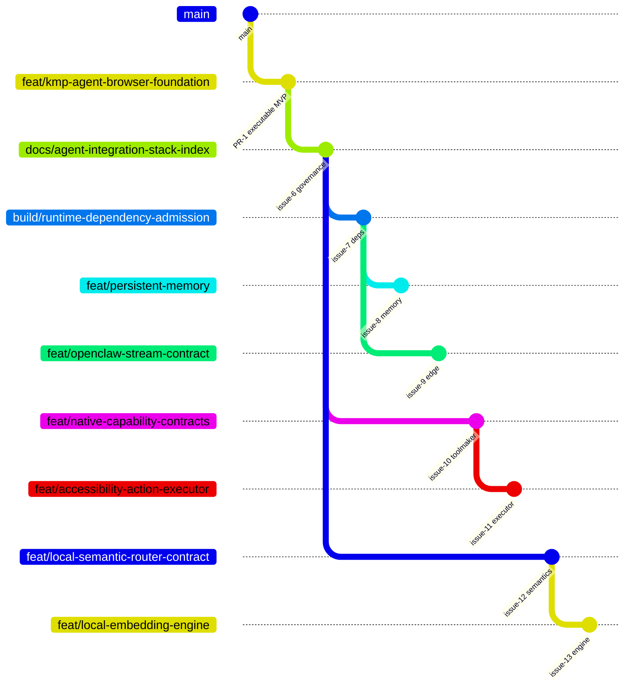

# Kotlin Auto WebView

繁體中文 · [English](README.md)

這是一個可上架導向的 Kotlin Multiplatform 瀏覽器外殼，目標平台包含 Android、iOS、Web/Wasm 與 Desktop。它不是把 WebView 當成被動頁面容器，而是建立一個**有邊界、可驗證、可由人類隨時接管的 Agent Surface**：觀察並清洗頁面 Context、保存在地 L1 記憶、把相關證據投影回頁面、以 MCP 暴露受控 Resource/Proposal，所有會改變狀態的權限都必須通過決定性 Policy 與 Human-in-the-loop。

> **目前基線：** Draft PR #1 已完成可執行架構 MVP。Head `a449fac24b8ee602b3c36ae60e972fe25f35c516` 已通過 Common tests、Desktop compile、Wasm production distribution、Android debug assembly 與 iOS Simulator ARM64 framework linking。商店交付、永久記憶、Authenticated OpenClaw L2、原生動作執行與可上架的端側 Semantic Engine 仍是獨立工作。

## 整合真實狀態

| 能力 | 實作 | 證據狀態 | Owner／下一關卡 |
|---|---|---|---|
| Android、iOS、Web/Wasm、Desktop 入口 | 已實作 | 基線 Head `PASS` | PR #1 |
| WebView Observer、DOM 文字、Selection、Fingerprint、Geometry | 已實作 | Common／Platform build `PASS` | `web/` |
| Sensitive field 排除與 Kotlin Redaction | 已實作 | Common tests `PASS` | `privacy/` |
| L1 Semantic Cache | In-memory 決定性基線 | Common tests `PASS` | `cache/`；永久化 #8 |
| OpenClaw L2 Stream | 架構契約而已 | `NOT_IMPLEMENTED` | Epic #4；Transport #9 |
| Cache-to-DOM Projection | Bubble／Context Rail MVP | Common tests `PASS` | `projection/` |
| Capability Policy 與人類搶回控制權 | 已實作 | Common tests `PASS` | `capability/`、`dispatcher/` |
| 受控 Browser Action Executor | 尚無 Privileged Executor | `NOT_IMPLEMENTED` | Contract #10；Executor #11 |
| MCP | 跨平台 JSON-RPC Discovery／Resource／Proposal Gateway | Common tests `PASS` | `mcp/` |
| MCP Peer Authentication／Network Listener | Common Core 刻意不包含 | `NOT_IMPLEMENTED` | #9 |
| Local Semantic Router | 目前 Lexical Ranking 位於 Cache 基線 | 已有基線；拆分契約待 #12 | #12 |
| On-device Embedding／SLM Engine | 尚未選定 | `NOT_IMPLEMENTED` | #13 |
| Android Play 交付 | 只有 Debug APK | Store Evidence `NOT_EXERCISED` | #2 |
| iOS App Store／TestFlight | 只有 Simulator Framework | Store Evidence `NOT_EXERCISED` | #3 |
| Web 部署 | 已產生 Production Wasm Artifact | Deployment `NOT_EXERCISED` | #5 |
| Git Town Static Policy | `.git-town.toml` 對應 v24.0.0 | 設定存在 | Issue #6 |
| Git Town Executable Admission／Live Sync | 缺 Host Binary、Checksum 與 Canary | `ABSENT`／`NOT_EXERCISED` | `docs/git/GIT_TOWN_ADMISSION.md` |

`PASS`、`FAIL`、`ABSENT`、`NOT_IMPLEMENTED`、`NOT_EXERCISED` 與 `SKIPPED_BY_POLICY` 不可互換。

## Runtime 資料流


### 端到端硬法則

1. Observation 必須先於 Action。
2. Raw Page Data 必須在 Cache、Projection、MCP、Audit 前完成清洗。
3. Model 或 Remote Node 只能提出 Typed Action，不能授權自己。
4. 使用者互動永遠優先於 Agent。
5. 未來真正執行前必須重新驗證 Page Identity 與 Anchor Freshness。
6. Same-origin、CSP、iframe 等限制必須明示，不得繞過。

## 目錄 → State Machine → Data Contract

下表區分「程式碼中明確存在的 State Machine」與「模組必須遵守的 Pipeline Transition Contract」。目前只有 `dispatcher/` 擁有序列化 Enum State Machine；其他列是該目錄的生命週期與責任邊界。

| 目錄 | 狀態／轉移責任 | Input | Output | 禁止耦合 |
|---|---|---|---|---|
| `domain/` | `DEFINE -> SERIALIZE -> VALIDATE` 不可變契約 | Constructor／Decoder Values | `PageContext`、`AgentAction`、`ProjectionHint`、Cache／Audit DTO | I/O、Platform API、Policy Decision |
| `web/` | `NOT_INJECTED -> OBSERVING -> EMITTING -> RETRY/DEGRADED` | Page Lifecycle、DOM／Selection／Mutation Event | Raw `PageContext` JSON | Privileged Execution、Secret Retention、Authorization |
| `privacy/` | `RAW -> FILTERED -> REDACTED -> BOUNDED` | Raw `PageContext` | Sanitized `PageContext` | Ranking、Remote Transport、Permission Decision |
| `cache/` | `QUERY -> HIT/MISS`；`PUT -> STORED`；`REMOVE/CLEAR` | Sanitized Text／Record | Ranked `CacheMatch` | UI Render、Network Identity、Action Execution |
| `projection/` | `MATCH -> ANCHORED/BUBBLE` 或 `UNMATCHED/CONTEXT_RAIL`；Stale 必須丟棄 | Current Anchors + Cache Matches | `ProjectionHint` List | Authorization、直接修改 DOM |
| `mcp/` | `PARSE -> VALIDATE -> DISCOVER/READ/PROPOSE -> RESULT/ERROR` | JSON-RPC Payload | Sanitized Resource 或 Typed Proposal | Network Listener、Peer Trust、WebView／Native Call |
| `capability/` | `UNREGISTERED/DISABLED/MISSING_PERMISSION/OVER_RISK -> DENIED`；Low Risk `-> ALLOWED`；Medium／High `-> REQUIRES_CONFIRMATION` | `AgentAction`、Granted Permissions | `PolicyDecision` | Temporal Authority、UI Render |
| `dispatcher/` | 明確狀態：`READY`、`OBSERVING_USER`、`PROPOSING`、`WAITING_FOR_CONFIRMATION`、`EXECUTING`、`SUSPENDED` | User／Action Lifecycle Event | `DispatcherSnapshot` | Capability Inventing、Platform Implementation |
| `runtime/` | `CAPTURE -> SANITIZE -> QUERY -> PROJECT -> STORE -> AUDIT` | Page Context、Proposal、HITL Event | Context／Projection／Audit／Dispatcher StateFlow | Store Packaging、Transport Identity |
| `ui/` | `RENDER -> OBSERVE_USER -> REQUEST_CONFIRMATION -> CONFIRM/REJECT -> RENDER` | Runtime Flow 與 User Input | UI Event | Hidden Authorization、Raw Model Execution |
| `androidMain/` | `CREATE -> ATTACH_RENDERER -> FOREGROUND/BACKGROUND -> DESTROY` | Android Lifecycle + Shared Contract | Android Renderer／Tool Result | Android-only Policy Divergence |
| `iosMain/` + `iosApp/` | `CREATE_CONTROLLER -> ATTACH_WKWEBVIEW -> ACTIVE/BACKGROUND -> RELEASE` | iOS Lifecycle + Shared Contract | iOS Renderer／Tool Result | iOS-only Policy Divergence |
| `desktopMain/` | `INIT_KCEF -> READY -> ACTIVE -> SHUTDOWN` | Desktop Lifecycle + Shared Contract | Desktop Renderer／Tool Result | 把 Chromium 假設套到 Mobile |
| `wasmJsMain/` | `BOOT -> MOUNT -> ACTIVE -> UNMOUNT` | Browser Document／Lifecycle | Web UI Event | 宣稱繞過 Same-origin／CSP |

### Dispatcher State Machine



## Repository Layout

```text
.git-town.toml                 # Static No-push Policy；不等於 Executable Admission
AGENTS.md                      # Repository-wide Agent Authority
README.md / README.zh-TW.md    # 架構、狀態／資料分工、Stack Index

composeApp/
  src/commonMain/kotlin/dev/ed3c/autowebview/
    domain/                    # Serializable Contracts；禁止 I/O
    web/                       # Observer Injection + PageContext Bridge
    privacy/                   # Filtering／Redaction Boundary
    cache/                     # L1 Contract + In-memory Implementation
    projection/                # Anchor Selection + Rendering Hints
    mcp/                       # Transport-independent JSON-RPC Gateway
    capability/                # Capability Policy Decision
    dispatcher/                # 明確的人機 State Machine
    runtime/                   # Orchestration + Bounded Audit State
    ui/                        # Browser Shell、Overlay、HITL Surface
  src/commonTest/              # Shared State／Policy／Privacy／Serialization Evidence
  src/androidMain/             # Android Lifecycle／Renderer Adapter
  src/iosMain/                 # iOS Lifecycle／WKWebView Adapter
  src/desktopMain/             # Desktop／KCEF Lifecycle
  src/wasmJsMain/              # Browser Entry／Web Resources

iosApp/                       # Xcode Host Shell

docs/
  architecture/               # Hard Laws 與 ADR
  git/                        # Git Town Profile、Stack Graph、Worker Protocol
  harness/                    # Eval 與 Evidence Contract
  release/                    # Platform Delivery Runbook
  security/                   # Threat Model
  TRACEABILITY.md             # Requirement -> Owner -> Code -> Evidence -> Issue

.github/
  ISSUE_TEMPLATE/             # Eval-first Stack PR Task Packet
  PULL_REQUEST_TEMPLATE.md    # Branch Graph／Path Lease／Evidence Contract
  workflows/                  # CI 與 Pages Workflow
```

## Git Town Stacked PR Governance

本 Repo 使用共享的 [`git-town-stacked-pr-worker`](https://github.com/ed3c/skills-shared/tree/main/skills/git-town-stacked-pr-worker) 方法；不在 Repo 內複製第二份 Skill，以免 Shadow Canonical Authority。

```text
Git Town                  Branch Hierarchy + Bounded Local Synchronization
Consumer Repository       Profile + Task Packet + Path Lease + Eval + CI + Receipt
GitHub Publication Gate   Exact-HEAD Publication Admission
Human/Trusted Operator    Semantic Conflict + Legal + Merge/Ship + Release
```

### Admission 狀態

| Lane | State |
|---|---|
| 對應 v24.0.0 的 Static `.git-town.toml` | 已存在 |
| Exact Source Release 與 Checksums Manifest Identity | 已記錄 |
| Host OS／Architecture Binary Checksum | `ABSENT` |
| Executable Provenance／SBOM／Legal Approval | `ABSENT`／`NOT_EXERCISED` |
| Live Dry-run 與 No-push Sync Canary | `NOT_EXERCISED` |
| Planted Conflict Canary | `NOT_EXERCISED` |
| Exact-HEAD Publication Gate | `NOT_IMPLEMENTED` |

Admission 未完成前，Worker 必須回傳 `BLOCKED_POLICY`；不得安裝 `latest`、改用其他工具假裝等價，或手動 Publish。

### Planned Branch Graph

實線代表真正的 Branch Parent Dependency。Convergence Branch 只能在所有必要 Sibling Head 被 Admit 後建立。彼此獨立的 Child 必須擁有不重疊的 Path Lease。



包含 Release 與 Convergence 的完整圖，請看 [`docs/git/STACKED_PRS.md`](docs/git/STACKED_PRS.md)。

### 分子化 Stack PR 索引

| 順序 | Issue | Planned Branch | Parent | Class | Exclusive Path Lease | Required Evidence／State |
|---:|---:|---|---|---|---|---|
| 0 | #1 | `feat/kmp-agent-browser-foundation` | `main` | foundation | 初始 Repository Implementation | Draft PR；Baseline CI `PASS` |
| 1 | #6 | `docs/agent-integration-stack-index` | Foundation | foundation | `.git-town.toml`、Root Docs、`docs/git/**`、`docs/harness/**`、Templates | Current Docs Stack；Live Git Town `NOT_EXERCISED` |
| 2 | #7 | `build/runtime-dependency-admission` | Docs Stack | foundation | Gradle Catalog／Build Files、Dependency Evidence、NOTICE | Exact Variant／License；禁止 Feature Code |
| 3A | #8 | `feat/persistent-memory` | Runtime Deps | child | `persistence/**`、SQLDelight Schema／Tests、ADR-0004 | Migration／Restart／Redaction；`NOT_IMPLEMENTED` |
| 3B | #9 | `feat/openclaw-stream-contract` | Runtime Deps | child | `edge/**` Common／Mobile Tests、ADR-0005 | Auth／Order／Replay／Backpressure；`NOT_IMPLEMENTED` |
| 2B | #10 | `feat/native-capability-contracts` | Docs Stack | sibling | `toolmaker/**`、ADR-0006 | Contract／Policy Only；`NOT_IMPLEMENTED` |
| 3C | #11 | `feat/accessibility-action-executor` | Capability Contracts | child | `executor/**` Common／Platform Tests、ADR-0007 | Freshness／HITL／Preemption；`NOT_IMPLEMENTED` |
| 2C | #12 | `feat/local-semantic-router-contract` | Docs Stack | sibling | `semantics/**` Contract／Fixtures、ADR-0008 | Deterministic Benchmark Baseline；`NOT_IMPLEMENTED` |
| 3D | #13 | `feat/local-embedding-engine` | Semantic Contract | child | Semantic Engine／Platform Adapter + 該 Engine 的 Dependency Admission | Physical-device Budget／License；`NOT_IMPLEMENTED` |
| 4A | #2 | `release/android-play-evidence` | Action Executor | release | Android Release Workflow／Metadata／Runbook | Signed AAB + Device／Pre-launch Evidence |
| 4B | #3 | `release/ios-app-store-evidence` | Action Executor | release | iOS Signing／Metadata／Runbook | Signed Archive + TestFlight／Device Evidence |
| 2D | #5 | `release/web-deployment-evidence` | Docs Stack | sibling | Pages／Web Deployment Smoke Evidence | Deployed URL／Browser／CSP Receipts |
| 5 | #14 | `converge/release-readiness-index` | Docs Stack；等待所有 Dependency Admit | convergence | Shared README、`AGENTS.md`、Traceability、Aggregate Release Index | Full Exact-head Matrix + Human Admit |

Issue #4 是 Persistent／Private L2／Semantic Runtime 的 Parent Epic。Leaf PR 禁止修改 Shared Index；#14 是最終唯一 Convergence Owner。

### Admission 完成後的 Worker Sync

```bash
# 僅能使用 Version-supported Equivalent；必須先 Admit Exact v24.0.0 Binary。
git town sync --stack --dry-run --non-interactive --no-auto-resolve --no-push
git town sync --stack --non-interactive --no-auto-resolve --no-push
```

Exit `0` 只證明 Synchronization。Publication、CI、Merge、Store Submission、Promotion、Rollback 都是不同 Evidence Lane。

## Build 與 Verification

Prerequisites：JDK 17、Android SDK 36；iOS 需要 macOS 與 Xcode。

```bash
./gradlew :composeApp:allTests
./gradlew :composeApp:compileKotlinDesktop
./gradlew :composeApp:wasmJsBrowserDistribution
./gradlew :composeApp:assembleDebug
./gradlew :composeApp:linkDebugFrameworkIosSimulatorArm64  # macOS
```

Development Entry Point：

```bash
./gradlew :composeApp:run
./gradlew :composeApp:wasmJsBrowserDevelopmentRun
```

Module Eval、Mutation Control、Evidence State 與 Release Proof Boundary 請看 [`docs/harness/README.md`](docs/harness/README.md)。

## MCP 相容性邊界

`BrowserMcpGateway` 位於 `commonMain`，支援 Stateless Discovery 與 Legacy Initialize，只暴露已清洗的 Resource 與 Typed Action Proposal。它不會啟動 Network Listener。Platform／Edge Transport 必須加入 Authenticated Pairing、Protocol／Version Negotiation、Origin Policy、Rate Limit、Cancellation、Replay Protection 與 Lifecycle Shutdown。

官方 Kotlin SDK 只能放在 Published Variant 與目標平台相符的 Edge／Platform Module；Common Mobile Core 不會假裝不存在的 Variant 可以解析。詳細決策請看 [ADR-0003](docs/architecture/ADR-0003-mcp-platform-boundary.md)。

## 平台硬限制

- Mobile WebView 不支援 Chrome Extension；本專案使用受控 Observer Injection 與 JS Bridge。
- iOS 使用 WKWebView；Chromium-only Behavior 必須有 Fallback 或明確 Unsupported State。
- Web/Wasm 受 Same-origin、CSP、`X-Frame-Options` 與 iframe Policy 限制。App-owned Page 可透過明確 `postMessage` Contract 提供更豐富 Context；任意網站可以拒絕嵌入。
- Desktop KCEF 提供最完整 Chromium Surface，但增加 Package Size、Memory 與 Cold Start 成本。

## 安全模型

不執行任何 Raw Model Output。Model 與 Remote Peer 只能提出 Typed Action；Capability Policy 與 Dispatcher State 決定 Deny、Stage 或要求 Explicit Confirmation。Password／Payment Field 在進入 Kotlin 前即被排除。正式版仍需 Identity Pinning、Attestation、Zero-telemetry Review、Persistent Audit Evidence 與商店 Privacy Declaration。

請閱讀 [`SECURITY.md`](SECURITY.md)、[`docs/security/THREAT_MODEL.md`](docs/security/THREAT_MODEL.md) 與 [`docs/TRACEABILITY.md`](docs/TRACEABILITY.md)。

## 授權

Apache License 2.0。第三方元件維持各自授權，請見 [`NOTICE`](NOTICE)。Git Town 是 Development Tool，必須依 `docs/git/GIT_TOWN_ADMISSION.md` 獨立 Admission。
