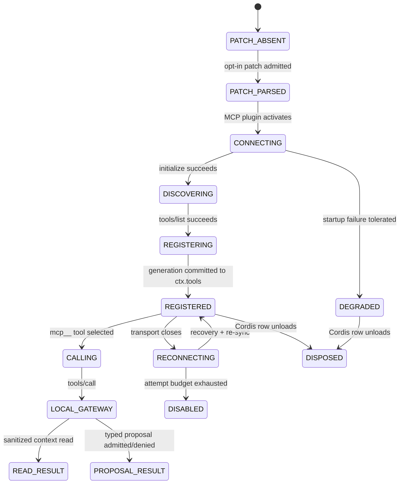

# ADR-0010: DeepSeek Harness Cordis/MCP compatibility

- Status: proposed
- Issue: #26
- Parent branch: `feat/agent-provider-compatibility`
- Head branch: `feat/deepseek-harness-compatibility`
- Upstream evidence subject: `deepseek-ai/deepseek-harness@47f943859bef60e4160492346772ded9b24f765a`
- Upstream license: MIT

## Context

DeepSeek Harness is an agent harness built around Cordis. At the observed upstream commit, product components are plugins that contribute services, events, and reversible effects to a shared context. Profiles compose ordered bundles and patch layers. Tools are registered through `ctx.tools`, while model-visible durable facts derive from an append-only session event log.

The observed `@deepseek-ai/dsh-mcp-client` plugin can connect to `stdio` or Streamable HTTP MCP servers, discover tools, and register them under deterministic server-qualified names of the form:

```text
mcp__<serverName>__<rawName>
```

The upstream project is in developer preview and explicitly warns that compatibility-breaking changes are expected. Compatibility in this repository must therefore remain bound to an exact upstream subject and must not be inferred indefinitely from the product name.

## Decision

Treat DeepSeek Harness as a `PLUGIN_HARNESS` and MCP consumer. Do not treat it as the KMP application's action executor, sandbox authority, permission owner, or policy oracle.

The application exposes a transport-independent `BrowserMcpGateway`. A future Streamable HTTP server adapter may carry that gateway to DeepSeek Harness. The external harness may discover and invoke the two current tools:

```text
browser_capture_context
browser_propose_navigation
```

With `serverName: kotlin_auto_webview`, the expected DeepSeek Harness public names are:

```text
mcp__kotlin_auto_webview__browser_capture_context
mcp__kotlin_auto_webview__browser_propose_navigation
```

`browser_capture_context` reads context that has already crossed the local privacy boundary. `browser_propose_navigation` creates a typed proposal and remains subject to local capability policy, dispatcher state, human confirmation, and executor freshness checks.

No Cordis or DeepSeek Harness runtime package is introduced into the KMP build. Compatibility is protocol- and configuration-level only.

## Provider profile

```yaml
id: deepseek-harness
kind: DEEPSEEK_HARNESS
role: PLUGIN_HARNESS
protocols:
  - MCP_CLIENT
  - MCP_STREAMABLE_HTTP_CLIENT
  - CORDIS_PLUGIN_COMPOSITION
  - DYNAMIC_TOOL_REGISTRY
  - DURABLE_SESSION_EVENT_LOG
authority_ceiling: PROPOSE_TYPED_ACTIONS
requires_local_hitl: true
upstream_repository: deepseek-ai/deepseek-harness
observed_upstream_commit: 47f943859bef60e4160492346772ded9b24f765a
```

The profile cannot be constructed without the Cordis composition protocol. `DIRECT_EXECUTION` remains globally forbidden.

## SM-DSH-001 — Cordis MCP consumer lifecycle



### State contract

| State | Owner | Meaning | Illegal promotion |
|---|---|---|---|
| `PATCH_ABSENT` | DeepSeek Harness profile | No compatibility row mounted | Cannot claim any connection |
| `PATCH_PARSED` | Cordis | Configuration shape accepted | Not endpoint reachability |
| `CONNECTING` | DSH MCP plugin | Transport initialization attempted | Not tool discovery |
| `DISCOVERING` | DSH MCP plugin | MCP initialization succeeded | Not registered tools |
| `REGISTERING` | `ctx.tools` generation | Tool schemas are being added atomically | Partial generation cannot become success |
| `REGISTERED` | DSH tool registry | Current generation is model-visible | Not KMP capability authorization |
| `CALLING` | DSH MCP client | Raw MCP tool invocation in flight | Not a browser/native side effect |
| `LOCAL_GATEWAY` | KMP `BrowserMcpGateway` | Request parsed and routed locally | Not action approval |
| `READ_RESULT` | KMP runtime | Sanitized read-only result returned | Not remote ownership of context |
| `PROPOSAL_RESULT` | KMP runtime | Proposal accepted, denied, or awaiting confirmation | Not executed action |
| `RECONNECTING` | DSH MCP supervisor | Transport recovery and re-sync | Last schemas do not prove calls succeed |
| `DISABLED` | DSH MCP supervisor | Reconnect budget exhausted | No silent infinite retry |
| `DISPOSED` | Cordis lifecycle | Registrations and effects unwind | No stale authority survives disposal |

## Data flows

### DF-DSH-001 — Cordis configuration

```text
repository example or generated binding
  -> Cordis patch parser
  -> @deepseek-ai/dsh-mcp-client config row
```

Payload:

```yaml
id: bounded Cordis row identifier
serverName: DSH namespace matching [A-Za-z0-9_-]{1,32}
transport: streamable-http
url: admitted HTTPS or explicit loopback HTTP endpoint
authentication: environment reference only
reconnect: bounded delays and attempt count
```

Secrets are not owned by the repository, binding object, or generated receipt. Remote authentication values remain in the external harness's secret environment.

### DF-DSH-002 — Tool discovery

```text
BrowserMcpGateway tools/list
  -> DSH MCP client
  -> deterministic mcp__ namespace
  -> ctx.tools generation
  -> model tool schema
```

The observed upstream MCP client bridges tools only. Resources and Prompts are outside the supported compatibility claim.

### DF-DSH-003 — Read-only context

```text
mcp__kotlin_auto_webview__browser_capture_context
  -> DSH raw tools/call name browser_capture_context
  -> BrowserMcpGateway
  -> AgentBrowserRuntime.currentContextJson()
  -> sanitized text result
```

Only already-sanitized application context may cross this boundary.

### DF-DSH-004 — Action proposal

```text
mcp__kotlin_auto_webview__browser_propose_navigation
  -> raw tools/call browser_propose_navigation
  -> HTTPS URL validation
  -> typed AgentAction
  -> Capability Policy
  -> Dispatcher
  -> HITL when required
  -> proposal result
```

No direct navigation side effect is introduced in this slice.

## Invariants

### INV-DSH-001 — Plugin discovery is not authority

- Statement: Cordis plugin activation, MCP connection, `tools/list`, `ctx.tools` registration, or a successful tool call never grants native/browser authority.
- Owner: KMP provider compatibility and local runtime policy.
- Enforcement: remote authority ceiling, proposal-only MCP action, existing dispatcher/HITL/executor boundaries.
- Failure mode: external harness bypasses local policy.
- Oracle: provider-policy tests and MCP gateway tests.
- Negative control: request `DIRECT_EXECUTION`; expect fail-closed rejection.

### INV-DSH-002 — Configuration is secret-free

- Statement: committed or serialized binding values cannot contain bearer tokens, OAuth tokens, arbitrary auth headers, certificates, or private keys.
- Owner: `DeepSeekHarnessCordisBinding`.
- Enforcement: environment-variable-name-only authentication field and endpoint URL admission.
- Failure mode: secrets enter source, logs, receipts, or model context.
- Oracle: rendering and serialization tests.
- Negative control: URL credentials, query values, fragments, malformed environment names, and plaintext insecure remote endpoints are rejected.

### INV-DSH-003 — Remote transport is encrypted

- Statement: non-loopback MCP endpoints require HTTPS and an external bearer-token environment reference.
- Owner: `DeepSeekHarnessCordisBinding`.
- Enforcement: endpoint-class validation.
- Failure mode: remote context or proposals traverse plaintext transport.
- Oracle: URL policy tests.
- Negative control: `http://` non-loopback endpoint is rejected.

### INV-DSH-004 — Upstream evidence is exact

- Statement: compatibility claims are bound to DeepSeek Harness commit `47f943859bef60e4160492346772ded9b24f765a`.
- Owner: provider profile, issue packet, ADR, and integration guide.
- Enforcement: exact commit stored in the profile and rendered patch comment.
- Failure mode: developer-preview upstream changes silently invalidate the integration.
- Oracle: provider profile tests and documentation review.
- Negative control: a later upstream state cannot be labeled compatible without a new probe.

### INV-DSH-005 — Tool namespace is deterministic

- Statement: the current two raw KMP tools map to stable server-qualified DSH names.
- Owner: `DeepSeekHarnessCordisBinding`.
- Enforcement: admitted raw-tool set, server-name contract, 64-character public-name budget.
- Failure mode: collisions, unexpected tools, or model-history drift.
- Oracle: exact-name tests.
- Negative control: an unowned raw tool name is rejected.

## Configuration admission

### Remote HTTPS

```yaml
endpoint_class: REMOTE_HTTPS
endpoint: https://agent.example.invalid/mcp
bearer_token_environment_variable: KOTLIN_AUTO_WEBVIEW_MCP_TOKEN
```

Allowed only when:

- endpoint protocol is HTTPS;
- URL has no username, password, query, fragment, or control character;
- environment-variable name matches `[A-Z][A-Z0-9_]{0,63}`.

### Loopback development

```yaml
endpoint_class: LOOPBACK_HTTP
endpoint: http://127.0.0.1:3090/mcp
bearer_token_environment_variable: null
```

Allowed only for `localhost`, `127.0.0.1`, or `::1`. It is a development configuration shape, not production evidence.

## Shadow Architecture review

| Delta | Classification | Outcome |
|---|---|---|
| New external harness consumer | `EXTERNAL_INTEGRATION_DELTA` | L2: protocol and authority boundary separated before implementation |
| Dynamic external tool registry | `AUTHORITY_DELTA` | L3 block on direct execution; proposal ceiling retained |
| Runtime endpoint and auth reference | `PRIVATE_EGRESS_DELTA` | L2: secret-free binding and HTTPS/loopback split |
| Developer-preview upstream | `EVIDENCE_DELTA` | L1: exact commit pinned; future compatibility remains unknown |
| Cordis lifecycle/reconnect | `LIFECYCLE_DELTA` | L1: modeled, not exercised |

## Verification

Positive controls:

- DeepSeek Harness provider discovery and serialization.
- Protocol and authority admission.
- Exact tool-name mapping.
- Deterministic Cordis patch rendering.
- HTTPS remote and loopback development endpoint admission.
- Bounded timeout/reconnect configuration.

Negative controls:

- direct execution request;
- unsupported NemoClaw-managed MCP protocol claim;
- unknown or unowned raw tool;
- invalid or oversized `serverName`;
- remote plaintext endpoint;
- non-loopback endpoint labeled loopback;
- URL credentials, query, fragment, or control characters;
- missing or malformed bearer environment reference;
- secret values in serialized/rendered configuration.

## Evidence boundary

This ADR and its implementation can prove:

```yaml
portable_provider_model: IMPLEMENTED
cordis_binding_contract: IMPLEMENTED
secret_free_patch_rendering: IMPLEMENTED
expected_tool_namespace: IMPLEMENTED
configuration_negative_controls: IMPLEMENTED
```

It cannot prove:

```yaml
deepseek_harness_process_start: NOT_EXERCISED
cordis_patch_parse_and_hmr: NOT_EXERCISED
ctx_tools_registration: NOT_EXERCISED
streamable_http_server_in_kmp: NOT_IMPLEMENTED
mcp_initialization_and_tools_list: NOT_EXERCISED
mcp_tool_calls: NOT_EXERCISED
cross_process_timeout_cancellation: NOT_EXERCISED
production_authentication: NOT_IMPLEMENTED
physical_device_interoperability: NOT_EXERCISED
resources_or_prompts_compatibility: NOT_SUPPORTED_BY_OBSERVED_UPSTREAM_CLIENT
merge_or_release: EXTERNAL_AUTHORITY_REQUIRED
```

## Rollback

The rollback subject is the exact parent branch state before this slice. Removing the provider additions, binding implementation/tests, integration guide/fixture, and this ADR restores the prior OpenClaw/Hermes/NemoClaw compatibility plane without changing the core MCP gateway or local action-authority model.
