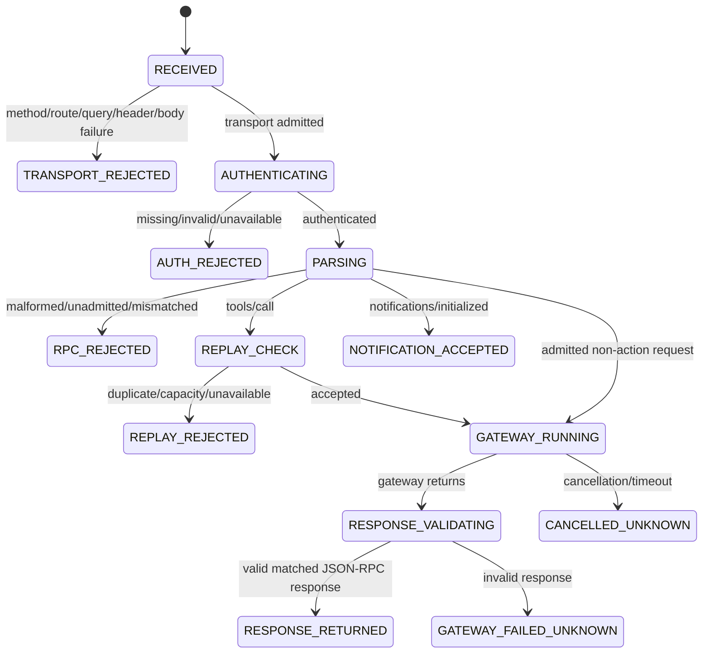

# ADR-0011: Authenticated Streamable HTTP admission bridge

- Status: proposed
- Issue: #29
- Parent issue: #26
- Parent branch: `feat/deepseek-harness-compatibility`
- Head branch: `feat/deepseek-harness-streamable-http-bridge`
- DeepSeek Harness evidence subject: `deepseek-ai/deepseek-harness@47f943859bef60e4160492346772ded9b24f765a`
- Observed client package: `@deepseek-ai/dsh-mcp-client@0.1.0-rc.5`

## Context

ADR-0010 introduced a portable DeepSeek Harness provider profile and a deterministic Cordis binding for the existing `BrowserMcpGateway`. That slice proved configuration and namespace compatibility, but it did not provide an HTTP admission surface.

The observed DeepSeek Harness MCP client creates `StreamableHTTPClientTransport` with the configured URL and request headers. The client owns Cordis lifecycle, discovery, tool registration, reconnect, and disposal. This repository owns the browser capability and must keep every remote request behind local privacy, capability, dispatcher, HITL, and executor boundaries.

A platform server dependency is intentionally not added in this slice. Android, iOS, and Wasm must not acquire an inbound public listener as an accidental consequence of MCP compatibility. A future host-side bridge, admitted sandbox, or optional Desktop-local server may translate real HTTP requests into the portable contracts defined here.

## Decision

Add a framework-neutral `McpStreamableHttpBridge` around `BrowserMcpGateway`.

```text
DeepSeek Harness / @deepseek-ai/dsh-mcp-client
  -> private or loopback Streamable HTTP POST
  -> host-owned HTTP/TLS/body-stream adapter
  -> McpStreamableHttpBridge
  -> BrowserMcpGateway
  -> sanitized read OR typed proposal
  -> local Privacy / Capability Policy / Dispatcher / HITL / Executor
```

The bridge performs admission, authentication delegation, JSON-RPC validation, action-call duplicate suppression, gateway response validation, and redacted receipt emission. It owns no socket, TLS key, token store, browser engine, native API, or direct side-effect authority.

## Owned files

```text
composeApp/src/commonMain/kotlin/dev/ed3c/autowebview/mcp/http/
├── McpHttpBridgeContracts.kt
├── BoundedMcpHttpReplayGuard.kt
└── McpStreamableHttpBridge.kt

composeApp/src/commonTest/kotlin/dev/ed3c/autowebview/mcp/http/
└── McpStreamableHttpBridgeTest.kt

integrations/deepseek-harness/bridge/
└── README.md
```

## HTTP contract

### Admitted request shape

```yaml
method: POST
scheme_authority_path: exact policy match
query: absent
content_type: application/json
accept:
  - application/json
  - text/event-stream
mcp_session_id: absent
authorization: delegated to injected verifier
body: one JSON-RPC object within configured byte budget
```

The bridge accepts repeated `Accept` lines because HTTP permits them. Security-sensitive singleton headers such as `Authorization`, `Content-Type`, `Origin`, `MCP-Protocol-Version`, `Mcp-Method`, `Mcp-Name`, and `Mcp-Session-Id` fail closed when repeated.

The current response mode is one JSON object per request. Request-scoped SSE output is not implemented. Protocol-level HTTP sessions and GET/SSE session streams are explicitly rejected.

### Exact route policy

`McpHttpEndpointPolicy` binds one route to:

```yaml
scheme: exact http or https
host_and_port: exact authority after case normalization
path: exact absolute path
origins: exact allowlist when Origin is present
missing_origin: policy-controlled
request_body_budget: positive byte count
response_body_budget: positive byte count
```

Plain HTTP is allowed only for explicit loopback authorities:

```text
localhost
127.0.0.1
[::1]
```

A remote or private-network mount must use HTTPS. The host adapter remains responsible for TLS termination and for proving that its derived scheme and authority cannot be spoofed by an untrusted forwarding header.

### Content negotiation

The media type parser compares exact parsed media types rather than substrings.

Accepted examples:

```text
Content-Type: application/json
Content-Type: application/json; charset=utf-8
Accept: application/json, text/event-stream
```

Rejected examples:

```text
Content-Type: text/plain; note=application/json
Accept: application/jsonx, text/event-stream-bogus
Accept: application/json
```

## JSON-RPC surface

The portable bridge admits only:

```text
server/discover
initialize
ping
tools/list
tools/call
notifications/initialized
```

The current HTTP tool allowlist is exactly:

```text
browser_capture_context
browser_propose_navigation
```

`resources/list`, `resources/read`, Prompts, arbitrary native tools, and client-supplied JSON-RPC responses are not admitted by this transport slice. The existing in-process `BrowserMcpGateway` resource surface is unchanged; it is simply not projected through this first HTTP bridge.

### Notification handling

`notifications/initialized` is handled at the HTTP bridge boundary:

```text
valid admitted notification
  -> HTTP 202 Accepted
  -> empty response body
  -> BrowserMcpGateway not invoked
```

Unknown notifications fail closed. A notification cannot accidentally receive a JSON-RPC response with `id: null`.

### Request handling

```text
valid JSON-RPC request
  -> gateway invocation
  -> response JSON parse
  -> jsonrpc == 2.0
  -> response id exactly equals request id
  -> exactly one of result or error
  -> response byte budget
  -> HTTP 200 application/json
```

An invalid or mismatched gateway response becomes HTTP 502 and side-effect evidence `UNKNOWN` because the bridge cannot prove what happened after invocation began.

## Authentication boundary

Authentication is injected through `McpHttpAuthenticationVerifier`.

```text
raw Authorization value
  -> verifier only
  -> Accepted(subjectId, credentialEpoch)
     OR Rejected(reason)
```

The bridge does not implement a production bearer-token comparison and does not store the raw header. The accepted subject and credential epoch are used only to derive an opaque duplicate-suppression key. They are not copied into receipts.

A future host may back the verifier with:

```text
constant-time bearer verification
OAuth access-token validation
mTLS identity established by the TLS terminator
external secret-header verification
sandbox-issued workload identity
```

Authentication availability failure is distinct from invalid credentials and returns a typed fail-closed transport error.

## Duplicate replay control

`tools/call` requests pass through `BoundedMcpHttpReplayGuard` before the gateway.

```text
subjectId
+ credentialEpoch
+ admitted scheme/authority/path
+ exact JSON-RPC body
  -> opaque deterministic key
  -> bounded time window
```

The guard:

- rejects an exact duplicate while its entry is live;
- removes expired entries;
- rejects new action-bearing calls when live capacity is exhausted;
- never evicts a live entry to make room;
- stores no request body or token.

This control prevents exact duplicate action-call delivery inside one credential epoch. It is not a cryptographic anti-replay signature. A production remote deployment that requires protection against an attacker who possesses valid credentials must add a signed nonce or equivalent proof in the host/authentication layer.

Discovery, initialization, and `tools/list` are not duplicate-suppressed so bounded reconnect and re-initialization remain possible. They are non-authoritative and cannot cause a browser/native side effect.

## SM-MCP-HTTP-001 — Portable request lifecycle



### State contract

| State | Gateway invoked | HTTP outcome | Side-effect evidence |
|---|---:|---|---|
| `TRANSPORT_REJECTED` | No | Typed 4xx/5xx | `NOT_STARTED` |
| `AUTH_REJECTED` | No | 401/403/503 | `NOT_STARTED` |
| `RPC_REJECTED` | No | Typed 4xx | `NOT_STARTED` |
| `REPLAY_REJECTED` | No | 409/503 | `NOT_STARTED` |
| `NOTIFICATION_ACCEPTED` | No | 202, no body | `NOT_APPLICABLE` |
| `RESPONSE_RETURNED` read/discovery | Yes | 200 JSON | `NOT_APPLICABLE` |
| `RESPONSE_RETURNED` navigation proposal | Yes | 200 JSON | `PROPOSAL_ONLY` |
| `CANCELLED_UNKNOWN` | Maybe | Cancellation propagates | `UNKNOWN` only after invocation |
| `GATEWAY_FAILED_UNKNOWN` | Yes | 502 | `UNKNOWN` |

## Data flows

### DF-MCP-HTTP-001 — Transport admission

```text
host HTTP request
  -> trusted scheme/authority/path extraction
  -> exact route + Origin policy
  -> body/media/session checks
```

The bridge cannot enforce a streaming read limit before the body is materialized because it does not own the server engine. A concrete host must enforce the same byte ceiling while reading the request stream, then provide the bounded body and declared length to the bridge.

### DF-MCP-HTTP-002 — Authentication

```text
Authorization header
  -> injected verifier
  -> opaque subject + credential epoch
  -> no raw credential in receipt
```

### DF-MCP-HTTP-003 — Discovery

```text
initialize
  -> BrowserMcpGateway
  -> 2025-11-25 server capabilities
notifications/initialized
  -> bridge 202 empty body
tools/list
  -> BrowserMcpGateway tool schemas
```

### DF-MCP-HTTP-004 — Sanitized read

```text
tools/call browser_capture_context
  -> duplicate guard
  -> BrowserMcpGateway
  -> AgentBrowserRuntime.currentContextJson()
  -> existing privacy redaction
  -> JSON-RPC result
```

### DF-MCP-HTTP-005 — Typed proposal

```text
tools/call browser_propose_navigation
  -> exact duplicate guard
  -> BrowserMcpGateway HTTPS validation
  -> AgentAction proposal
  -> local capability policy / dispatcher / HITL
  -> proposal status result
```

The bridge never calls a WebView, selector, coordinate executor, Android Intent, iOS URL API, camera, location provider, or other native capability.

## Invariants

### INV-MCP-HTTP-001 — Transport success is not execution authority

- Statement: HTTP 200, MCP initialization, tool discovery, or tool-call completion cannot authorize browser/native execution.
- Enforcement: only `BrowserMcpGateway` is called; the navigation tool remains proposal-only.
- Oracle: runtime dispatcher remains `WAITING_FOR_CONFIRMATION` after the navigation call.
- Negative control: no executor or platform source set is modified.

### INV-MCP-HTTP-002 — Rejections stop before the gateway

- Statement: method, route, query, Origin, media, body, session, authentication, metadata, tool allowlist, and replay failures do not invoke the gateway.
- Oracle: recording fake gateway call count remains zero.

### INV-MCP-HTTP-003 — Notifications have no JSON-RPC response body

- Statement: admitted `notifications/initialized` produces HTTP 202 and an empty body.
- Oracle: gateway invocation count is unchanged and response body is null.

### INV-MCP-HTTP-004 — Receipts are non-sensitive

- Statement: receipts contain only outcome class, RPC method, HTTP status, typed error code, gateway-invoked flag, and side-effect evidence.
- Excluded: endpoint, Origin, credential, subject, body, arguments, page context, and gateway response.
- Oracle: synthetic secrets, URLs, and tokens do not appear in recorded receipt strings.

### INV-MCP-HTTP-005 — Cancellation is not fabricated rollback

- Statement: cancellation propagates. After gateway invocation begins, receipt evidence is `UNKNOWN`; before invocation it is `NOT_STARTED`.
- Oracle: cancellation test observes the original cancellation and the correct receipt state.

### INV-MCP-HTTP-006 — Response routing is exact

- Statement: the gateway response ID must exactly equal the request ID and contain exactly one of `result` or `error`.
- Failure mode: cross-request response mix-up or malformed output.
- Oracle: mismatched response ID becomes 502.

## Verification matrix

| Oracle | Expected |
|---|---|
| Legacy `initialize` | 200 JSON, protocol `2025-11-25` |
| `notifications/initialized` | 202, no body, no gateway call |
| `tools/list` | two admitted tools |
| `browser_capture_context` | secret redacted |
| `browser_propose_navigation` | local confirmation state, no navigation |
| Exact repeated `tools/call` | 409 before gateway |
| GET | 405 with `Allow: POST` |
| Wrong authority/path/scheme | fail before gateway |
| Query data | fail before gateway |
| Wrong Origin | fail before gateway |
| Missing media type pair | 406/415 |
| Session ID | explicit unsupported failure |
| Missing/invalid auth | 401/403 |
| Oversized body | 413 |
| Header/body mismatch | 400 |
| Unowned tool | 403 |
| Invalid gateway response | 502, side-effect `UNKNOWN` |
| Cancellation after invocation | propagated, side-effect `UNKNOWN` |
| Full KMP matrix | Android, Common/Web/Desktop, iOS remain green |

## Shadow Architecture review

| Delta | Classification | Outcome |
|---|---|---|
| New external HTTP boundary | `PRIVATE_EGRESS_DELTA` | Exact route, media, Origin, auth, and body contracts |
| Action-call delivery | `AUTHORITY_DELTA` | Tool allowlist, duplicate suppression, proposal-only authority |
| Stateful retry/reconnect | `LIFECYCLE_DELTA` | HTTP sessions rejected; idempotent discovery can repeat |
| Cancellation uncertainty | `EVIDENCE_DELTA` | No fabricated rollback; `UNKNOWN` after invocation |
| Mobile listener temptation | `PLATFORM_DELTA` | No Android/iOS/Wasm listener or server dependency |

## Evidence boundary

This slice can prove:

```yaml
portable_http_admission: IMPLEMENTED
exact_route_and_origin_policy: IMPLEMENTED
injected_authentication_boundary: IMPLEMENTED
bounded_body_validation: IMPLEMENTED
legacy_initialize_notification_tools_sequence: IMPLEMENTED_IN_TEST
sanitized_context_forwarding: IMPLEMENTED_IN_TEST
typed_navigation_proposal: IMPLEMENTED_IN_TEST
exact_tools_call_duplicate_rejection: IMPLEMENTED_IN_TEST
response_id_validation: IMPLEMENTED_IN_TEST
cancellation_receipt_semantics: IMPLEMENTED_IN_TEST
```

It cannot prove:

```yaml
real_network_listener: NOT_IMPLEMENTED
tls_termination: NOT_IMPLEMENTED
production_bearer_or_oauth_or_mtls_verifier: NOT_IMPLEMENTED
deepseek_harness_process_e2e: NOT_EXERCISED
cordis_ctx_tools_registration: NOT_EXERCISED
request_scoped_sse_response: NOT_IMPLEMENTED
mobile_private_edge_lifecycle: NOT_EXERCISED
nemoclaw_or_openshell_packaging: NOT_EXERCISED
physical_devices: NOT_EXERCISED
merge_or_release: EXTERNAL_AUTHORITY_REQUIRED
```

## Rollback

Remove the `mcp/http` contracts, replay guard, bridge, tests, integration bridge guide, and this ADR. The rollback subject is the exact parent branch `feat/deepseek-harness-compatibility`; provider modeling and the in-process `BrowserMcpGateway` remain unchanged.
