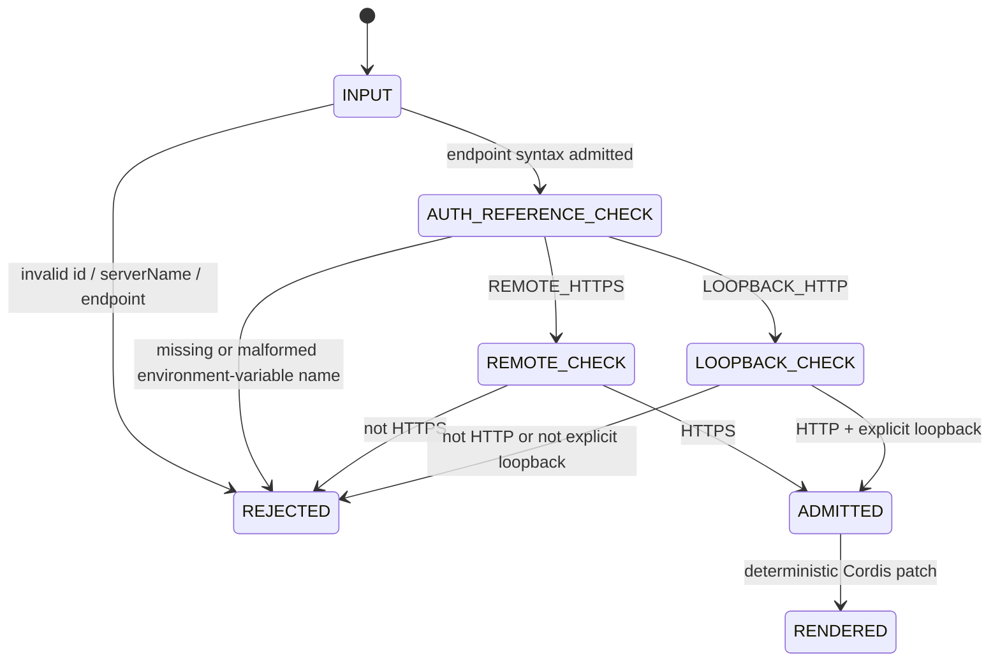

# ADR-0012: Authenticated loopback relock for DeepSeek Harness

- Status: proposed
- Issue: #31
- Parent issue: #29
- Parent branch: `feat/deepseek-harness-streamable-http-bridge`
- Head branch: `fix/deepseek-harness-loopback-auth-contract`
- Rollback subject: `72dd92e8faaf2c6e8679ad9c06869c01548a4cf4`
- Upstream evidence subject: `deepseek-ai/deepseek-harness@47f943859bef60e4160492346772ded9b24f765a`

## Context

ADR-0010 introduced two endpoint classes:

```text
REMOTE_HTTPS
LOOPBACK_HTTP
```

The original loopback contract deliberately carried no authentication material. ADR-0011 and PR #30 then introduced an authenticated portable HTTP admission bridge whose verifier always participates before JSON-RPC reaches `BrowserMcpGateway`.

That progression exposed a contract mismatch:

```text
Typed Cordis loopback renderer
  -> no Authorization header

Portable HTTP bridge
  -> authentication verifier required

Result
  -> a secure listener cannot use the typed fixture without a manual, out-of-contract patch
```

Allowing a future Desktop listener to bypass authentication would resolve the mismatch mechanically but violate the stronger security model. Loopback limits network reach; it does not establish caller identity. Any local process under the same user or host policy may attempt to call the endpoint.

## Decision

Require an environment-resolved bearer-token reference for both endpoint classes.

```text
REMOTE_HTTPS
  -> HTTPS
  -> valid bearer-token environment-variable name

LOOPBACK_HTTP
  -> HTTP
  -> explicit localhost / 127.0.0.1 / [::1]
  -> valid bearer-token environment-variable name
```

`DeepSeekHarnessCordisBinding` still cannot contain a token value or arbitrary headers. It stores only the environment-variable name and renders the same runtime lookup for remote and loopback configurations.

The default-off loopback fixture uses:

```text
KOTLIN_AUTO_WEBVIEW_MCP_TOKEN
```

No value is committed.

## Why loopback still needs authentication

The following properties are separate:

```text
network location == loopback
caller identity == unknown until verified
```

Loopback prevents off-host routing under ordinary network behavior, but it does not prevent:

- another local process from sending requests;
- browser-driven requests to a loopback service;
- a compromised local tool from invoking an MCP endpoint;
- accidental connection by a second Harness profile;
- cross-user access when host permissions or container boundaries are weak.

Origin checks help with browser-origin requests but do not authenticate a non-browser client such as DeepSeek Harness. Authentication therefore remains mandatory even when `Origin` is absent and the socket is loopback-only.

## Updated configuration flow

```text
Cordis binding object
  -> validate endpoint class
  -> validate environment-variable name
  -> render @deepseek-ai/dsh-mcp-client row
  -> DSH process resolves environment value
  -> Authorization: Bearer <runtime value>
  -> future host verifier
  -> McpStreamableHttpBridge
```

The token value exists only at runtime inside the DSH host and the future verifier boundary. It is not part of the Kotlin value object, generated evidence, committed fixture, or bridge receipt.

## SM-DSH-AUTH-001 — Binding admission



## Invariants

### INV-DSH-AUTH-001 — Endpoint class cannot disable authentication

- Statement: both `REMOTE_HTTPS` and `LOOPBACK_HTTP` require a syntactically valid bearer-token environment-variable name.
- Oracle: constructing either class with `null` or a malformed name throws before rendering.
- Negative control: there is no anonymous endpoint class.

### INV-DSH-AUTH-002 — Authentication configuration is secret-free

- Statement: the Kotlin binding and serialized representation contain an environment-variable name, never a token value.
- Oracle: round-trip serialization contains `bearerTokenEnvironmentVariable` but no headers, private key, certificate, or synthetic token value.
- Negative control: rendered YAML uses `process.env.<NAME>` and does not contain `Authorization: Bearer <literal>`.

### INV-DSH-AUTH-003 — Transport restrictions remain distinct

- Statement: remote bindings remain HTTPS-only; loopback bindings remain HTTP-only and host-restricted.
- Oracle: insecure non-loopback, HTTPS mislabeled as loopback, and HTTP mislabeled as remote all fail.
- Negative control: adding authentication does not permit plaintext remote endpoints.

### INV-DSH-AUTH-004 — Provider authority is unchanged

- Statement: this relock changes credential configuration only.
- Oracle: no provider authority ceiling, capability registry, dispatcher, executor, native platform file, or MCP bridge implementation is modified.
- Negative control: authenticated configuration is not action authorization.

## Data flows

### DF-DSH-AUTH-001 — Loopback patch

```text
DeepSeekHarnessCordisBinding(LOOPBACK_HTTP)
  -> validate explicit loopback URL
  -> validate KOTLIN_AUTO_WEBVIEW_MCP_TOKEN name
  -> render Cordis row
  -> DSH resolves token at runtime
```

### DF-DSH-AUTH-002 — Remote patch

```text
DeepSeekHarnessCordisBinding(REMOTE_HTTPS)
  -> validate HTTPS URL
  -> validate environment-variable name
  -> render the same secret-free Authorization expression
```

### DF-DSH-AUTH-003 — Future request admission

```text
runtime token
  -> Authorization header
  -> host authentication verifier
  -> opaque subject + credential epoch
  -> portable HTTP bridge
```

The future verifier owns constant-time comparison, OAuth, mTLS identity, workload identity, rotation, and revocation. This ADR does not implement those operations.

## Verification matrix

| Oracle | Expected |
|---|---|
| Remote binding with valid env reference | Rendered authenticated patch |
| Loopback binding with valid env reference | Rendered authenticated patch |
| Missing env reference in either class | Construction failure |
| Malformed env reference in either class | Construction failure |
| Remote HTTP | Construction failure |
| Loopback HTTPS | Construction failure |
| Non-loopback HTTP | Construction failure |
| URL credentials/query/fragment/control characters | Construction failure |
| Remote and loopback serialization | Deterministic, secret-free round trip |
| Existing tool namespace | Unchanged |
| Parent HTTP bridge files | Unchanged |
| Full KMP CI | Android, Common/Web/Desktop, iOS pass |

## Consequences

### Positive

- The typed renderer, committed fixture, and portable bridge now agree on authenticated operation.
- A future Desktop loopback listener does not need an anonymous compatibility exception.
- The same DSH environment-variable injection pattern works for local and remote endpoints.
- Secret values remain outside Git and serialized configuration.

### Tradeoffs

- Local development requires explicit token injection in both the DSH process and future listener process.
- A missing environment variable causes plugin activation failure when `failOnStartupError` is enabled.
- This does not by itself solve token generation, custody, rotation, or cross-process distribution.

## Evidence boundary

This slice can prove:

```yaml
remote_binding_requires_auth_reference: IMPLEMENTED
loopback_binding_requires_auth_reference: IMPLEMENTED
secret_free_patch_rendering_for_both_classes: IMPLEMENTED
authenticated_loopback_fixture: IMPLEMENTED
serialization_round_trip: IMPLEMENTED_IN_TEST
transport_classification_controls: IMPLEMENTED_IN_TEST
```

It cannot prove:

```yaml
real_listener: NOT_IMPLEMENTED
runtime_token_generation: NOT_IMPLEMENTED
production_token_custody: NOT_IMPLEMENTED
constant_time_verifier: NOT_IMPLEMENTED
oauth_or_mtls: NOT_IMPLEMENTED
real_deepseek_harness_process: NOT_EXERCISED
cross_process_authentication: NOT_EXERCISED
mcp_tool_registration: NOT_EXERCISED
physical_devices: NOT_EXERCISED
merge_or_release: EXTERNAL_AUTHORITY_REQUIRED
```

## Rollback

Restore `DeepSeekHarnessCordisBinding` and its tests, the loopback fixture, and compatibility documentation to exact parent `72dd92e8faaf2c6e8679ad9c06869c01548a4cf4`, and remove this ADR. The portable HTTP bridge remains valid but a later integration must then choose explicitly between an anonymous loopback verifier and a manually authored authenticated patch; that weaker mismatch is why rollback is not recommended for an actual listener.