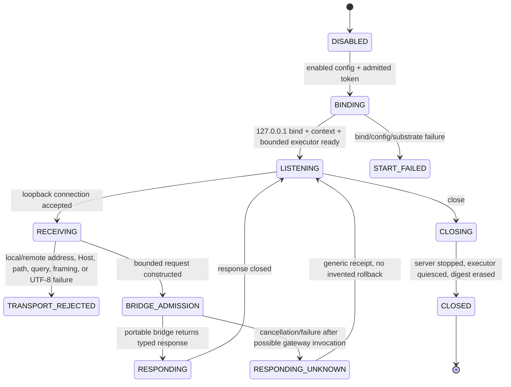

# ADR-0013: Default-off Desktop loopback MCP listener

- Status: proposed
- Issue: #33
- Parent issue: #31
- Parent PR: #32
- Parent exact subject: `651b6ceb4b5d3269b0bfc77a5985fa138c922106`
- Upstream evidence subject: `deepseek-ai/deepseek-harness@47f943859bef60e4160492346772ded9b24f765a`
- Dependency delta: none

## Context

PR #30 introduced a transport-neutral `McpStreamableHttpBridge`. It proves bounded HTTP admission and JSON-RPC forwarding but intentionally owns no socket, TLS key, listener lifecycle, or production credential source. PR #32 then relocked the DeepSeek Harness Cordis configuration so both remote HTTPS and loopback HTTP bindings resolve a bearer token from an external environment variable.

A real interoperability path now needs one concrete substrate. Exposing an inbound listener from Android, iOS, or Wasm would widen the attack and lifecycle surface without evidence that mobile inbound networking is required. Desktop already runs on JDK 17 and can use the JDK `jdk.httpserver` module without adding a dependency or changing repository license/notice state.

## Decision

Add a Desktop-only, default-off HTTP listener with these fixed boundaries:

```text
bind address: 127.0.0.1 only
transport: HTTP loopback development/private-host use only
route: exact configured path, default /mcp
authentication: host-supplied bearer token, fixed-length digest comparison
body handling: bounded while streaming before full materialization
execution authority: none beyond the existing portable bridge
platforms: Desktop JVM only
```

The bind host is not a configuration field. Runtime port `0` is rejected; an internal test factory may use port `0` to obtain an isolated ephemeral port. Starting the listener requires an explicit `enabled=true` configuration and an admitted token byte array.

No Android, iOS, or Wasm source set receives a listener. No Ktor Server, Netty, npm package, mutable installer, or other dependency is added.

## Architecture

```text
DeepSeek Harness / @deepseek-ai/dsh-mcp-client
  -> HTTP POST on 127.0.0.1
  -> DesktopMcpLoopbackServer
  -> bounded streaming reader
  -> DesktopMcpBearerAuthenticationVerifier
  -> McpStreamableHttpBridge
  -> BrowserMcpGateway
  -> sanitized context OR typed navigation proposal
  -> local Capability Policy / Dispatcher / HITL / Executor
```

The listener owns HTTP substrate behavior only. It cannot evaluate JavaScript, identify a DOM target, navigate a WebView, invoke an Android Intent or iOS URL API, access a native capability, or replace local freshness and human-confirmation gates.

## `SM-DESKTOP-MCP-001` — listener lifecycle



### State contract

| State | Owner | Required truth | Illegal promotion |
|---|---|---|---|
| `DISABLED` | host configuration | no socket exists | token presence cannot auto-start |
| `BINDING` | Desktop listener | numeric IPv4 loopback only | no wildcard/LAN fallback |
| `LISTENING` | JDK HTTP server | exact bound port and bounded executor | not DeepSeek Harness E2E |
| `RECEIVING` | listener adapter | request bytes still untrusted | not authenticated |
| `TRANSPORT_REJECTED` | listener adapter | gateway not invoked | cannot become tool success |
| `BRIDGE_ADMISSION` | portable bridge | transport request admitted for policy evaluation | not browser/native authority |
| `RESPONDING_UNKNOWN` | listener/bridge | outcome after invocation may be unknown | cannot claim rollback or no effect |
| `CLOSED` | listener | server stopped, workers quiesced, digest zeroed | no stale listener authority |

## Data flows

### `DF-DESKTOP-MCP-001` — listener configuration

```text
repository-independent host decision
  -> DesktopMcpLoopbackServerConfig(enabled=true, explicit port)
  -> hard-coded 127.0.0.1 bind
  -> actual authority 127.0.0.1:<bound-port>
  -> McpHttpEndpointPolicy
```

The configuration contains no token and no configurable bind host.

### `DF-DESKTOP-MCP-002` — credential admission

```text
host-supplied token bytes
  -> printable/non-whitespace length and diversity gate
  -> temporary copy
  -> SHA-256 expected digest
  -> temporary copy zeroed

Authorization candidate
  -> strict Bearer parser
  -> SHA-256 candidate digest
  -> MessageDigest.isEqual on fixed-length digests
  -> candidate bytes/digest zeroed
  -> opaque subjectId + credentialEpoch
```

The verifier does not render the token, authority, subject, or epoch. Closing the listener erases the retained expected digest.

### `DF-DESKTOP-MCP-003` — bounded HTTP request

```text
HttpExchange request stream
  -> exact local/remote loopback check
  -> singleton security-header check
  -> exact Host/path/query check
  -> Content-Length / Transfer-Encoding ambiguity check
  -> streaming byte ceiling
  -> strict UTF-8 decode
  -> McpHttpBridgeRequest
  -> McpStreamableHttpBridge
```

The byte ceiling is enforced before the complete body is materialized. A declared length over budget is rejected before reading the body; an unknown/chunked body is stopped as soon as the running byte count exceeds the budget.

### `DF-DESKTOP-MCP-004` — response

```text
McpHttpBridgeResponse
  -> exact status
  -> safe headers
  -> bounded body or no-body response
  -> HttpExchange close
```

Listener-generated errors contain only a safe typed code and generic message. No request body, response body, endpoint, token, page context, tool arguments, or exception message is included.

## Invariants

### `INV-DESKTOP-MCP-001` — loopback only

- Statement: the listener binds only to numeric IPv4 `127.0.0.1` and accepts only loopback peers.
- Enforcement: no host configuration field; `InetAddress.getByAddress(127,0,0,1)`; local and remote address checks; exact Host authority.
- Failure mode: LAN, wildcard, DNS, or public exposure.
- Oracle: actual listener tests and structural review.
- Negative control: wrong Host and non-loopback construction paths fail closed.

### `INV-DESKTOP-MCP-002` — default off

- Statement: token availability or application startup cannot implicitly create the listener.
- Enforcement: `enabled=false` default and `startIfEnabled` returns without binding.
- Failure mode: unexpected local service and authority surface.
- Oracle: disabled-start test.

### `INV-DESKTOP-MCP-003` — loopback is not authentication

- Statement: every admitted POST still passes the injected bearer verifier.
- Enforcement: authenticated Cordis binding from PR #32 plus verifier invocation inside the portable bridge.
- Failure mode: another local process calls tools anonymously.
- Oracle: missing, wrong, repeated, and malformed credential tests.

### `INV-DESKTOP-MCP-004` — bounded resources

- Statement: backlog, worker count, queue, request body, response body, and token size are bounded.
- Enforcement: configuration gates, `ThreadPoolExecutor` with `ArrayBlockingQueue`, streaming byte counter, portable response budget.
- Failure mode: memory, thread, or request exhaustion.
- Oracle: configuration, fixed-length, and chunked oversize controls.

### `INV-DESKTOP-MCP-005` — no secret-bearing receipts

- Statement: durable strings and listener errors contain no token, endpoint, Origin, body, context, arguments, or internal exception.
- Enforcement: redacted `toString`, safe error envelopes, no logging calls.
- Failure mode: public CI or crash evidence leaks private data.
- Oracle: redaction tests and source review.

### `INV-DESKTOP-MCP-006` — transport success is not action success

- Statement: `HTTP 200`, `tools/list`, and `tools/call` do not grant browser/native execution authority.
- Enforcement: existing `BrowserMcpGateway` proposal-only action, Capability Policy, Dispatcher, HITL, and bounded executor.
- Failure mode: DeepSeek Harness bypasses local authority.
- Oracle: real HTTP navigation call leaves dispatcher in `WAITING_FOR_CONFIRMATION` without navigation.

### `INV-DESKTOP-MCP-007` — deterministic close

- Statement: close stops the server, quiesces the bounded executor, releases the port, and erases the expected credential digest.
- Enforcement: idempotent `AutoCloseable`, `server.stop(0)`, bounded `awaitTermination`, `shutdownNow` fallback, verifier close.
- Failure mode: stale listener, worker, port, or credential material.
- Oracle: port-release and worker-thread tests.

## Header and framing policy

Security-sensitive singleton headers are rejected when repeated as multiple values or comma-combined values:

```text
Host
Content-Length
Transfer-Encoding
Authorization
Content-Type
Origin
Mcp-Session-Id
MCP-Protocol-Version
Mcp-Method
Mcp-Name
```

`Content-Length` and `Transfer-Encoding` cannot coexist. The only admitted transfer coding is `chunked`. The exact request path and an empty query are checked before body materialization.

## Token policy

The Desktop listener accepts only a host-supplied token that is:

```text
32..4096 bytes
printable non-whitespace ASCII
at least 8 distinct byte values
```

This is a bounded quality floor, not a claim of cryptographic entropy measurement or production secret custody. Token generation, distribution, rotation, revocation, and secure storage remain external to this slice.

## Verification

Positive controls:

- disabled configuration creates no listener;
- actual loopback `initialize` returns JSON-RPC success;
- initialized notification returns HTTP 202 with no body;
- `tools/list` returns the two admitted tools;
- context call returns app-sanitized content;
- navigation call creates a proposal and waits for local confirmation;
- close releases the port and worker threads.

Negative controls:

- runtime port 0;
- short or low-diversity token;
- missing/wrong/repeated bearer credential;
- wrong Host, path, query, Origin, Content-Type, or Accept;
- oversized fixed-length and chunked bodies;
- Content-Length/Transfer-Encoding ambiguity;
- secret-bearing string rendering;
- any interpretation of transport success as native/browser execution success.

## Shadow Architecture review

| Delta | Classification | Outcome |
|---|---|---|
| First real inbound substrate | `EXTERNAL_SIDE_EFFECT_DELTA` | L2: Desktop-only, default-off, loopback-only placement |
| Listener and worker lifecycle | `LIFECYCLE_DELTA` / `RESOURCE_DELTA` | L2: bounded executor and deterministic close |
| Host-supplied bearer token | `AUTHORITY_DELTA` / `PRIVATE_EGRESS_DELTA` | L2: fixed-digest verifier and redacted surfaces |
| Actual HTTP request bytes | `FAILURE_SURFACE_DELTA` | L2: framing, size, UTF-8, Host, path, and header controls |
| No dependency addition | `USAGE_RIGHT_DELTA` | L0: project license/notice state unchanged |
| No mobile listener | `OWNERSHIP_DELTA` | L3 block retained on Android/iOS/Wasm inbound exposure |

## Evidence boundary

This slice may prove:

```yaml
desktop_loopback_listener: PASS_OR_FAIL
default_off_start: PASS_OR_FAIL
constant_digest_bearer_verification: PASS_OR_FAIL
bounded_streaming_body: PASS_OR_FAIL
real_local_http_bridge_exchange: PASS_OR_FAIL
sanitized_context_over_http: PASS_OR_FAIL
proposal_only_navigation_over_http: PASS_OR_FAIL
deterministic_shutdown: PASS_OR_FAIL
kmp_build_compatibility: PASS_OR_FAIL
```

It cannot prove:

```yaml
real_deepseek_harness_process: NOT_EXERCISED
cordis_patch_parse_or_hmr: NOT_EXERCISED
ctx_tools_registration: NOT_EXERCISED
production_token_generation_or_custody: NOT_IMPLEMENTED
oauth_or_mtls: NOT_IMPLEMENTED
remote_tls_listener: NOT_IMPLEMENTED
jdk_httpserver_packaged_runtime: NOT_EXERCISED
android_or_ios_listener: DENIED_BY_ARCHITECTURE
physical_devices: NOT_EXERCISED
merge: EXTERNAL_AUTHORITY_REQUIRED
release_or_production: EXTERNAL_AUTHORITY_REQUIRED
```

## Consequences

The repository gains a real Desktop loopback substrate without adding a dependency or widening mobile exposure. A later child slice may opt the Desktop application into this listener through an explicit host-owned configuration and secret source, or may run a pinned DeepSeek Harness process against the test listener. Neither transition is implied by this ADR.
