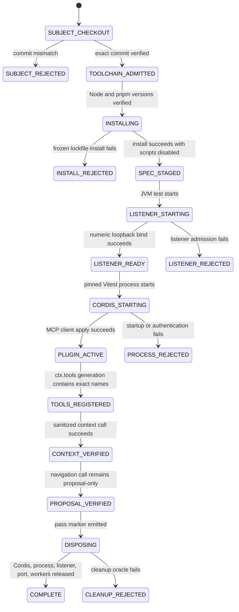

# ADR-0014: Pinned DeepSeek Harness process E2E

- Status: proposed
- Issue: #35
- Parent issue: #33
- Parent PR: #34
- Parent exact head: `9d8a421a54ce1983f4a075b3ef4c4b47defe2839`
- Upstream subject: `deepseek-ai/deepseek-harness@47f943859bef60e4160492346772ded9b24f765a`
- Upstream version: `0.1.0-rc.5`
- Upstream license: MIT

## Context

The repository now has four separate evidence layers for DeepSeek Harness compatibility:

1. PR #28 models DeepSeek Harness as a Cordis plugin harness and renders a secret-free MCP client configuration.
2. PR #30 implements portable HTTP admission and JSON-RPC forwarding.
3. PR #32 requires authentication for loopback and remote bindings.
4. PR #34 mounts the portable bridge behind a real Desktop-only numeric-loopback listener.

None of those layers proves that a real DeepSeek Harness process can activate the observed MCP client plugin, register the KMP tools in `ctx.tools`, and call them over the real HTTP substrate.

The observed upstream project is a developer preview. Its exact commit declares Node `^22.19.0 || >=24.0.0`, pnpm `11.7.0`, package version `0.1.0-rc.5`, and MIT licensing. Its own MCP E2E suite mounts Cordis `SystemPrompt` and `ToolRuntime`, applies `@deepseek-ai/dsh-mcp-client`, and exercises a stateless Streamable HTTP endpoint.

## Decision

Add a dedicated, opt-in CI lane that runs the pinned upstream process against the repository's Desktop listener.

Do not add DeepSeek Harness, Node, pnpm, Cordis, or any npm package to the application dependency graph. The external workspace exists only in the ephemeral GitHub Actions runner.

The normal KMP CI compiles the Desktop E2E test but returns without exercising the external process when `DSH_E2E_ROOT` is absent. The dedicated workflow supplies the exact upstream workspace and synthetic credential, making the external evidence lane explicit rather than silently conflating it with ordinary unit tests.

## Exact supply-chain contract

```yaml
upstream_checkout:
  repository: deepseek-ai/deepseek-harness
  commit: 47f943859bef60e4160492346772ded9b24f765a
  scripts: disabled
  lockfile: frozen
node:
  version: 22.19.0
pnpm:
  version: 11.7.0
actions_setup_node:
  commit: 249970729cb0ef3589644e2896645e5dc5ba9c38
  direct_license: MIT
project_runtime_dependency_delta: none
project_license_notice_delta: none
```

The workflow also pins the already-used checkout, Java, and Gradle setup actions to the immutable commits observed in the repository's existing CI runs.

## State machine — `SM-DSH-E2E-001`



## Data flows

### `DF-DSH-E2E-001` — Exact upstream admission

```text
GitHub Actions
  -> immutable upstream checkout
  -> git rev-parse HEAD
  -> exact commit comparison
  -> frozen lockfile install with scripts disabled
```

No mutable branch, npm tag, or default-branch state is accepted as evidence.

### `DF-DSH-E2E-002` — Synthetic authentication

```text
CI cryptographic random source
  -> masked environment value
  -> JVM listener digest verifier
  -> child-process Authorization header
  -> transient candidate digest
```

The value is never committed, uploaded, printed, or included in a receipt.

### `DF-DSH-E2E-003` — Tool registration

```text
Cordis Context
  -> SystemPrompt
  -> ToolRuntime
  -> @deepseek-ai/dsh-mcp-client apply
  -> initialize
  -> notifications/initialized
  -> tools/list
  -> mcp__kotlin_auto_webview__* ctx.tools generation
```

Raw KMP tool names are not registered directly in the Cordis tool registry.

### `DF-DSH-E2E-004` — Read-only context

```text
ctx.tools.execute(capture)
  -> MCP tools/call
  -> Desktop listener
  -> portable bridge
  -> BrowserMcpGateway
  -> already-sanitized runtime context
  -> Cordis tool result
```

The external test asserts `[REDACTED]` is present and the fixture secret is absent.

### `DF-DSH-E2E-005` — Proposal-only navigation

```text
ctx.tools.execute(propose_navigation)
  -> MCP tools/call
  -> BrowserMcpGateway
  -> typed AgentAction
  -> local capability policy
  -> local dispatcher
  -> WAITING_FOR_CONFIRMATION
```

The JVM test independently observes the dispatcher and exact proposed URL. No executor or renderer action begins.

## Invariants

### `INV-DSH-E2E-001` — Exact upstream subject

- Statement: external compatibility evidence is valid only for commit `47f943859bef60e4160492346772ded9b24f765a`.
- Enforcement: exact checkout ref, `git rev-parse` comparison, fixed test constant.
- Negative control: branch or mismatched commit fails before install or execution.

### `INV-DSH-E2E-002` — Lifecycle scripts remain disabled

- Statement: the upstream `postinstall` or package lifecycle scripts cannot execute in this lane.
- Enforcement: `PNPM_IGNORE_SCRIPTS=true` and `pnpm install --ignore-scripts --frozen-lockfile`.
- Failure mode: host mutation or unreviewed setup behavior.

### `INV-DSH-E2E-003` — No application dependency expansion

- Statement: Node, pnpm, Cordis, and DSH remain CI-only external tooling.
- Enforcement: no Gradle, version-catalog, lockfile, NOTICE, or application source change.
- Oracle: path lease and PR diff.

### `INV-DSH-E2E-004` — Real process is not execution authority

- Statement: process startup, MCP initialization, tool registration, and successful calls do not grant browser/native execution.
- Enforcement: proposal-only gateway, local policy, dispatcher, HITL, and independent JVM oracle.
- Negative control: final dispatcher state must be `WAITING_FOR_CONFIRMATION`, not an executed state.

### `INV-DSH-E2E-005` — No raw credential or page payload in evidence

- Statement: token, endpoint, fixture secret, request/response body, and page content cannot enter logs or artifacts.
- Enforcement: masked token, non-logging listener, marker-only TypeScript output, bounded/redacted JVM failure output.
- Negative control: JVM test fails if child output contains token, endpoint, or fixture secret.

### `INV-DSH-E2E-006` — Cleanup is part of success

- Statement: Cordis fiber, child process, listener, bound port, and listener workers must terminate.
- Enforcement: bounded process timeout, `afterAll` disposal, listener close, port and thread probes.
- Failure mode: stale authority, leaked process, or resource exhaustion.

## Shadow Architecture review

| Delta | Classification | Outcome |
|---|---|---|
| Execute third-party developer-preview workspace | `EXTERNAL_INTEGRATION_DELTA` / `USAGE_RIGHT_DELTA` | L2: exact subject, MIT license, frozen lockfile, scripts disabled |
| Real cross-process HTTP exchange | `LIFECYCLE_DELTA` / `CONCURRENCY_DELTA` | L2: bounded timeouts and cleanup oracles |
| Synthetic bearer crosses process boundary | `PRIVATE_EGRESS_DELTA` | L2: per-run masked value and output negative controls |
| Cordis dynamically registers tools | `AUTHORITY_DELTA` | L3 block on direct execution; proposal-only local authority retained |
| First real DSH process success | `EVIDENCE_DELTA` | L1: proves this exact CI subject, not production or future upstream commits |

## Verification

Positive controls:

- exact upstream commit and toolchain verification;
- frozen lockfile installation with scripts disabled;
- real Cordis plugin activation;
- real Streamable HTTP initialization;
- exact `ctx.tools` names;
- capture-context sanitization;
- proposal-only navigation result;
- independent local dispatcher observation;
- clean child process, listener, port, and worker termination;
- full existing KMP CI matrix.

Negative controls:

- mutable upstream source;
- lifecycle-script execution;
- missing or leaked synthetic token;
- raw tool-name registration;
- raw fixture-secret return;
- direct browser/native action claim;
- child timeout or non-zero exit;
- missing pass marker;
- leaked listener resources.

## Evidence boundary

A green dedicated workflow may prove:

```yaml
pinned_deepseek_harness_process: PASS
cordis_plugin_activation: PASS
real_streamable_http_exchange: PASS
ctx_tools_registration: PASS
sanitized_context_call: PASS
proposal_only_navigation_call: PASS
clean_process_and_listener_disposal: PASS
```

It cannot prove:

```yaml
future_upstream_commit_compatibility: UNKNOWN
cordis_hmr: NOT_EXERCISED
reconnect_after_listener_failure: NOT_EXERCISED
production_token_generation_or_custody: NOT_IMPLEMENTED
oauth_or_mtls: NOT_IMPLEMENTED
remote_tls: NOT_IMPLEMENTED
desktop_application_auto_start: NOT_IMPLEMENTED
desktop_distribution_packaging: NOT_EXERCISED
physical_devices: NOT_EXERCISED
arbitrary_site_behavior: NOT_EXERCISED
merge: EXTERNAL_AUTHORITY_REQUIRED
production: EXTERNAL_AUTHORITY_REQUIRED
```

## Rollback

Remove the dedicated workflow, Desktop external-process test, repository-owned TypeScript E2E specification, integration guide, and this ADR. The exact rollback subject is `9d8a421a54ce1983f4a075b3ef4c4b47defe2839`; the Desktop listener and prior provider/transport contracts remain unchanged.
