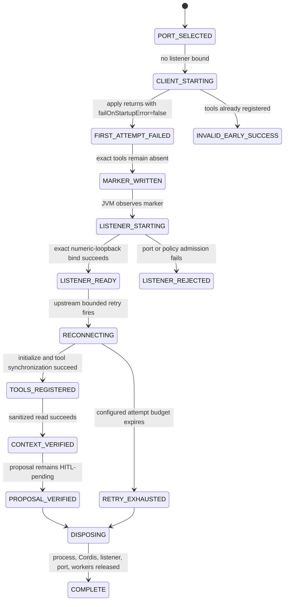

# ADR-0015: Bounded DeepSeek Harness startup recovery

- Status: proposed
- Issue: #37
- Parent issue: #35
- Parent PR: #36
- Parent exact head: `82d6a77ce832f93aced9c743af5dece35d91a6bf`
- Upstream subject: `deepseek-ai/deepseek-harness@47f943859bef60e4160492346772ded9b24f765a`
- Upstream version: `0.1.0-rc.5`

## Context

PR #36 proves that the pinned DeepSeek Harness Cordis MCP client can connect to an already-running Desktop loopback listener, register the two KMP-owned tools, read sanitized context, and create a proposal that remains pending local human confirmation.

That does not prove behavior when the configured endpoint is unavailable at plugin startup.

At the pinned upstream subject, `@deepseek-ai/dsh-mcp-client` has a bounded reconnect supervisor. `apply` awaits the first connection attempt. When `failOnStartupError=false`, a failed first attempt does not roll back the plugin instance; the supervisor retains responsibility for configured retries. Delay starts at `initialDelayMs`, doubles to `maxDelayMs`, and stops after `maxAttempts` consecutive failed attempts.

## Decision

Add a separate child E2E subject that starts the real pinned Cordis process before the listener exists.

The external process must prove its first attempt completed without a registered KMP tool generation. Only then may the JVM test start the Desktop listener on the exact configured numeric-loopback port. The external process then waits under a bounded deadline for one current tool generation and exercises the existing context and navigation tools.

This is **initial-outage recovery** evidence. It is not evidence for transport loss after a previously established connection.

## State machine — `SM-DSH-STARTUP-RECOVERY-001`



## Data flows

### `DF-DSH-STARTUP-001` — Initial failure coordination

```text
Pinned DSH process
  -> first Streamable HTTP connect attempt
  -> connection refused because listener is absent
  -> failOnStartupError=false
  -> no KMP tools in ctx.tools
  -> write initial-failure marker
  -> JVM observes marker
```

The marker contains only a fixed literal and exists under a JVM-created temporary directory.

### `DF-DSH-STARTUP-002` — Listener admission after proof

```text
JVM marker observer
  -> DesktopMcpLoopbackServerConfig.forTest(exactPort)
  -> numeric 127.0.0.1 listener
  -> synthetic bearer verifier
  -> portable MCP HTTP bridge
```

The listener cannot start before the marker oracle passes.

### `DF-DSH-STARTUP-003` — Bounded reconnect and synchronization

```text
DSH reconnect timer
  -> Streamable HTTP initialization
  -> tools/list
  -> current mcp__kotlin_auto_webview__* generation
  -> sanitized context call
  -> proposal-only navigation call
```

## Reconnect policy subject

```yaml
failOnStartupError: false
reconnect:
  enabled: true
  initialDelayMs: 100
  maxDelayMs: 500
  maxAttempts: 40
registration_deadline_ms: 30000
process_deadline_ms: 120000
```

The policy is finite. Failure to register within the test deadline is a failed oracle, not a reason to extend retry indefinitely.

## Invariants

### `INV-DSH-STARTUP-001` — Listener starts after initial failure proof

- Statement: the JVM cannot start the listener until the external process has completed its first unavailable-endpoint attempt and observed no registered KMP tools.
- Enforcement: exclusive marker file written after `apply` returns and tool absence assertions pass.
- Failure mode: test accidentally becomes another immediate-connect test.
- Oracle: marker deadline and process liveness.

### `INV-DSH-STARTUP-002` — Retry is bounded

- Statement: no infinite reconnect loop is admitted.
- Enforcement: positive finite delay and attempt configuration plus JVM/process deadlines.
- Failure mode: hanging CI, resource exhaustion, or hidden unavailable endpoint.
- Oracle: bounded process completion.

### `INV-DSH-STARTUP-003` — One current tool generation

- Statement: recovery yields exactly one current registration for each KMP tool and no raw tool registration.
- Enforcement: `ctx.tools.schemas()` exact-count assertions.
- Failure mode: duplicate generation, stale registration, or namespace bypass.
- Oracle: external TypeScript test.

### `INV-DSH-STARTUP-004` — Recovery does not increase authority

- Statement: successful reconnect and tool synchronization do not execute browser or native actions.
- Enforcement: proposal-only gateway and local dispatcher/HITL boundary.
- Oracle: external result plus independent JVM dispatcher state.

### `INV-DSH-STARTUP-005` — Temporary coordination remains non-sensitive

- Statement: marker files and output receipts cannot contain token, endpoint, page context, or tool arguments.
- Enforcement: fixed marker literal, synthetic credential, bounded redirected output, redacted failure rendering, temporary-directory deletion.

### `INV-DSH-STARTUP-006` — Initial recovery is not established-session recovery

- Statement: a PASS may be labeled only as recovery from an endpoint unavailable before the first successful connection.
- Enforcement: issue, ADR, PR, and evidence vocabulary.
- Negative control: `reconnect_after_established_listener_failure` remains `NOT_EXERCISED`.

## Shadow Architecture review

| Delta | Classification | Outcome |
|---|---|---|
| Endpoint absent at plugin startup | `FAILURE_SURFACE_DELTA` | L2: explicit initial-failure marker before listener start |
| Retry timer and process coordination | `LIFECYCLE_DELTA` / `CONCURRENCY_DELTA` | L2: finite attempts, deadlines, and cleanup oracles |
| Tool generation appears after recovery | `STATE_DELTA` | L2: exact one-generation assertions |
| Successful retry could be overclaimed | `EVIDENCE_DELTA` | L1: initial-outage evidence kept distinct from established-session reconnect |
| Remote tool availability after recovery | `AUTHORITY_DELTA` | L3 block on direct execution; local HITL remains authoritative |

## Verification

Positive controls:

- exact parent and upstream subjects;
- initial connection attempt with no listener;
- absence of both KMP tool names after first attempt;
- marker written before listener start;
- listener started on the selected exact port;
- bounded reconnect and tool synchronization;
- exactly one registration per admitted tool;
- sanitized context result;
- proposal-only navigation result;
- independent pending-dispatcher oracle;
- process, temporary directory, listener, port, and worker cleanup;
- dedicated E2E and normal KMP CI.

Negative controls:

- listener starts too early;
- initial tools unexpectedly exist;
- retry deadline or attempt budget expires;
- duplicate tool generation;
- raw tool registration;
- secret fixture or token appears in output;
- navigation becomes an executed action;
- leaked process, port, worker, output, or marker directory.

## Evidence boundary

A green exact-head subject may prove:

```yaml
initial_endpoint_unavailable: PASS
first_attempt_completed_without_tools: PASS
bounded_startup_reconnect: PASS
post_recovery_tool_generation: PASS
sanitized_context_after_recovery: PASS
proposal_only_navigation_after_recovery: PASS
clean_recovery_disposal: PASS
```

It cannot prove:

```yaml
reconnect_after_established_listener_failure: NOT_EXERCISED
cordis_hmr: NOT_EXERCISED
tool_list_change_generation_replacement: NOT_EXERCISED
production_token_custody: NOT_IMPLEMENTED
oauth_or_mtls: NOT_IMPLEMENTED
remote_tls: NOT_IMPLEMENTED
desktop_application_auto_start: NOT_IMPLEMENTED
physical_devices: NOT_EXERCISED
merge: EXTERNAL_AUTHORITY_REQUIRED
production: EXTERNAL_AUTHORITY_REQUIRED
```

## Rollback

Remove the recovery workflow changes, JVM test, external TypeScript specification, README additions, and this ADR. The rollback subject is `82d6a77ce832f93aced9c743af5dece35d91a6bf`; the immediate-connect process E2E remains intact.
