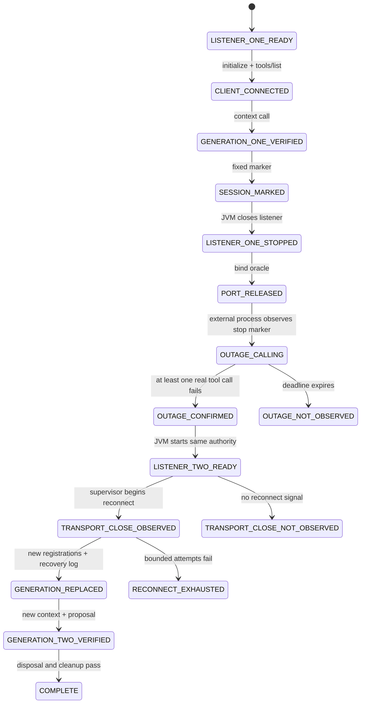

# ADR-0016: Established-session Streamable HTTP recovery probe

- Status: diagnostic
- Issue: #39
- Parent issue: #37
- Parent PR: #38
- Parent exact head: `d0e9eaa58be658e943be99b47a37a4e21b5bc6ba`
- Upstream subject: `deepseek-ai/deepseek-harness@47f943859bef60e4160492346772ded9b24f765a`
- Upstream version: `0.1.0-rc.5`

## Context

The existing evidence stack proves:

1. immediate connection to an already-running Desktop listener;
2. a real pinned DeepSeek Harness/Cordis process and `ctx.tools` registration;
3. bounded recovery when the endpoint is unavailable before the first successful connection.

Those subjects do not prove that a real `StreamableHTTPClientTransport` reports loss after an established session, causes the DeepSeek Harness supervisor to create a new client generation, and atomically replaces tool registrations.

At the pinned upstream subject, mocked supervisor tests explicitly call `Client.onclose`. Under that condition the supervisor schedules bounded reconnect, creates a replacement client, re-synchronizes tools, removes the old generation, and reports `reconnected and re-synced tools`. This ADR defines a real transport probe for the missing `onclose` boundary.

## Decision

Run a two-listener-generation diagnostic on the same numeric-loopback authority.

A PASS requires more than a successful call after the endpoint returns. The test must observe:

- a real call failure while the listener is absent;
- the upstream supervisor's reconnected/re-synchronized log;
- a new capture-tool registry object;
- a second registration event for each KMP tool;
- exactly one live registration per KMP tool after recovery;
- generation-two context and proposal-only navigation.

If any reconnect-specific oracle is absent, the test fails. The failure is used to distinguish transport behavior from supervisor behavior.

## State machine — `SM-DSH-ESTABLISHED-RECOVERY-001`



## Data flows

### `DF-DSH-ESTABLISHED-001` — Generation one

```text
Desktop listener generation 1
  -> DSH Streamable HTTP client
  -> ctx.tools generation 1
  -> capture context
  -> generation-one-public + redacted secret
  -> initial-session-ready marker
```

### `DF-DSH-ESTABLISHED-002` — Real outage

```text
JVM closes listener generation 1
  -> port and worker cleanup
  -> listener-stopped marker
  -> ctx.tools.execute during no-listener interval
  -> thrown or typed tool error
  -> outage-call-failed marker
```

The JVM cannot start listener generation 2 until the outage-call failure marker exists.

### `DF-DSH-ESTABLISHED-003` — Supervisor recovery

```text
real transport failure
  -> MCP Client onclose
  -> DSH bounded reconnect supervisor
  -> new Client + transport
  -> tools/list
  -> new ctx.tools registration generation
  -> reconnected-and-re-synced log
```

Both registration counters and object identity must change. A successful request through an unchanged tool object is not accepted as supervisor reconnect evidence.

### `DF-DSH-ESTABLISHED-004` — Generation two authority

```text
listener generation 2
  -> generation-two-public sanitized context
  -> proposal-only navigation
  -> JVM dispatcher WAITING_FOR_CONFIRMATION
```

## Reconnect subject

```yaml
failOnStartupError: true
reconnect:
  enabled: true
  initialDelayMs: 100
  maxDelayMs: 500
  maxAttempts: 30
tool_call_timeout_ms: 2000
outage_failure_deadline_ms: 15000
recovery_deadline_ms: 30000
process_deadline_ms: 150000
```

## Invariants

### `INV-DSH-ESTABLISHED-001` — Outage is real

Listener generation 1 must release its exact port before the outage marker is written. At least one real tool call must fail while no listener is bound.

### `INV-DSH-ESTABLISHED-002` — Recovery is supervisor-owned

A PASS requires the upstream re-synchronization log, a changed registration object, and second registration events. Endpoint availability alone cannot satisfy the oracle.

### `INV-DSH-ESTABLISHED-003` — One live generation

After recovery, each server-qualified KMP tool appears exactly once and raw tool names remain absent.

### `INV-DSH-ESTABLISHED-004` — Context identifies listener generation

Generation-one and generation-two public markers differ. Both fixture secrets remain redacted.

### `INV-DSH-ESTABLISHED-005` — Recovery does not grant action authority

The generation-two navigation call must return pending confirmation, while the JVM independently observes `WAITING_FOR_CONFIRMATION` and the exact proposed URL.

### `INV-DSH-ESTABLISHED-006` — Diagnostic failure is preserved

Failure to observe `onclose`/re-synchronization is `FAIL_TRANSPORT_CLOSE_NOT_OBSERVED`, not a reason to relabel startup recovery or manually extend the timeout.

## Shadow Architecture review

| Delta | Classification | Outcome |
|---|---|---|
| Established endpoint disappears | `FAILURE_SURFACE_DELTA` | L2: two-generation runtime probe |
| Real SDK transport close semantics unknown | `ASSUMPTION_DELTA` / `UNKNOWN` | L2: distinguishing onclose/re-sync oracle |
| Dynamic tool registration replacement | `STATE_DELTA` / `CONCURRENCY_DELTA` | L2: registration counters, identity, exact-count checks |
| Successful request could mask no reconnect | `EVIDENCE_DELTA` | L3 block on PASS without recovery log and generation replacement |
| Remote tools remain visible during outage | `AUTHORITY_DELTA` | L1: visibility is not successful execution authority |

## Stable outcomes

```text
PASS
  real transport loss caused bounded supervisor reconnect and tool-generation replacement

FAIL_TRANSPORT_CLOSE_NOT_OBSERVED
  tool-call outage occurred, but no required onclose/re-sync generation evidence appeared

FAIL_RECONNECT_EXHAUSTED
  reconnect began but did not recover under the bounded policy

FAILED_EVAL
  initial session, outage, sanitization, proposal, or cleanup oracle failed
```

## Evidence boundary

A PASS may establish established-session recovery only for the exact pinned DSH, MCP SDK resolution, JDK listener, and CI substrate.

It cannot establish:

```yaml
cordis_hmr: NOT_EXERCISED
tool_list_changed_notification_replacement: NOT_EXERCISED
arbitrary_remote_proxy_behavior: NOT_EXERCISED
mobile_network_lifecycle: NOT_EXERCISED
production_token_custody: NOT_IMPLEMENTED
oauth_or_mtls: NOT_IMPLEMENTED
remote_tls: NOT_IMPLEMENTED
future_upstream_commit_compatibility: UNKNOWN
physical_devices: NOT_EXERCISED
merge: EXTERNAL_AUTHORITY_REQUIRED
production: EXTERNAL_AUTHORITY_REQUIRED
```

## Rollback

Remove the diagnostic workflow change, JVM test, external specification, README additions, and this ADR. The rollback subject is `d0e9eaa58be658e943be99b47a37a4e21b5bc6ba`; immediate-connect and startup-recovery evidence remain intact.
