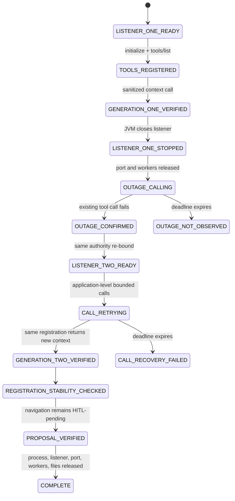

# ADR-0017: Stateless same-registration call recovery

- Status: proposed
- Issue: #41
- Parent issue: #39
- Parent PR: #40
- Parent exact head: `38d32472cfeb6a88cbe4a910bda98c0813ba2bb4`
- Parent diagnostic outcome: `FAIL_TRANSPORT_CLOSE_NOT_OBSERVED`
- Upstream subject: `deepseek-ai/deepseek-harness@47f943859bef60e4160492346772ded9b24f765a`
- Upstream version: `0.1.0-rc.5`

## Context

The DeepSeek Harness compatibility stack now proves:

1. immediate real-process interoperability with the Desktop listener;
2. bounded recovery when the endpoint is absent before the first successful connection;
3. a negative established-session diagnostic showing that real listener loss did not produce the required upstream supervisor re-synchronization plus tool-registration generation replacement contract.

The failed diagnostic must not be repaired by weakening its oracle. It demonstrates that the consumer cannot depend on `Client.onclose`-driven generation replacement for every stateless Streamable HTTP outage.

A stateless HTTP transport may still allow a later request to succeed through the existing MCP client and existing Cordis tool wrapper after the endpoint returns. That behavior has a different state and authority model and requires its own evidence.

## Decision

Add a positive real-process E2E subject for **stateless same-registration call recovery**.

The subject keeps one Cordis tool generation alive across an outage:

```text
registered generation 1
  -> one real call fails while endpoint is absent
  -> endpoint returns on the same authority
  -> a later call through the same registry object succeeds
```

A PASS requires stable registration identity and count. It must not emit or depend on the upstream `reconnected and re-synced tools` signal.

The failed supervisor-reconnect test remains unchanged and excluded from the positive dedicated workflow. It continues to compile in the normal KMP matrix.

## State machine — `SM-DSH-STATELESS-CALL-001`



## Data flows

### `DF-DSH-STATELESS-001` — Initial registration

```text
Pinned DSH MCP client
  -> initialize
  -> tools/list
  -> one capture registration
  -> one navigation registration
  -> store registry object identities and counts
```

### `DF-DSH-STATELESS-002` — Real outage

```text
JVM closes listener generation 1
  -> exact port release
  -> external tool call through existing registration
  -> request error or typed tool error
  -> outage-call-failed marker
```

Listener generation 2 cannot start until the outage marker exists.

### `DF-DSH-STATELESS-003` — Same-registration request recovery

```text
listener generation 2 on same authority
  -> existing capture tool wrapper
  -> existing MCP Client / Streamable HTTP transport
  -> bounded repeated request attempts
  -> generation-two sanitized context
```

No `tools/list`, new registration event, or registry-object replacement is required or accepted as this subject's recovery mechanism.

### `DF-DSH-STATELESS-004` — Post-outage authority

```text
existing navigation tool wrapper
  -> generation-two Desktop listener
  -> BrowserMcpGateway
  -> typed AgentAction proposal
  -> local dispatcher WAITING_FOR_CONFIRMATION
```

## Subject bounds

```yaml
initial_tool_call_timeout_ms: 2000
outage_failure_deadline_ms: 15000
post_restart_call_deadline_ms: 30000
process_deadline_ms: 120000
vitest_retry: 0
registration_count_expected:
  capture: 1
  navigation: 1
```

## Invariants

### `INV-DSH-STATELESS-001` — A real outage precedes recovery

- Statement: at least one call through the existing registration must fail while no listener is bound.
- Enforcement: listener close, port-release oracle, outage call loop, fixed marker ordering.
- Failure mode: the test becomes an uninterrupted-session test.

### `INV-DSH-STATELESS-002` — Registration identity remains stable

- Statement: capture and navigation registry objects after endpoint return are the same objects created during initial synchronization.
- Enforcement: object-identity assertions.
- Failure mode: supervisor reconnect or another generation mechanism is mislabeled as stateless call recovery.

### `INV-DSH-STATELESS-003` — Registration count remains one

- Statement: each admitted KMP tool registers exactly once for the entire subject.
- Enforcement: intercepted `ctx.tools.register` counters and exact schema counts.
- Failure mode: duplicate or stale tool generation.

### `INV-DSH-STATELESS-004` — Supervisor reconnect is not claimed

- Statement: the test neither requires nor observes `reconnected and re-synced tools` as its recovery mechanism.
- Enforcement: captured info-log negative assertion and unchanged registry generation.
- Failure mode: evidence vocabulary collapses distinct recovery paths.

### `INV-DSH-STATELESS-005` — Context proves the replacement listener

- Statement: the recovered call returns the generation-two public marker and redacts the generation-two secret.
- Enforcement: distinct runtime fixtures and external text assertions.
- Failure mode: a cached or stale generation-one response is mistaken for recovery.

### `INV-DSH-STATELESS-006` — Action authority remains local

- Statement: the post-restart navigation call creates a proposal only.
- Enforcement: external pending-confirmation result and independent JVM dispatcher oracle.
- Failure mode: remote tool recovery becomes direct browser/native execution authority.

### `INV-DSH-STATELESS-007` — Failed reconnect diagnostic is preserved

- Statement: PR #40's failed supervisor-reconnect test and ADR remain unchanged and are not run in the positive dedicated workflow.
- Enforcement: separate files, explicit Gradle test-class allowlist, child-path lease.
- Failure mode: a negative result is silently rewritten into a positive claim.

## Shadow Architecture review

| Delta | Classification | Outcome |
|---|---|---|
| Recovery mechanism changes from generation replacement to request retry | `STATE_DELTA` / `LIFECYCLE_DELTA` | L2: separate state machine and evidence vocabulary |
| Existing registration remains model-visible during outage | `AUTHORITY_DELTA` | L1: visibility does not mean successful call or action authority |
| Repeated calls after endpoint return | `EXTERNAL_SIDE_EFFECT_DELTA` | L2: bounded deadline and synthetic read/proposal tools only |
| Negative parent evidence must remain intact | `EVIDENCE_DELTA` | L3 block on modifying or running failed diagnostic as positive gate |
| Same authority serves a new runtime generation | `OWNERSHIP_DELTA` | L2: generation-specific context markers prove current destination |

## Verification

Positive controls:

- exact pinned upstream/toolchain/install subject;
- real initial registration and generation-one context;
- listener shutdown, port release, and real outage call failure;
- listener generation 2 on the same numeric-loopback authority;
- bounded later call through the existing registration;
- generation-two public marker and redacted secret;
- stable capture/navigation object identity;
- registration counters and schema counts remain one;
- no supervisor re-sync log used as evidence;
- proposal-only navigation and independent dispatcher oracle;
- clean process/listener/port/worker/marker/output disposal;
- dedicated E2E and normal KMP matrix.

Negative controls:

- no listener restart before outage proof;
- no registration-object replacement;
- no second registration event;
- no raw KMP tool names;
- no generation-one cached response accepted as generation-two recovery;
- no secret/token/endpoint disclosure;
- no retry beyond the bounded deadline;
- no direct action execution;
- no mutation of the failed diagnostic.

## Evidence boundary

A green exact-head subject may prove:

```yaml
real_outage_call_failure: PASS
stateless_same_registration_call_recovery: PASS
stable_tool_registration_identity: PASS
stable_single_registration_count: PASS
generation_two_context: PASS
proposal_only_navigation_after_recovery: PASS
clean_two_listener_disposal: PASS
```

It cannot prove:

```yaml
supervisor_reconnect: FAIL_ON_PARENT_SUBJECT
mcp_client_generation_replacement: FAIL_ON_PARENT_SUBJECT
cordis_hmr: NOT_EXERCISED
tool_list_changed_notification_replacement: NOT_EXERCISED
arbitrary_proxy_or_remote_network_behavior: NOT_EXERCISED
production_token_custody: NOT_IMPLEMENTED
oauth_or_mtls: NOT_IMPLEMENTED
remote_tls: NOT_IMPLEMENTED
mobile_lifecycle: NOT_EXERCISED
physical_devices: NOT_EXERCISED
future_upstream_commit_compatibility: UNKNOWN
merge: EXTERNAL_AUTHORITY_REQUIRED
production: EXTERNAL_AUTHORITY_REQUIRED
```

## Rollback

Remove the stateless-call workflow changes, JVM test, external specification, README additions, and this ADR. The rollback subject is `38d32472cfeb6a88cbe4a910bda98c0813ba2bb4`; the failed supervisor-reconnect diagnostic remains preserved.
