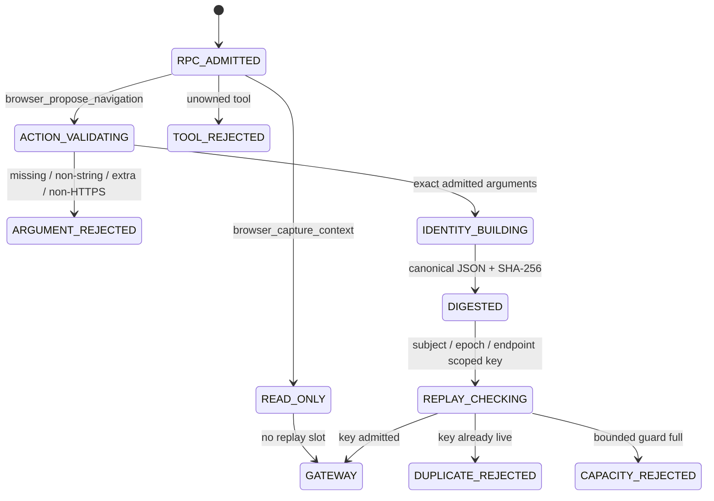

# ADR-0018: Semantic replay identity for action-bearing MCP calls

- Status: proposed
- Issue: #43
- Parent issue: #41
- Parent PR: #42
- Parent exact head: `11c41871bbcb604813eb6003338d96bce4a8ef95`

## Context

PR #42 proves that the pinned DeepSeek Harness Streamable HTTP subject recovers established stateless sessions by issuing later requests through one stable Cordis tool registration. That makes request retry behavior part of the consumer contract.

The existing replay guard derives its key from the complete JSON-RPC request body. JSON-RPC request IDs are transport correlation values, not action identities. Two requests can therefore carry the same navigation intent while differing only in `id`, whitespace, or object insertion order and receive different replay keys.

The same generic `tools/call` classification also places repeatable read-only context calls into the replay guard even though stateless request recovery needs them to remain callable.

## Decision

Classify replay protection by admitted tool semantics:

```text
browser_capture_context
  -> read-only
  -> repeatable
  -> no replay slot

browser_propose_navigation
  -> state-changing proposal
  -> semantic replay key
  -> duplicate rejection before gateway
```

The navigation arguments object is admitted only when it contains exactly one string member named `url`. The bridge repeats the existing HTTPS, length, and control-character checks before replay admission; `BrowserMcpGateway` remains the second policy boundary.

## State machine — `SM-MCP-SEMANTIC-REPLAY-001`



## Data flow — `DF-MCP-SEMANTIC-REPLAY-001`

```text
authenticated subject id
+ credential epoch
+ normalized scheme / authority / path
+ tools/call
+ browser_propose_navigation
+ canonical {url: ...}
  -> deterministic canonical JSON
  -> repository-owned common-code SHA-256
  -> 64-character lowercase digest
  -> bounded replay guard
```

The JSON-RPC request ID, formatting, HTTP header order, and raw request body are absent from the identity.

## Canonicalization

```text
JsonObject
  -> recursively sort keys lexicographically

JsonArray
  -> preserve order

JsonPrimitive / JsonNull
  -> preserve JSON type and value representation
```

Object key sorting removes insertion-order and formatting differences without erasing array semantics.

## Digest boundary

A repository-owned common-code SHA-256 implementation avoids:

- storing raw action URLs or canonical payloads in the replay guard;
- using non-cryptographic `StableIds` at a security boundary;
- adding a new dependency or platform-specific crypto API to `commonMain`.

Known vectors for empty input, `abc`, and the standard quick-brown-fox phrase are required oracles.

## Invariants

### `INV-MCP-SEMANTIC-001` — Request ID is not action identity

- Statement: semantically identical navigation proposals receive the same replay digest regardless of JSON-RPC `id`.
- Enforcement: request ID is absent from the canonical identity.
- Negative control: IDs `1` and `2` with the same URL; second call is rejected before gateway.

### `INV-MCP-SEMANTIC-002` — Read-only retries remain repeatable

- Statement: `browser_capture_context` never consumes replay capacity.
- Enforcement: replay classification is tool-specific.
- Negative control: identical read calls both succeed, then the first navigation action still acquires the only replay slot.

### `INV-MCP-SEMANTIC-003` — Ignored fields cannot bypass replay

- Statement: the navigation argument object contains exactly `url` and no other member.
- Enforcement: exact key-set validation before identity generation.
- Negative control: extra, missing, non-string, non-HTTPS, or control-bearing URL requests fail before gateway.

### `INV-MCP-SEMANTIC-004` — Security domains remain isolated

- Statement: subject identity, credential epoch, and endpoint identity scope replay keys.
- Enforcement: all are canonical identity members before hashing.
- Negative control: the same action under another subject or credential epoch remains independent.

### `INV-MCP-SEMANTIC-005` — Replay state contains no raw action data

- Statement: the guard stores only a lowercase 64-character SHA-256 digest.
- Enforcement: `semanticActionReplayKey` returns the digest only.
- Negative control: replay-key tests search for URL, subject, epoch, and action text.

### `INV-MCP-SEMANTIC-006` — Duplicate suppression is not execution authority

- Statement: replay admission only allows a proposal to reach the existing gateway; it cannot authorize or execute navigation.
- Enforcement: unchanged capability policy, dispatcher, HITL, and executor boundaries.

## Shadow Architecture review

| Delta | Classification | Outcome |
|---|---|---|
| Established-session recovery adds request retries | `LIFECYCLE_DELTA` | L2: replay identity detached from correlation IDs |
| Replay class narrows from all tool calls to action tool | `AUTHORITY_DELTA` | L2: read-only and state-changing semantics separated |
| Canonical action payload is transient | `PRIVATE_EGRESS_DELTA` | L2: only SHA-256 digest enters replay state |
| Custom common SHA-256 implementation | `FAILURE_SURFACE_DELTA` | L2: published known vectors plus cross-target CI |
| Unknown arguments previously reached gateway | `ASSUMPTION_DELTA` | L3 block: exact action schema required before replay |

## Verification

Portable controls:

- published SHA-256 vectors;
- recursive canonical object ordering and array-order preservation;
- same action across different IDs and formatting rejected;
- repeated read-only calls admitted without consuming replay capacity;
- different URL, subject, and credential epoch remain independent;
- invalid or extra action arguments stop before gateway;
- replay key contains no raw sensitive identity or URL data;
- existing portable bridge tests and full KMP matrix.

Pinned DeepSeek Harness control:

- two Cordis calls with distinct call IDs and identical navigation arguments;
- first result remains proposal-only;
- second result is a typed duplicate-action error;
- independent JVM runtime retains only the first pending action.

## Evidence boundary

A green exact-head subject may prove semantic duplicate suppression for the currently admitted navigation proposal across JSON-RPC correlation IDs and formatting differences, plus repeatable read-only calls.

It cannot prove:

```yaml
replay_durability_across_process_restart: NOT_IMPLEMENTED
multi_node_replay_coordination: NOT_IMPLEMENTED
arbitrary_future_tool_semantics: NOT_IMPLEMENTED
production_credential_custody: NOT_IMPLEMENTED
oauth_or_mtls: NOT_IMPLEMENTED
remote_tls: NOT_IMPLEMENTED
physical_devices: NOT_EXERCISED
merge: EXTERNAL_AUTHORITY_REQUIRED
production: EXTERNAL_AUTHORITY_REQUIRED
```

## Rollback

Remove the semantic replay utility/tests, restore raw-body replay classification in the portable bridge, and remove this ADR. The exact rollback subject is `11c41871bbcb604813eb6003338d96bce4a8ef95`.
