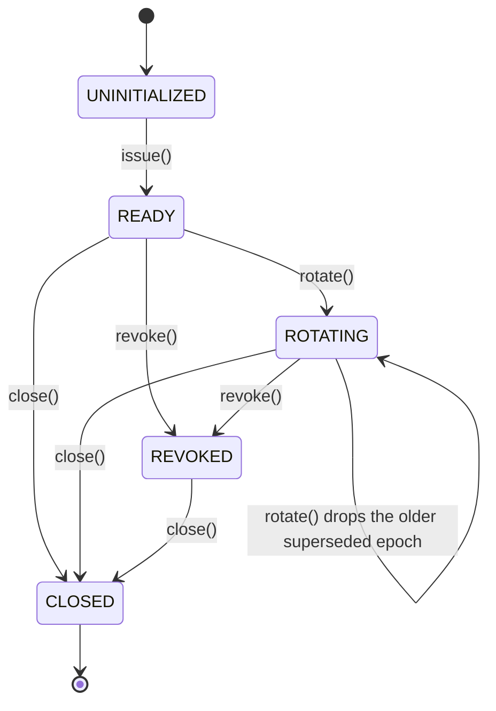

# ADR-0019: Runtime MCP credential issuance, rotation, custody, and revocation

- Status: proposed
- Issue: #46
- Depends on: #33 (listener), #43 (semantic replay identity)
- Dependency delta: none

## Context

The Desktop listener from PR #34 verifies a bearer credential the host must supply. CI generates a
per-run synthetic token, which is evidence for test isolation, not for production issuance or
custody. Nothing in the repository owned credential *generation*, *rotation*, or *revocation*, so a
compromised credential could only be retired by restarting the process, and a long-lived token had
no expiry at all.

## Decision

Add `DesktopMcpCredentialLifecycle`: one host-owned object that mints credentials, keeps only their
digests, and answers the bridge's `McpHttpAuthenticationVerifier` boundary directly.

```text
issuance:   48 bytes from SecureRandom -> base64url -> printable ASCII credential
custody:    raw bytes exist only inside a one-shot DesktopMcpCredentialMaterial handle
retention:  SHA-256 digest only; MessageDigest.isEqual comparison; zeroed on close
rotation:   new epoch is active immediately; prior epoch verifiable for a bounded handover
expiry:     every epoch carries notAfter; a late request is EXPIRED, not INVALID
revocation: immediate and final for every issued epoch
```

The credential epoch (`epoch-1`, `epoch-2`, …) is the same value the bridge feeds into the semantic
replay key from #43, so rotating a credential also retires the previous epoch's replay digests
without a separate cache invalidation path.

## `SM-MCP-CRED-001` — credential lifecycle



### State contract

| State | Required truth | Illegal promotion |
|---|---|---|
| `UNINITIALIZED` | no credential exists; `rotate` fails | listener start cannot mint implicitly |
| `READY` | exactly one verifiable epoch | expiry is still enforced |
| `ROTATING` | at most two verifiable epochs, the older one time-boxed | a second rotation cannot keep three |
| `REVOKED` | no credential verifies, including the active one | `rotate` cannot resurrect |
| `CLOSED` | digests zeroed | no post-close acceptance |

## Data flow `DF-MCP-CRED-001`

```text
SecureRandom
  -> 48 entropy bytes (zeroed after encoding)
  -> base64url credential bytes
  -> SHA-256 digest retained with an epoch and notAfter
  -> DesktopMcpCredentialMaterial (consumable exactly once)
  -> listener start + one approved child process environment value
  -> raw bytes zeroed
```

## Invariants

### `INV-MCP-CRED-001` — the process never keeps the credential

- Statement: after the host consumes the material, no live object holds the raw credential.
- Enforcement: `use {}` zeroes the array in `finally`; a second `use` throws.
- Negative control: a consumed handle cannot be replayed; `toString` renders `<redacted>`.

### `INV-MCP-CRED-002` — rotation is bounded, not additive

- Statement: at most one superseded epoch is verifiable, and only until `rotatedAt + handover`.
- Enforcement: a single `retiring` slot whose digest is zeroed when it is displaced.
- Negative control: two rotations reject the first credential outright.

### `INV-MCP-CRED-003` — absence is distinguishable

- Statement: missing, wrong, expired, and out-of-scope credentials produce different reasons.
- Enforcement: `MISSING_CREDENTIALS`, `INVALID_CREDENTIALS`, `EXPIRED_CREDENTIALS`,
  `INSUFFICIENT_SCOPE` map to distinct bridge statuses (401 vs 403).

### `INV-MCP-CRED-004` — scope binding

- Statement: a credential is only valid for the exact scheme and authority it was scoped to.
- Enforcement: constructor-bound `expectedScheme`/`expectedAuthority`; the listener refuses an
  ephemeral port when a rotating lifecycle is used, because port 0 cannot be pre-scoped.

## Verification

Positive controls: issuance produces printable high-entropy material; distinct issuances differ;
the prior epoch verifies inside the handover window; the active epoch verifies after it; rotation
and revocation apply to a running listener over a real socket.

Negative controls: reversed credential, missing header, expired handover, expired lifetime, third
rotation, wrong authority, wrong scheme, post-revocation, post-close, double consumption,
`rotate` before `issue`.

## Evidence boundary

```yaml
runtime_token_generation: PASS_OR_FAIL
credential_rotation: PASS_OR_FAIL
credential_revocation: PASS_OR_FAIL
in_process_custody: PASS_OR_FAIL
os_keychain_or_hsm_custody: NOT_IMPLEMENTED
multi_process_credential_distribution: NOT_EXERCISED
```

Custody here means in-process custody: the credential is never persisted, logged, or rendered.
Storing it in an OS keychain or HSM, and distributing it to processes other than one directly
launched child, remain out of scope for this slice.
