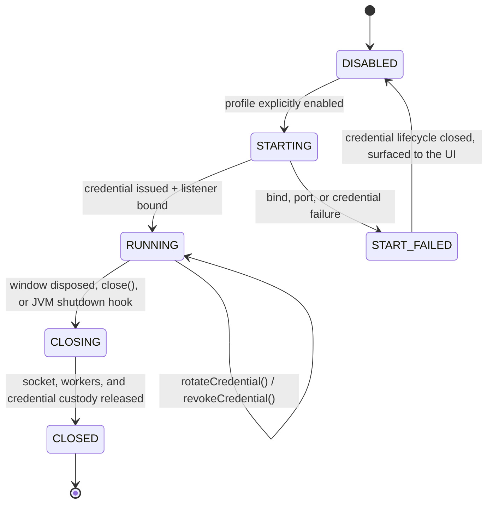

# ADR-0020: Desktop application lifecycle for the opt-in MCP listener

- Status: proposed
- Issue: #50
- Depends on: #33 (listener), #46 (credential lifecycle)
- Dependency delta: none (`jdk.httpserver` is a JDK module, not a new dependency)

## Context

`DesktopMcpLoopbackServer` was a verified library surface with no application owner: the Desktop
entry point had no configuration surface, no start transition, no shutdown hook, and no packaged
distribution that actually contains `jdk.httpserver`. A packaged app would therefore start fine and
fail only later, at the moment a user enabled the profile — the worst place for the failure to
appear.

## Decision

Add `DesktopMcpRuntimeProfile` (explicit configuration) and `DesktopMcpIntegration` (lifecycle
owner), and declare `jdk.httpserver` in the Compose native distribution.

```text
KAW_MCP_LISTENER=enabled     the only value that starts anything
KAW_MCP_PORT                 exact TCP port; malformed value is fatal, not defaulted
KAW_MCP_ALLOWED_ORIGINS      exact Origin allowlist; when present, a missing Origin is denied
```

`DesktopMcpIntegration.startIfEnabled` returns `null` for a disabled profile, so there is no
half-initialised object to reason about. When it does start, it owns one credential lifecycle and
one listener, and closes both from `close()` and from a JVM shutdown hook.

## `SM-DESKTOP-APP-001` — application-owned listener lifecycle



### State contract

| State | Required truth | Illegal promotion |
|---|---|---|
| `DISABLED` | no socket, no credential | an unset or misspelled variable never enables |
| `STARTING` | credential exists before the socket does | a bound socket without a verifier is impossible |
| `START_FAILED` | credential closed; failure is displayed | never silently downgraded to `DISABLED` |
| `RUNNING` | app stays responsive; listener is on its own bounded pool | UI thread is never blocked by a request |
| `CLOSED` | port released, workers quiesced, digests zeroed | a crash path cannot leave the socket open |

## Data flow `DF-DESKTOP-APP-001`

```text
process environment
  -> DesktopMcpRuntimeProfile (fail-closed parsing)
  -> DesktopMcpLoopbackServerConfig
  -> DesktopMcpCredentialLifecycle (issue)
  -> DesktopMcpLoopbackServer (bind 127.0.0.1:<port>)
  -> childProcessEnvironment() -> one approved child process
```

The same `AgentBrowserRuntime` instance backs the UI and the listener's gateway, so an MCP caller
observes exactly the state the user sees — it cannot address a second, invisible runtime.

## Invariants

### `INV-DESKTOP-APP-001` — default off survives packaging

- Statement: a packaged application with no environment configuration opens no port.
- Enforcement: `ENABLE_VARIABLE` must equal `enabled` exactly; comparison is case-sensitive.
- Negative control: `true` and `ENABLED` do not enable.

### `INV-DESKTOP-APP-002` — malformed configuration fails closed

- Statement: an enabled profile with an unusable port refuses to start rather than binding a
  default port.
- Enforcement: `requireNotNull(... in 1..65535)`; the failure surfaces in the window.
- Negative control: `0`, `-1`, `70000`, `3090abc`, and `""` all throw.

### `INV-DESKTOP-APP-003` — shutdown is total

- Statement: normal disposal and abrupt JVM exit both release socket, workers, and credentials.
- Enforcement: `DisposableEffect(onDispose)` plus a registered shutdown hook; both funnel through
  one idempotent `closeInternal`.
- Negative control: after close, the port is connectable no more and the endpoint refuses.

### `INV-DESKTOP-APP-004` — the packaged runtime contains the listener's module

- Statement: the distribution image includes `jdk.httpserver`.
- Enforcement: `nativeDistributions { modules("jdk.httpserver") }`.
- Residual risk: this is a build declaration. See the evidence boundary.

## Verification

Positive controls: disabled profile starts nothing; enabled profile serves the issued credential
over a real socket; rotation keeps both epochs live inside the handover; revocation rejects both;
close releases the port.

Negative controls: no credential (401); wrong credential (403); every malformed profile value.

## Evidence boundary

```yaml
desktop_application_startup: PASS_OR_FAIL
desktop_application_shutdown: PASS_OR_FAIL
credential_rotation_on_a_live_listener: PASS_OR_FAIL
desktop_packaging_with_jdk_httpserver: DECLARED_NOT_EXERCISED
packaged_process_e2e: NOT_EXERCISED
crash_recovery_after_SIGKILL: NOT_EXERCISED
```

`modules("jdk.httpserver")` is a declaration verified by review, not by a packaging run: producing
and launching a `jpackage` image is a platform-specific, signing-adjacent operation that this slice
does not perform. `SIGKILL` bypasses JVM shutdown hooks by definition; the operating system closes
the socket in that case, which is not the same claim as an orderly release.
