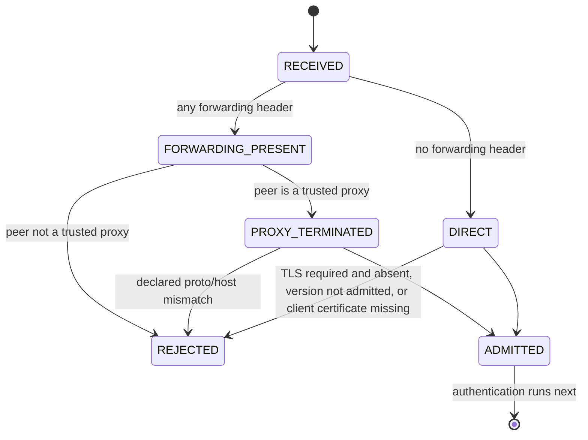

# ADR-0021: Remote HTTPS termination and trusted-proxy admission

- Status: proposed
- Issue: #47
- Depends on: #29 (portable bridge), #33 (loopback listener)
- Dependency delta: none (`javax.net.ssl` and `com.sun.net.httpserver` are JDK surfaces)

## Context

The portable bridge admitted only what a host handed it, and the only host was a loopback listener
with no TLS. Any remote deployment would therefore have had to sit behind a proxy whose forwarding
headers the bridge had no way to distinguish from client-asserted ones — the classic
`X-Forwarded-Proto: https` self-promotion.

## Decision

Split the problem in two and put each half where it can actually be decided.

```text
transport facts   observed by the host listener      -> McpHttpTransportFacts
transport policy  declared by the deployment         -> McpHttpTransportPolicy
admission         decided by the portable bridge     -> validateTransportIdentity
termination       performed by a JDK HTTPS listener  -> DesktopMcpHttpsServer
```

`McpHttpTransportFacts` can only be filled in by the listener adapter from its own socket and TLS
session. Nothing that arrived in a header ever reaches it.

### Forwarding rule

```text
any of Forwarded / X-Forwarded-Proto / X-Forwarded-Host / X-Forwarded-For present
  and immediate peer NOT in trustedProxies -> FORWARDING_NOT_ADMITTED (403)
  and immediate peer IS in trustedProxies  -> declared proto/host must equal the admitted route
                                              else FORWARDED_METADATA_REJECTED (400)
```

Presence of forwarding metadata from an unlisted peer is a rejection, not a hint to ignore. An
HTTPS endpoint that neither terminates TLS itself nor names a trusted proxy cannot be constructed
at all — the failure is at configuration time, not at request time.

## `SM-MCP-TLS-001` — transport admission



Transport admission runs **before** authentication, so a rejected hop never reaches a verifier and
never consumes credential-verification work.

## Invariants

### `INV-MCP-TLS-001` — headers cannot promote a hop

- Statement: no request header can make a plaintext hop look like TLS.
- Enforcement: TLS facts come only from `HttpsExchange.sslSession`; forwarding headers are gated on
  the numeric peer address.
- Negative control: `X-Forwarded-Proto: https` from an unlisted peer yields 403 over real TLS.

### `INV-MCP-TLS-002` — an unverified certificate is not an identity

- Statement: a peer certificate subject is reported only when the JDK trust manager validated it.
- Enforcement: `peerCertificateSubject` is populated from `sslSession.peerPrincipal`, which throws
  when the peer was not authenticated; `peerCertificateVerified` is derived from that, not asserted.

### `INV-MCP-TLS-003` — only modern TLS

- Statement: TLS 1.2 is the floor and TLS 1.3 is the default admitted protocol.
- Enforcement: config `require` rejects anything below `TLSv1.2`; the configurator pins the
  negotiated protocol list; the bridge re-checks the negotiated value.

### `INV-MCP-TLS-004` — no new inbound surface off Desktop

- Statement: Android, iOS, and Wasm gain no listener.
- Enforcement: `DesktopMcpHttpsServer` lives in `desktopMain` only.

## Verification

Positive controls: a real TLS 1.3 request over a test-generated certificate reaches the gateway and
returns a JSON-RPC result; the negotiated protocol on the client side is `TLSv1.3`; a trusted proxy
may present plaintext with matching forwarding metadata.

Negative controls: plaintext on an HTTPS endpoint; `TLSv1.2` when only 1.3 is admitted; missing or
unvalidated client certificate when required; forwarding metadata from an unlisted peer; forwarding
metadata that claims a different scheme or host; an HTTPS policy with neither TLS nor a proxy;
`requireClientCertificate` without direct TLS.

## Evidence boundary

```yaml
remote_tls: PASS_OR_FAIL
tls_termination: PASS_OR_FAIL
trusted_proxy_boundary: PASS_OR_FAIL
client_certificate_admission: PASS_OR_FAIL
arbitrary_proxy_or_remote_network_behavior: NOT_EXERCISED
public_internet_exposure: DENIED_BY_ARCHITECTURE
certificate_rotation_under_load: NOT_EXERCISED
```

The evidence is a loopback-bound TLS listener with a certificate generated at test time. It proves
the termination and admission logic; it does not prove behaviour behind a specific production
reverse proxy, nor does it authorise exposing this endpoint to the public internet.
