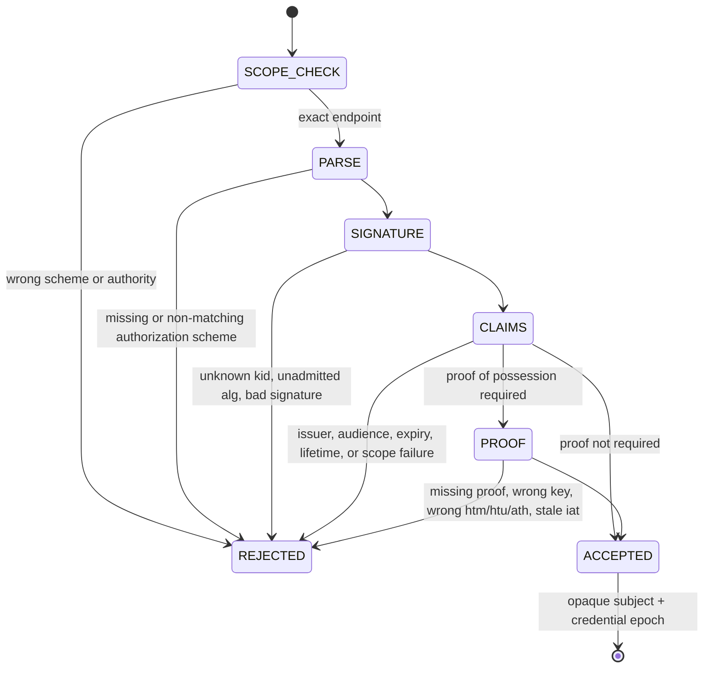

# ADR-0022: Production OAuth, mTLS, and workload-identity MCP verifiers

- Status: proposed
- Issue: #48
- Depends on: #29 (bridge), #31 (loopback auth), #46 (credential lifecycle), #47 (transport)
- Dependency delta: none

## Context

`McpHttpAuthenticationVerifier` was an injected boundary with exactly one real implementation: a
fixed bearer digest bound to a loopback authority. Every production deployment shape — an OAuth
authorization server, a workload mesh with client certificates, a platform identity channel — had
no implementation at all.

## Decision

Implement three profiles behind the existing boundary, and one strict JWT verifier shared by two of
them. **No third-party JWT dependency is added**: the surface is small, security-critical, and
fully expressible with `java.security.Signature`, so the alternative would have been a new
dependency plus its licence and notice evidence for roughly a hundred lines of code.

```text
OAUTH_BEARER       RS256/ES256 access token; iss, aud, exp, nbf, iat, scope, kid rotation
                   optional DPoP proof-of-possession bound to method + endpoint + token hash
MTLS               identity is the validated peer certificate subject, exactly allow-listed
WORKLOAD_IDENTITY  platform-issued short-lived assertion read from the host channel, not a header
```

Every profile authenticates a caller and returns **only** an opaque subject and a credential epoch.
None of them authorises a browser or native action; the Capability Policy, Dispatcher, HITL, and
executor remain the only authorities for that.

### Two deliberate strictness choices

- **`aud` must equal the exact endpoint URL.** A token minted by the same issuer, signed by the
  same key, for a different service does not authenticate here.
- **The signing key id is the credential epoch.** Rotating the key therefore also retires the
  previous epoch's semantic replay digests (#43) with no separate invalidation path.

### Why `alg` never selects the key

`McpJwtKeySource.publicKey(keyId, algorithm)` is asked for a key *for* an algorithm; a token cannot
name an algorithm that changes which key material is trusted, and `none` is not in the admitted
set. This is the standard JWT algorithm-confusion defence.

## `SM-MCP-AUTHN-001` — OAuth admission



## Invariants

### `INV-MCP-AUTHN-001` — the upstream principal never leaks

- Statement: `sub`, certificate subject, and workload name never appear in the bridge identity.
- Enforcement: `opaqueSubject` returns a SHA-256 digest of `namespace + principal`.
- Negative control: the accepted subject id does not contain the account name.

### `INV-MCP-AUTHN-002` — an unbounded credential is malformed

- Statement: a token with no `exp`/`iat`, or a lifetime beyond the profile ceiling, is rejected.
- Rationale: "valid forever" is not a security property the endpoint may inherit from an issuer.

### `INV-MCP-AUTHN-003` — transport identity is not client-assertable

- Statement: mTLS and workload identity read only `McpHttpTransportFacts`.
- Negative control: the same workload assertion presented as an `Authorization` header is treated
  as *missing* credentials.

### `INV-MCP-AUTHN-004` — proof of possession binds the request

- Statement: with PoP enabled, the credential is only usable with this method, this endpoint, this
  access token, and a recent proof.
- Enforcement: `cnf.jkt` thumbprint (RFC 7638), `htm`, `htu`, `ath`, and a bounded `iat` age.
- Negative control: a proof for another endpoint, a proof signed by an unpinned key, and a stale
  proof are each rejected while the access token itself remains valid.

## Verification

Positive controls: RS256 and ES256 access tokens; key rotation producing a new epoch; a DPoP-bound
request; a validated and allow-listed client certificate; a host-supplied workload assertion.

Negative controls: unknown key id; token signed by a different key; wrong issuer; wrong audience;
missing scope; expired; not yet valid; unbounded lifetime; no expiry; missing credential; wrong
authorization scheme; wrong endpoint authority; unvalidated certificate; unlisted certificate
subject; no TLS hop; assertion for an unlisted workload; assertion presented as a client header;
missing, mismatched, stale, and wrongly-keyed proofs.

## Evidence boundary

```yaml
oauth_authentication: PASS_OR_FAIL
mtls_authentication: PASS_OR_FAIL
workload_identity: PASS_OR_FAIL
cryptographic_request_binding: PASS_OR_FAIL
live_authorization_server_integration: NOT_EXERCISED
jwks_endpoint_fetching_and_caching: NOT_IMPLEMENTED
certificate_revocation_lists_or_ocsp: NOT_IMPLEMENTED
```

Key distribution stays a host responsibility: `McpJwtKeySource` is an interface, and fetching a
JWKS document, caching it, and honouring revocation are deployment concerns this slice does not
implement. Certificate revocation is likewise delegated to the JDK trust manager the host
configures.
