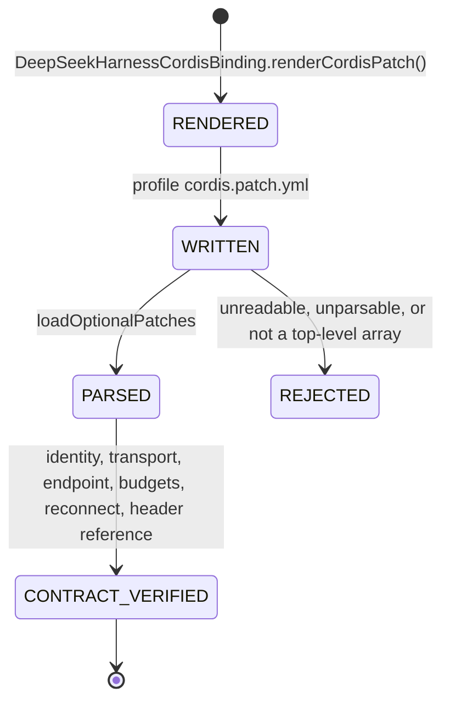

# ADR-0025: The generated Cordis patch as configuration

- Status: proposed
- Issue: #49
- Depends on: #26 (provider binding), #35 (pinned process E2E), #41
- Upstream evidence subject: `deepseek-ai/deepseek-harness@47f943859bef60e4160492346772ded9b24f765a`
- Dependency delta: none

## Context

The pinned-process subject (#35) proves a real Cordis client against this repository's listener by
applying the observed plugin **directly**, with plugin options constructed by hand in the test. That
is evidence about the upstream plugin. It is not evidence about the artefact this repository ships:
the YAML that `DeepSeekHarnessCordisBinding.renderCordisPatch()` emits.

The two can differ silently. A hand-built options object cannot fail YAML parsing, cannot exercise
the `!!js` tag, and cannot show whether the loader accepts an `insert` patch row shaped the way this
repository shapes it. #49 exists to remove that gap.

## Decision

Feed the **rendered** patch to the upstream loader and assert on what the upstream parser returns.
Nothing in the test reconstructs an equivalent object: the Kotlin driver calls production code,
writes the result as the profile's `cordis.patch.yml`, and the external specification parses that
file with `loadOptionalPatches` from `@deepseek-ai/dsh-app-boot`.

## What the upstream parser reports

```json
[{ "insert": [{
  "id": "kotlin-auto-webview-mcp",
  "name": "@deepseek-ai/dsh-mcp-client",
  "config": {
    "serverName": "kotlin_auto_webview",
    "transport": "streamable-http",
    "url": "http://127.0.0.1:<port>/mcp",
    "headers": { "Authorization": { "__jsExpr": "(() => { const token = process.env…" } },
    "toolCallTimeoutMs": 60000,
    "failOnStartupError": true,
    "reconnect": { "enabled": true, "initialDelayMs": 500, "maxDelayMs": 30000, "maxAttempts": 10 }
  }}]}]
```

The `__jsExpr` node is the load-bearing part. The credential stays an **environment lookup the host
resolves at runtime**, and that is asserted by the upstream parser rather than by this repository
about itself — the difference between a secret boundary and a claim of one.

## `SM-DSH-PATCH-001` — patch admission



Absence is distinct from emptiness: a profile with no patch layer yields `undefined`, never `[]`.
An empty array would claim a configured-but-empty layer.

## Why this ADR stops at parsing

Mounting the rendered patch requires the loader to import the plugin the patch names. The chain that
blocks it was measured, not assumed:

```text
1  the rendered patch names the real package `@deepseek-ai/dsh-mcp-client`
   — as any real user's configuration must
2  the loader resolves that name to the package's built entry, packages/mcp/mcp-client/lib/index.js
3  the admitted E2E install is `pnpm install --frozen-lockfile --ignore-scripts`, which ships
   source only; lib/ does not exist
4  the upstream build is not reachable from that install: `build:lib:host` runs
   `tsc -b` (which succeeds) then `tsdown`, and tsdown fails with
   `Failed to import module "unrun"` — `unrun` is an *optional peer* of tsdown that nothing in the
   pinned workspace declares, so no lockfile-faithful install provides it
5  the upstream's own source-launch path is a Node loader hook owned by `apps/cli`
   (`node --import tsx/esm apps/cli/src/bin.ts`), not a reusable `dsh-app-boot` capability
```

The existing four E2E specifications avoid this only because they import
`@deepseek-ai/dsh-mcp-client/src/index.ts` directly. A patch cannot: naming a source path inside the
shipped artefact would make it a different artefact from the one users get.

The available workarounds — synthesising a `node_modules` entry that maps the package name to
source, or vendoring a package layout — would manufacture the evidence rather than obtain it. A
mount proven against a fabricated package layout is not a mount proven against the pinned subject.

## Evidence boundary

```yaml
cordis_patch_parse: PASS
rendered_contract_matches_binding: PASS
credential_absent_from_rendered_patch: PASS
absent_layer_distinguished_from_empty_layer: PASS

cordis_hmr: NOT_EXERCISABLE_IN_THIS_LANE
tool_list_changed_notification_replacement: NOT_EXERCISABLE_IN_THIS_LANE
```

The two unexercised states are **not** `FAIL_HMR_NOT_SUPPORTED`. The upstream contract exists and was
read: `@deepseek-ai/cordis-plugin-hmr` is a Cordis `Service` whose `registerConfig(filename, refresh)`
watches a file, `watchUserPatches` binds the profile's patch layer to it, and the upstream's own
`config-reload.spec.ts` already demonstrates the atomic semantics #49 asks for — a rejected read,
parse, or Loader candidate leaves the last good tree running and broadcasts
`hmr/config-update-failed`. What is missing is a way to mount the rendered patch inside the admitted
install, not a reload mechanism.

## Consequences

Unblocking the remaining two states needs one of:

- an upstream install that yields built packages, which changes what the E2E lane installs and adds
  a `tsc -b`/`tsdown` step to a job already bounded at 40 minutes — and still needs `unrun` supplied
  from somewhere; or
- an upstream-supported way to resolve bare plugin specifiers to workspace source outside
  `apps/cli`; or
- a newer pinned upstream subject where either of the above is true.

None of these is a change this repository can make on its own, so the states stay recorded rather
than quietly dropped.
