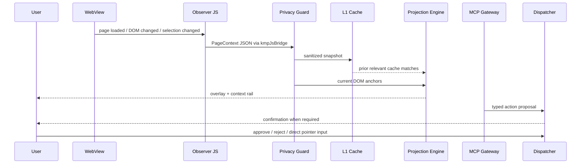

# Architecture contract

## Hard laws

1. **Native renderer law** — each target uses its platform renderer; shared code owns contracts and policy, not a fictional universal browser engine.
2. **Observation before action** — DOM/UI context is captured, sanitized, fingerprinted, and recorded before an action can be proposed.
3. **Human input preempts the agent** — pointer interaction moves the dispatcher to `OBSERVING_USER`; pending execution is cleared.
4. **No raw model execution** — model output becomes an `AgentAction`; only registered capabilities can proceed.
5. **Sensitive fields never enter context** — password/payment inputs are filtered in JavaScript and redacted again in Kotlin.
6. **Projection is evidence, not decoration** — every overlay carries a cache id, anchor fingerprint, relevance, and rendering mode.
7. **Web limitations are explicit** — same-origin/CSP/iframe restrictions are surfaced instead of bypassed.
8. **Protocol is not authority** — MCP transports can discover/read/propose; capability policy, dispatcher state, and HITL still decide execution.

## Decision records

| ADR | Subject | Issue |
|---|---|---:|
| [0001](ADR-0001-platform-webview.md) | Platform WebView renderers | #1 |
| [0002](ADR-0002-agent-boundary.md) | Agent boundary | #1 |
| [0003](ADR-0003-mcp-platform-boundary.md) | Portable MCP platform boundary | #1 |
| [0004](ADR-0004-persistent-memory.md) | Persistent memory and audit evidence | #8 |
| [0005](ADR-0005-openclaw-stream.md) | OpenClaw stream contract | #9 |
| [0006](ADR-0006-native-capabilities.md) | Native capability contracts | #10 |
| [0007](ADR-0007-action-executor.md) | Bounded action executor | #11 |
| [0008](ADR-0008-semantic-router.md) | Local semantic router baseline | #12 |
| [0009](ADR-0009-agent-provider-compatibility.md) | Agent provider compatibility plane | #23 |
| [0010](ADR-0010-deepseek-harness-compatibility.md) | DeepSeek Harness compatibility | #26 |
| [0011](ADR-0011-streamable-http-bridge.md) | Streamable HTTP bridge | #29 |
| [0012](ADR-0012-deepseek-loopback-auth-relock.md) | Loopback auth relock | #31 |
| [0013](ADR-0013-desktop-loopback-listener.md) | Default-off Desktop loopback listener | #33 |
| [0014](ADR-0014-deepseek-harness-process-e2e.md) | Pinned Cordis process E2E | #35 |
| [0015](ADR-0015-deepseek-harness-startup-recovery.md) | Bounded startup recovery | #37 |
| [0016](ADR-0016-deepseek-established-session-recovery-probe.md) | Established-session recovery probe | #39 |
| [0017](ADR-0017-deepseek-stateless-call-recovery.md) | Stateless call recovery | #41 |
| [0018](ADR-0018-semantic-action-replay-identity.md) | Semantic action replay identity | #43 |
| [0019](ADR-0019-mcp-credential-lifecycle.md) | Runtime credential lifecycle | #46 |
| [0020](ADR-0020-desktop-mcp-application-lifecycle.md) | Desktop application lifecycle | #50 |
| [0021](ADR-0021-remote-https-and-trusted-proxy.md) | Remote HTTPS and trusted proxy | #47 |
| [0022](ADR-0022-production-mcp-authentication.md) | OAuth, mTLS, workload identity | #48 |
| [0023](ADR-0023-request-scoped-sse-responses.md) | Request-scoped SSE responses | #54 |
| [0024](ADR-0024-durable-replay-state.md) | Durable and multi-node replay state | #53 |
| [0025](ADR-0025-deepseek-cordis-patch-as-configuration.md) | Generated Cordis patch as configuration | #49 |
| [0026](ADR-0026-mcp-jwks-key-retrieval.md) | JWKS retrieval, caching, and key retirement | #59 |

## Runtime pipeline

## State ownership

| State | Owner | Persistence |
|---|---|---|
| Current page context | `AgentBrowserRuntime` | memory, replace-on-capture |
| L1 semantic cache | `SemanticCache` | in-memory MVP; SQLDelight adapter next |
| L2 global cache | OpenClaw adapter | not connected in MVP |
| Capability policy | `CapabilityRegistry` | code/config, deny-by-default |
| Human/agent arbitration | `LocalDispatcher` | memory + audit event |
| MCP discovery/resources/tools | `BrowserMcpGateway` | generated from sanitized runtime state |
| MCP peer identity and transport | platform/edge adapter | not connected in MVP |
| Audit evidence | runtime audit flow | memory MVP; append-only store next |

## MCP boundary

The shared gateway supports stateless discovery and the legacy initialization flow without starting a socket or HTTP server. This keeps the protocol contract testable on every KMP target. A production transport must add authenticated pairing, protocol-version/header negotiation, origin policy, rate limiting, cancellation, replay protection, and lifecycle shutdown.

The official Kotlin SDK remains an optional edge adapter where its published target variants fit. It is not forced into `commonMain` when Android/iOS variants are unavailable. See [ADR-0003](ADR-0003-mcp-platform-boundary.md).

## Module boundaries

- `web/` may observe browser state but cannot execute privileged device actions.
- `mcp/` may create typed proposals but cannot directly call WebView APIs.
- `capability/` owns authorization decisions.
- `dispatcher/` owns temporal authority and human preemption.
- `ui/` renders state and obtains explicit confirmation.
- Platform source sets own lifecycle, store packaging, native API bridges, and authenticated MCP transports.
