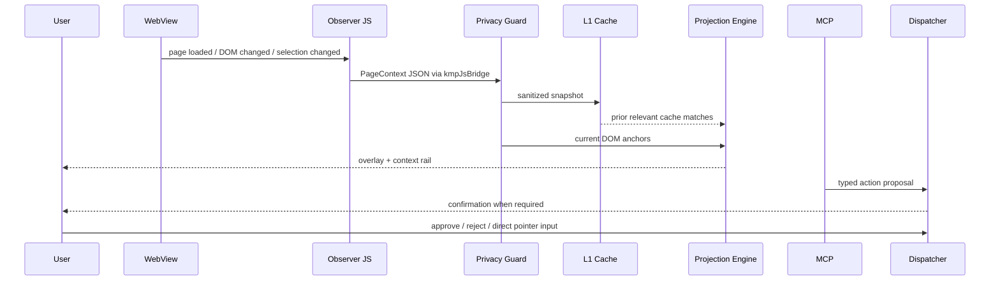

# Architecture contract

## Hard laws

1. **Native renderer law** — each target uses its platform renderer; shared code owns contracts and policy, not a fictional universal browser engine.
2. **Observation before action** — DOM/UI context is captured, sanitized, fingerprinted, and recorded before an action can be proposed.
3. **Human input preempts the agent** — pointer interaction moves the dispatcher to `OBSERVING_USER`; pending execution is cleared.
4. **No raw model execution** — model output becomes an `AgentAction`; only registered capabilities can proceed.
5. **Sensitive fields never enter context** — password/payment inputs are filtered in JavaScript and redacted again in Kotlin.
6. **Projection is evidence, not decoration** — every overlay carries a cache id, anchor fingerprint, relevance, and rendering mode.
7. **Web limitations are explicit** — same-origin/CSP/iframe restrictions are surfaced instead of bypassed.

## Runtime pipeline

## State ownership

| State | Owner | Persistence |
|---|---|---|
| Current page context | `AgentBrowserRuntime` | memory, replace-on-capture |
| L1 semantic cache | `SemanticCache` | in-memory MVP; SQLDelight adapter next |
| L2 global cache | OpenClaw adapter | not connected in MVP |
| Capability policy | `CapabilityRegistry` | code/config, deny-by-default |
| Human/agent arbitration | `LocalDispatcher` | memory + audit event |
| MCP features | `BrowserMcpServerFactory` | generated from runtime state |
| Audit evidence | runtime audit flow | memory MVP; append-only store next |

## Module boundaries

- `web/` may observe browser state but cannot execute privileged device actions.
- `mcp/` may create typed proposals but cannot directly call WebView APIs.
- `capability/` owns authorization decisions.
- `dispatcher/` owns temporal authority and human preemption.
- `ui/` renders state and obtains explicit confirmation.
- Platform source sets own lifecycle, store packaging, and native API bridges.
