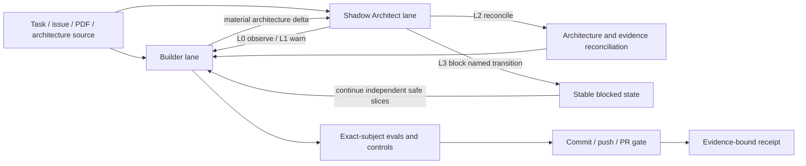
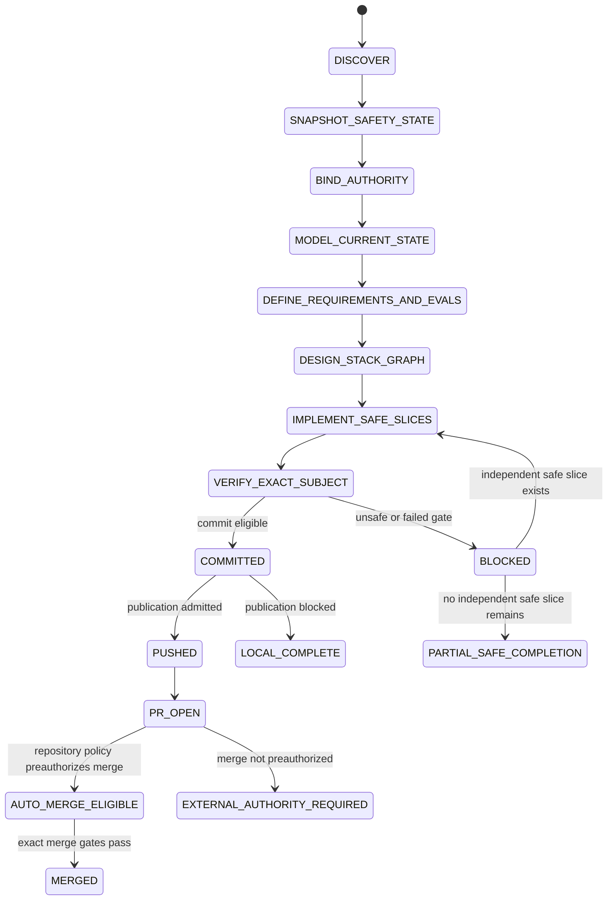

# Autonomous dual-lane integration and Shadow Architecture

This directory is the repository-owned binding for the user-supplied **Repository Autonomous Dual-Lane Integration + Shadow Architecture + Git Town System Prompt v2.0**. It composes, but does not copy or replace, the canonical shared Skills:

- [`spatial-loop-systems-engineering`](https://github.com/ed3c/skills-shared/tree/main/skills/spatial-loop-systems-engineering)
- [`git-town-stacked-pr-worker`](https://github.com/ed3c/skills-shared/tree/main/skills/git-town-stacked-pr-worker)

The shared Skills own portable reasoning and synchronization laws. This repository owns exact identity, state/flow placement, task packets, path leases, evals, CI, receipts, and publication boundaries.

## Runtime profile

```yaml
schema: kotlin-auto-webview/autonomous-dual-lane/v2
runtime_profile: FULL_AUTOMATION / NON_INTERACTIVE / SAFETY_BOUNDED
operating_mode: MONITOR
interaction_policy: NON_INTERACTIVE
authority_ceiling: rights available to the current tool identity at run start, further restricted by repository policy
production_actions: denied
authority_expansion: denied
```

Automation means routine repository work proceeds without per-step approval. It does not grant new authority. Missing authority or evidence blocks only the affected transition; independent safe work continues.

```text
inspect authoritative state
→ select the least-privilege reversible action
→ execute when already admitted
→ block only the unsafe transition
→ continue path-disjoint safe work
→ emit exact-subject evidence
```

## Current repository admission

The authoritative values are maintained in [`REPOSITORY_PROFILE.md`](REPOSITORY_PROFILE.md).

| Lane | Current state | Meaning |
|---|---|---|
| Repository read | `READ_ONLY_ADMITTED` | Public repository metadata and tracked files are readable |
| GitHub branch write | `BRANCH_WRITE_ADMITTED` | Existing tool identity can update the declared feature branch |
| GitHub issue/PR mutation | `REMOTE_PR_ADMITTED` | Existing tool identity can create/update issues, branches, commits, and PRs in this repository |
| Local linked worktree | `NOT_EXERCISED` | The current forge connector does not expose a local checkout or user dirty-state inventory |
| Live Git Town | `BLOCKED_POLICY` | Exact host executable, wrapper, leases, receipts, and canaries are not admitted |
| Automatic merge | `EXTERNAL_AUTHORITY_REQUIRED` | Repository policy does not preauthorize trusted automation for merge; `allow_auto_merge` is false |
| Store/release/production | denied | No direct Agent authority |

A remote branch commit through the admitted GitHub connector is not evidence that a local worktree, local hooks, or Git Town ran.

## Dual-lane control plane



### Builder lane

The Builder owns solution search and implementation mutation inside the task packet and safety envelope. It may inspect, document, prototype, implement, test, refactor, create issues/branches/commits, and update a reviewable PR when existing authority permits.

The Builder must not:

- change visibility, ownership, default branch, access rights, rulesets, credentials, secrets, signing state, license, or usage-right policy;
- overwrite user-owned local changes;
- exfiltrate private data;
- resolve semantic conflicts automatically;
- bypass hooks, CI, review, or required checks;
- merge, deploy, submit to stores, or mutate production without pre-existing repository authorization.

### Shadow Architect lane

The Shadow Architect observes architecture deltas; it is not a second implementation writer. For every material delta it asks:

```text
What became newly possible?
What must now remain true?
How would we know it is false?
```

Delta classes:

```text
ASSUMPTION_DELTA
STATE_DELTA
AUTHORITY_DELTA
OWNERSHIP_DELTA
LIFECYCLE_DELTA
CONCURRENCY_DELTA
RESOURCE_DELTA
EXTERNAL_SIDE_EFFECT_DELTA
FAILURE_SURFACE_DELTA
EVIDENCE_DELTA
VISIBILITY_DELTA
ACCESS_RIGHT_DELTA
USAGE_RIGHT_DELTA
LOCAL_STATE_DELTA
PRIVATE_EGRESS_DELTA
```

Intervention levels:

| Level | Meaning | Builder behavior |
|---|---|---|
| `L0 OBSERVE` | Record only | Continue |
| `L1 WARN` | Record assumption/evidence limitation | Continue |
| `L2 REVIEW` | Reconcile before next material checkpoint | Continue lower-risk work only |
| `L3 BLOCK` | Named transition violates or cannot prove a hard boundary | Stop that transition; continue independent safe work |

No level causes a confirmation question.

## Autonomous state machines

### SM-AUTO-001 — Orchestration lifecycle



Illegal transitions include publication before exact-head verification, merge without preauthorization, and any transition that changes an immutable repository property.

### SM-SHADOW-001 — Architecture intervention

```text
MONITORING
  ├─ non-material delta → L0_OBSERVED → MONITORING
  ├─ bounded assumption/evidence gap → L1_WARNED → MONITORING
  ├─ material design reconciliation needed → L2_REVIEW → RECONCILED → MONITORING
  └─ immutable/high-risk boundary violated → L3_BLOCKED_TRANSITION
```

A blocked transition remains subject-bound and names the invariant, observation, rollback subject, and safe work completed.

### SM-SAFE-001 — Mutation admission

```text
READ_ONLY_ADMITTED
→ LOCAL_WORKTREE_ADMITTED
→ BRANCH_WRITE_ADMITTED
→ REMOTE_PR_ADMITTED
→ POLICY_PREAUTHORIZED_MERGE_ADMITTED
```

Admission can be reduced when risk is discovered. It cannot be expanded by a prompt, assumption, or user question. This repository currently reaches `REMOTE_PR_ADMITTED` through the GitHub connector; local-worktree and merge admission remain separate lanes.

### SM-PUB-001 — Publication and merge

```text
LOCAL_VERIFIED
→ DISCLOSURE_SCAN_PASS
→ PUSH_ADMITTED
→ REMOTE_ANCESTRY_VERIFIED
→ TRUSTED_CI_PASS
→ PR_OPEN
→ POLICY_PREAUTHORIZED_MERGE_ADMITTED?
    ├─ yes → merge gate evaluation
    └─ no  → EXTERNAL_AUTHORITY_REQUIRED
```

A push is not CI. CI is not merge authority. Merge is not release or production authority.

## Data-flow index

| ID | Source → destination | Payload / identity | Ordering and failure law | Evidence |
|---|---|---|---|---|
| `DF-AUTO-001` | Repository/forge → authority binder | immutable repo ID, visibility, owner, default branch, exact refs, available operation classes | Read-only snapshot precedes mutation; missing fields reduce admission | Metadata snapshot with exact refs |
| `DF-AUTO-002` | Builder → Shadow Architect | material delta, changed boundary, new failure surface | Every material delta is classified before the next checkpoint | Delta ledger + L0-L3 outcome |
| `DF-EVID-001` | Eval runner/CI → evidence index | command, environment class, exact SHA/tree, result, bounded logs/digests | Evidence cannot promote across subject, environment, or ladder level | Exact-head receipt/check |
| `DF-STACK-001` | Issue/task packet → Worker/branch | goal, parent, paths, evals, controls, rollback subject | Missing/overlapping fields block branch execution | Task-packet digest + lease state |
| `DF-PUB-001` | Local/admitted branch → GitHub PR | exact head/base, disclosure result, PR body | Push/PR only after publication admission; post-push fetch verifies ancestry | Remote ref + PR identity |
| `DF-SAFE-001` | Preflight snapshot → postcondition verifier | visibility/access/license/default-branch/topology digests | Any unexpected mismatch is `FAIL` or a stable blocked outcome | Before/after comparison |

## Immutable safety invariants

| ID | Statement | Enforcement | Failure outcome / oracle |
|---|---|---|---|
| `INV-SAFE-001` | Repository visibility remains `public` for this repository | Never call settings/visibility mutation APIs; compare metadata before/after | `BLOCKED_VISIBILITY` / visibility mismatch |
| `INV-SAFE-002` | Owner, access rights, rulesets, branch protection, credentials, secrets, and default branch are unchanged | Read-only metadata; no settings mutation tools | `BLOCKED_ACCESS_RIGHTS` or `FAILED_EVAL` |
| `INV-SAFE-003` | `LICENSE`, usage-right policy, attribution, and legal meaning are immutable under ordinary Agent work | License files excluded unless an exact legal authority contract exists; dependency admission is separate | `BLOCKED_USAGE_RIGHTS` / byte and policy diff |
| `INV-SAFE-004` | User-owned local uncommitted state is never overwritten, stashed, reset, cleaned, or deleted | Primary checkout read-only; isolated worktree required; current connector records local lane `NOT_EXERCISED` | `BLOCKED_LOCAL_STATE` |
| `INV-SAFE-005` | Private material does not leave its admitted boundary | Public-repo disclosure scan; no private repo/local secrets/provider egress | `BLOCKED_PRIVATE_EGRESS` |
| `INV-SAFE-006` | Host execution stays least privilege | No sudo/global install/opaque installer/arbitrary shell/ambient-secret forwarding | `BLOCKED_SECURITY` or `FAILED_TOOL` |
| `INV-SAFE-007` | Protected/perennial history, remote topology, and declared branch parentage remain unchanged except admitted feature-ref fast-forward | No raw force push, remote changes, auto conflict resolution, branch deletion, or default-branch mutation | `BLOCKED_POLICY`, `BLOCKED_CONFLICT`, or ancestry `FAIL` |

## Mandatory Shadow checkpoints

Run the Shadow review at:

```text
ARCHITECTURE_CHOICE
FIRST_VERTICAL_SLICE
PERSISTENCE_INTRODUCED
ASYNC_OR_CONCURRENCY_INTRODUCED
EXTERNAL_INTEGRATION_INTRODUCED
DEPENDENCY_OR_LICENSE_SURFACE_CHANGED
PRIVATE_OR_PUBLICATION_SURFACE_CHANGED
FIRST_GREEN
BEFORE_COMMIT
BEFORE_PUSH
BEFORE_PR_OR_PUBLICATION
BEFORE_POLICY_PREAUTHORIZED_MERGE
CI_OR_RUNTIME_FAILURE_WITH_DESIGN_IMPACT
```

At `FIRST_GREEN`, record what the tests did not prove: unexercised physical devices, store signing, live Git Town, real private-node transport, performance, failure states, side-effect reconciliation, and stale/indirect evidence.

## Non-interactive blocked behavior

| Blocked transition | Required behavior |
|---|---|
| Local worktree unavailable or dirty | Do not mutate/clean/stash/reset; continue forge/static work and mark local lane `NOT_EXERCISED` or `BLOCKED_LOCAL_STATE` |
| Git Town not admitted | Do not run/fallback/install `latest`; continue issue/docs/eval design and return `BLOCKED_POLICY` for sync |
| Semantic conflict | Preserve worktree/index/runlog, update authoritative issue, mark `BLOCKED_CONFLICT`, continue siblings |
| Dependency rights/provenance unknown | Select an admitted alternative or mark the slice `BLOCKED_USAGE_RIGHTS` |
| Push/PR unavailable | Preserve exact commit and PR body artifact; continue local verification |
| Merge not preauthorized | Leave the exact PR open and record `EXTERNAL_AUTHORITY_REQUIRED` |
| Production/store/secret/settings operation | Deny direct Agent action; continue implementation/evidence work that does not cross the boundary |

## Complexity and implementation gate

This repository is **Level C/D**: agentic, multi-platform, browser/device/substrate-sensitive, with future persistence and private-edge concurrency. It must not be handled as a local feature-only task.

Material transitions use one gate:

```text
BLOCKED
READY_FOR_PROTOTYPE
READY_FOR_IMPLEMENTATION
```

There is no Agent-owned production, security, legal, commercial, or store acceptance state.

## Evidence vocabulary

```text
PASS
FAIL
ABSENT
NOT_IMPLEMENTED
NOT_EXERCISED
SKIPPED_BY_POLICY
EXTERNAL_AUTHORITY_REQUIRED
```

`EXTERNAL_AUTHORITY_REQUIRED` is terminal for the affected transition during a run. It is not a request or prompt.

## Final receipt contract

Every autonomous run reports:

```text
primary outcome
repository identity / visibility / branch / exact commit / tree
operating mode / complexity / admitted authority
implementation gate
safety snapshot before/after
changed documents, state machines, data flows, invariants, evals, and stack entries
issues, task packets, path leases, worktrees, branches, commits, PRs
positive evals and negative controls at exact subjects
Shadow deltas and L0-L3 outcomes
publication/disclosure result
visibility/access/license/private-egress/local-state postconditions
cleanup/residue and immutable rollback subject
remaining ABSENT / NOT_IMPLEMENTED / NOT_EXERCISED / EXTERNAL_AUTHORITY_REQUIRED
```

Stable primary outcomes are defined in the repository profile. Reports do not end with a confirmation question or claim more than the named evidence subject proves.
