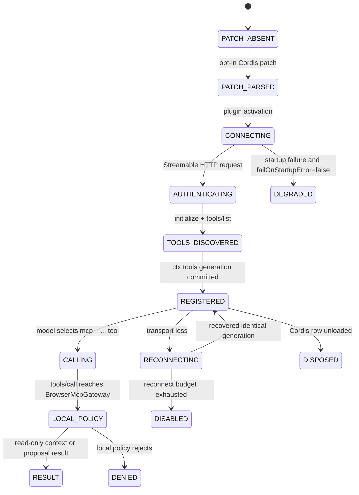

# DeepSeek Harness compatibility

This directory describes the bounded interoperability contract between `kotlin-auto-webview` and `deepseek-ai/deepseek-harness`.

## Evidence subject

```yaml
upstream_repository: deepseek-ai/deepseek-harness
upstream_commit: 47f943859bef60e4160492346772ded9b24f765a
upstream_default_branch: master
upstream_license: MIT
upstream_maturity: developer_preview
compatibility_breaking_changes_expected: true
observed_mcp_client: '@deepseek-ai/dsh-mcp-client@0.1.0-rc.5'
```

The observed DeepSeek Harness version uses Cordis plugin composition and ships `@deepseek-ai/dsh-mcp-client`. That plugin can consume `stdio` or `streamable-http` MCP servers, discover their tools, and register them on `ctx.tools` under server-qualified names.

No DeepSeek Harness or Cordis source code, npm artifact, installer, credential, or runtime is copied into this repository.

## Ownership boundary

```text
DeepSeek Harness profile / Cordis patch
  -> @deepseek-ai/dsh-mcp-client
  -> authenticated Streamable HTTP MCP transport
  -> McpStreamableHttpBridge
  -> BrowserMcpGateway
  -> browser_capture_context
     OR browser_propose_navigation
  -> local Privacy / Capability Policy / Dispatcher / HITL / Executor
```

DeepSeek Harness is a plugin harness and MCP consumer. The KMP application remains the capability and action-authority owner.

The following observations are intentionally separate:

```text
DSH process started                 != KMP MCP endpoint available
HTTP listener started              != authentication admitted
MCP transport connected            != tool discovery completed
tools/list completed               != local capability enabled
ctx.tools registration completed   != browser action authorized
tool call returned successfully    != native/browser side effect occurred
```

`browser_propose_navigation` creates a typed proposal. It does not directly navigate. The local app may deny the request or require human confirmation.

## Expected tool names

With `serverName: kotlin_auto_webview`, DeepSeek Harness should expose the current KMP tools as:

```text
mcp__kotlin_auto_webview__browser_capture_context
mcp__kotlin_auto_webview__browser_propose_navigation
```

The names are deterministic for the exact server name and raw tool names. This repository does not reimplement DeepSeek Harness's generic normalization/hash algorithm for arbitrary MCP tools.

## Authenticated local-development patch fixture

[`kotlin-auto-webview.loopback.cordis.yml`](kotlin-auto-webview.loopback.cordis.yml) is a default-off configuration-shape fixture. It targets:

```text
http://127.0.0.1:3090/mcp
```

Although the endpoint is loopback-only, the fixture requires authentication through the DeepSeek Harness host environment:

```text
KOTLIN_AUTO_WEBVIEW_MCP_TOKEN
```

The YAML stores only the environment-variable name. It resolves the value at runtime and builds the Authorization header inside the DSH process:

```yaml
headers:
  Authorization: !!js >-
    (() => { const token = process.env.KOTLIN_AUTO_WEBVIEW_MCP_TOKEN?.trim(); if (!token) throw new Error('KOTLIN_AUTO_WEBVIEW_MCP_TOKEN is required'); return `Bearer ${token}`; })()
```

Loopback is not treated as an authentication bypass. Another local process can reach a loopback listener, so anonymous local MCP is not the default contract.

The fixture can eventually be passed to DeepSeek Harness using its documented patch mechanism:

```sh
dsh web --patch "$PWD/integrations/deepseek-harness/kotlin-auto-webview.loopback.cordis.yml"
```

The command is documentation only in this repository. PR #30 implements a portable admission/forwarding bridge, but a real Desktop or host listener remains `NOT_IMPLEMENTED`, so running the patch still cannot prove cross-process interoperability.

## Remote HTTPS binding

`DeepSeekHarnessCordisBinding` can render a remote Cordis row only when:

- the endpoint is HTTPS;
- URL user information, query strings, fragments, and control characters are absent;
- `serverName` satisfies `[A-Za-z0-9_-]{1,32}`;
- authentication is represented by an environment-variable name, not a token value;
- timeout and reconnect budgets are positive and bounded.

The same authentication rule applies to explicit loopback HTTP bindings. The endpoint class changes transport admission, not credential requirements.

The binding object cannot carry arbitrary headers, OAuth tokens, private keys, certificate bytes, or bearer-token values.

## Portable bridge

PR #30 adds the framework-neutral bridge documented in [`bridge/README.md`](bridge/README.md) and ADR-0011.

It proves in portable tests:

```text
initialize
→ notifications/initialized (HTTP 202, empty body)
→ tools/list
→ sanitized browser_capture_context
→ proposal-only browser_propose_navigation
```

It also enforces exact route/media/Origin/body/auth checks, bounded exact-duplicate rejection for action-bearing calls, response-ID validation, redacted receipts, and cancellation uncertainty. It does not open a port or add a KMP server dependency.

## DeepSeek Harness lifecycle mapping



The DeepSeek Harness plugin lifecycle owns MCP connection, discovery, registration, reconnect, and disposal. A future host adapter owns the listener, TLS or loopback binding, streaming body limit, and credential verification. The KMP application owns privacy filtering, action policy, user confirmation, page/target freshness, and side-effect reporting.

## Compatibility limits

Current evidence supports:

```yaml
portable_provider_profile: IMPLEMENTED
cordis_binding_validation: IMPLEMENTED
secret_free_authenticated_patch_rendering: IMPLEMENTED
expected_tool_namespace: IMPLEMENTED
authenticated_loopback_patch_fixture: IMPLEMENTED
portable_http_admission_bridge: IMPLEMENTED
portable_initialize_tools_sequence: IMPLEMENTED_IN_TEST
sanitized_context_forwarding: IMPLEMENTED_IN_TEST
typed_navigation_proposal: IMPLEMENTED_IN_TEST
real_dsh_process: NOT_EXERCISED
real_cordis_plugin_activation: NOT_EXERCISED
real_network_listener: NOT_IMPLEMENTED
mcp_tools_list_cross_process_interop: NOT_EXERCISED
mcp_tool_call_cross_process_interop: NOT_EXERCISED
cordis_hmr_and_reconnect: NOT_EXERCISED
resources_and_prompts_bridge: NOT_SUPPORTED_BY_OBSERVED_DSH_MCP_CLIENT
production_token_custody_and_verification: NOT_IMPLEMENTED
physical_devices: NOT_EXERCISED
```

DeepSeek Harness is in developer preview at the observed upstream subject. A later upstream commit requires a new compatibility probe before this document or the provider profile can claim continued compatibility.
